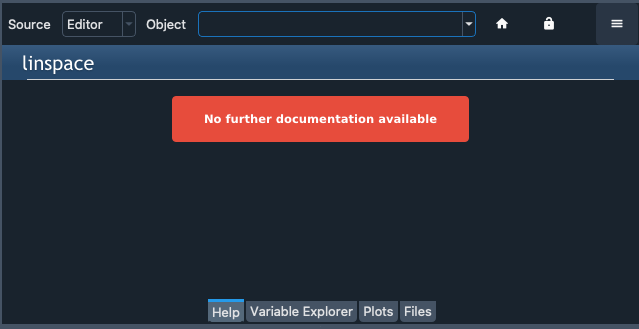

################
Common Illnesses
################

==========================
Errors starting the kernel
==========================

If you receive the message ``An error occurred while starting the kernel`` in the :doc:`ipythonconsole`, Spyder was unable to start a new Python interpreter in the current working environment to run your code.
There are a number of problems that can cause this, but most can be fixed fairly quickly with a few easy steps.

Spyder-Kernels not installed/incompatible
~~~~~~~~~~~~~~~~~~~~~~~~~~~~~~~~~~~~~~~~~

Spyder requires a supported version of the ``spyder-kernels`` package to be present in the working environment you want to run your console in.

It is included by default with Anaconda, but if you want to run your code in another Python environment or installation, you'll need to make sure it's installed and updated to the latest version.

To do so, activate the environment, then install ``spyder-kernels``.
If using Anaconda, open a terminal (Anaconda prompt on Windows) and run:

.. code-block:: bash

   conda activate ENVIRONEMENT-NAME
   conda install spyder-kernels=1

Otherwise, activate your environment by whatever means you installed it, and execute:

.. code-block:: bash

   pip install spyder-kernels==1.*

Issue with another dependency
~~~~~~~~~~~~~~~~~~~~~~~~~~~~~

If the kernel displays a long error traceback that mentions other packages like ``ipython``, ``ipykernel``, ``jupyter_client``, ``traitlets`` or ``pyzmq``, the problem may be an out of date or incompatible version of a dependency package.
To fix this, activate the environment and update the key dependencies.

In an Anaconda environment:

.. code-block:: bash

   conda activate ENVIRONMENT-NAME
   conda update spyder-kernels ipython ipykernel jupyter_client jupyter_core pyzmq traitlets

Otherwise, activate your environment by whatever means you installed it, and run:

.. code-block:: bash

   pip install -U spyder-kernels ipython ipykernel jupyter_client jupyter_core pyzmq traitlets

AttributeError/ImportError
~~~~~~~~~~~~~~~~~~~~~~~~~~

Check the last few lines of the error message, and see if its an ``AttributeError`` or ``ImportError``, or refers to a file you created, in your current working directory or your home folder (:file:`C:/Users/YOUR_USERNAME` on Windows, :file:`/Users/YOUR_USERNAME` on macOS, or :file:`/home/YOUR_USERNAME` on Linux).

.. image:: images/common-illnesses/common-illnesses-atribute-error.png
   :alt: Spyder's AtributeError dialog

If so, the the error is likely due to your file being named the same as a Python standard library module, such as ``string`` or ``time``, which overrides the built-in module that Spyder-Kernels is trying to load.
To fix this, simply rename your file to something other than one of these names, and try restarting the kernel.
To check the names of these modules, see the list in the `Python Documentation`_.

.. _Python Documentation: https://docs.python.org/3/library/

===========================
Completion/help not working
===========================

To provide code completions, help and real-time analysis in the Editor, Spyder uses the Python Language Server (PyLS), an implementation of the Language Server Protocol specification used by VSCode, Atom and other popular editors/IDEs.
Most help and completion issues lie outside of Spyder's control, and are either limitations with PyLS or the code that is being introspected, but some can be worked around.

Object missing docstring
~~~~~~~~~~~~~~~~~~~~~~~~

If nothing is displayed in the calltip, hover hint or help pane, the object you're trying to introspect may not have a docstring.

.. image:: images/common-illnesses/common-illnesses-missing-docstring.png
   :alt: Docstring not found in help pane
   :width: 500px

In this case, the only solution is to add one in the source code of the original function, method or class.

Object cannot be found
~~~~~~~~~~~~~~~~~~~~~~

Some objects, whether due to being written in C, Cython or another language; generated dynamically at runtime; or being a method of an object you create, cannot be easily found without executing the code.

However, once you run your code in the :doc:`ipythonconsole`, you might be able to get help and completions on the object there.

LSP has stopped working
~~~~~~~~~~~~~~~~~~~~~~~

Occasionally, especially after using Spyder for a while, code completion, help and analysis may stop working.
If this is the case, you can check LSP status with the :guilabel:`LSP Python` item in Spyder's status bar at the bottom of the screen, and restart it by right-clicking it and selecting the :guilabel:`Restart Python Language Server` item.

Spyder bug/dependency issue
~~~~~~~~~~~~~~~~~~~~~~~~~~~

Given the variety of dependencies involved in making LSP work, an incompatible or out of date version in your environment can result in error messages, incomplete results, or help/analysis not working at all.

To address this, first try updating Anaconda and Spyder as described in :doc:`basic-first-aid`.
If the issue still isn't resolved, update the various relevant dependencies with:

.. code-block:: bash

   conda update jedi rope parso python-language-server

===============
Plugin Problems
===============

If the error mentions or involves a Spyder plug-in, such as ``spyder-unittest``, ``spyder-terminal``, or ``spyder-notebook`` the first approach should be to update Spyder and the plugin to their latest versions.

If this doesn't fix the problem, you should check if the plugin is compatible with your version of Spyder in the plugin's website or repository.

Finally, if compatibility doesn't seem to be the problem, please check those repositories to see if an issue was already opened, and report it there if not.
