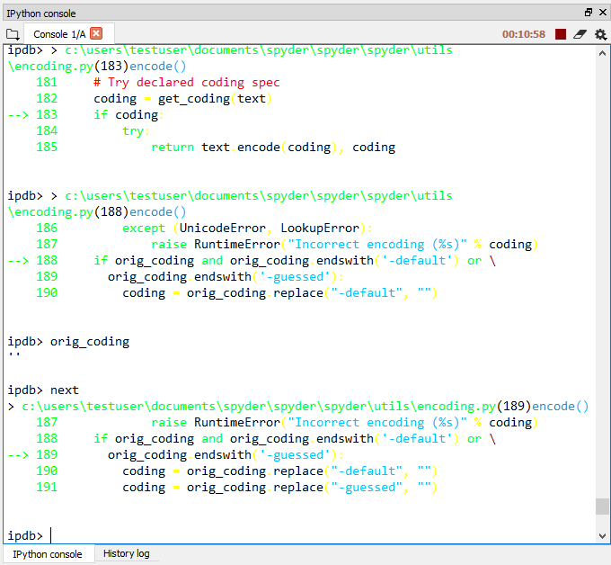
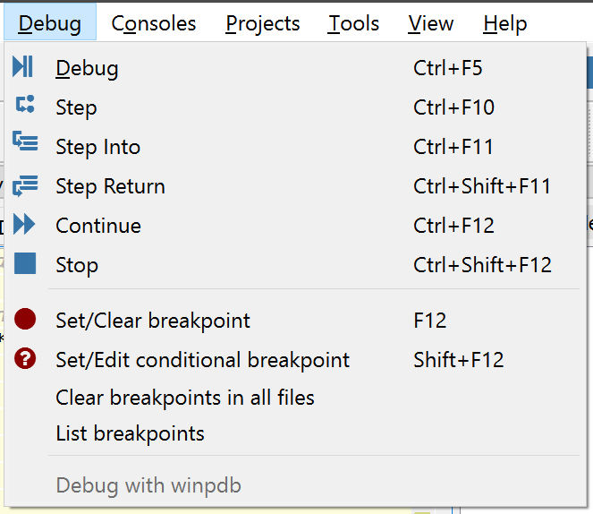
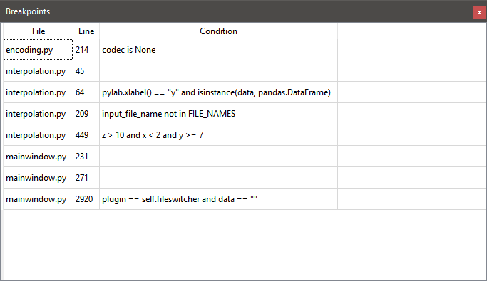
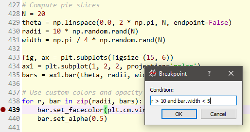

#########
Debugging
#########

**Debugging** in Spyder is supported through integration with the enhanced ``ipdb`` debugger in the :doc:`ipythonconsole`.
This allows breakpoints and the execution flow to be viewed and controlled right from the Spyder GUI, as well as with all the familiar IPython console commands.

|

===================
Debugging with ipdb
===================

Spyder offers the following debugging features integrated into the native GUI:

* Multiple means of setting and clearing normal and conditional breakpoints for any line in a file opened in the :doc:`editor`.

  * By selecting the respective option from the Debug menu.
  * Through pressing a configurable keyboard shortcut (:kbd:`F12` for normal, or :kbd:`Shift-F12` for conditional breakpoints by default).
  * By double-clicking to the left of the line number in an open file.
  * With an ``ipdb.set_trace()`` statement in your code (after ``import`` ing ``pdb``).
  * Interactively, using the ``b`` command in an ``ipdb`` session.

* A :guilabel:`Breakpoints` pane, listing the file, line, and condition (if any) of every breakpoint defined (:menuselection:`&Debug --> List breakpoints`, or :kbd:`Ctrl-Shift-B` by default).

* Full GUI control over debugger execution from the :guilabel:`Debug` menu, :guilabel:`Debug toolbar` and via configurable keyboard shortcuts, along with the standard ``ipdb`` console commands.

* Highlighting of the current frame (debugging step) in the :doc:`editor`.

* The ability to access and edit local and global variables at each breakpoint through the :doc:`variableexplorer`, and run many commands in the :doc:`ipythonconsole`.

For a comprehensive but accessible introduction to ``pdb``/``ipdb``, consult Steve Ferg's excellent online guide, `Debugging in Python`_.

.. _Debugging in Python: https://pythonconquerstheuniverse.wordpress.com/2009/09/10/debugging-in-python/

Related components
~~~~~~~~~~~~~~~~~~

* :doc:`editor`
* :doc:`ipythonconsole`
* :doc:`variableexplorer`
