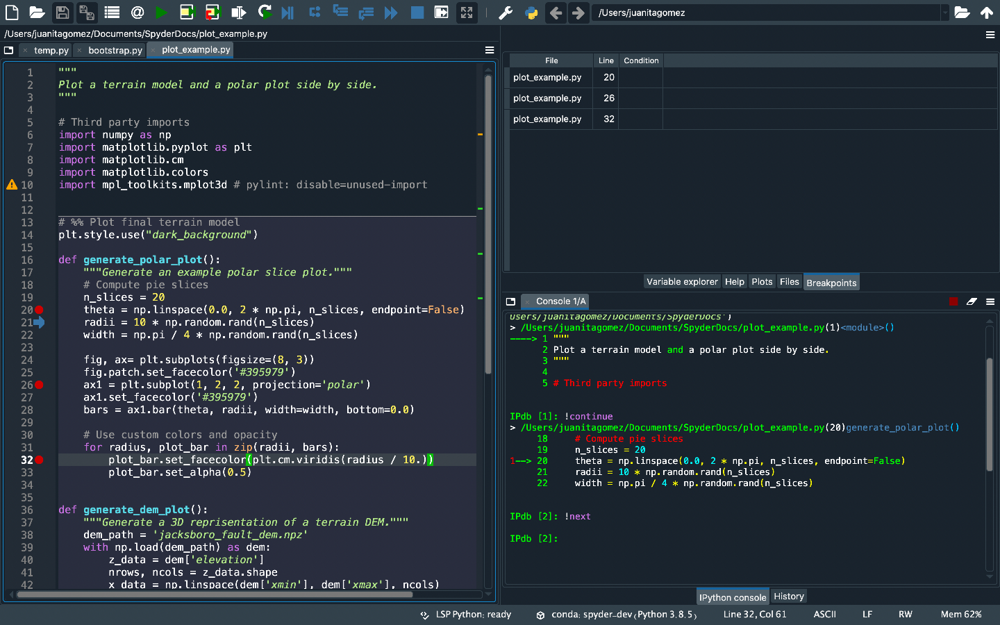
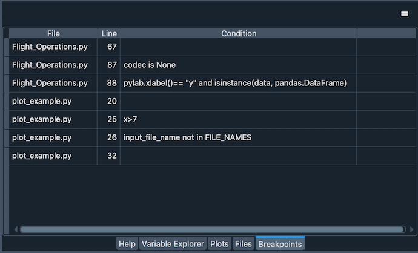

#########################
Debugging and Breakpoints
#########################

**Debugging** in Spyder is supported through integration with the enhanced ``ipdb`` debugger in the :doc:`ipythonconsole`.
This allows breakpoints and the execution flow to be viewed and controlled right from the Spyder GUI, as well as with all the familiar IPython console commands.

===================
Debugging with ipdb
===================

You can fully control debugger execution from the :guilabel:`Debug` menu, :guilabel:`Debug toolbar` and via configurable keyboard shortcuts, along with the standard ``ipdb`` `console commands`_.
Additionally, the  :doc:`editor` shows the line of code the debugger is currently stopped on with an arrow.

.. _console commands: https://pythonconquerstheuniverse.wordpress.com/2009/09/10/debugging-in-python/

GIF: Inset of Spyder's Editor, with a breakpoint set and the condition dialog open (commands from the toolbar)

Spyder's debugger offers syntax highlighting, code completion and command history, which work exactly like they do in the normal interactive interpreter.
Use the up and down arrows to recall previous commands, and press :kbd:`Tab` to trigger autocomplete suggestions.

GIF: Browsing autocomplete suggestions

Furthermore, IPython's `magic functions`_ are available in debugging mode.
You can, for example, run ``%ls`` to list the contents of your current working directory or ``%timeit`` to check how fast a given snippet of code is.

.. _magic functions: https://ipython.readthedocs.io/en/stable/interactive/magics.html

SCREENSHOT: (timeit)

SCREENSHOT of highlighting step (close up)

Finally, you can enter and execute multiline statements in Spyder's debugger just like with the regular IPython prompt, to easily run complex code.

GIF of multiline debugging

===========
Breakpoints
===========

Spyder's debugger is integrated with the :guilabel:`Breakpoints` pane, which lists the file, line, and condition (if any) of every breakpoint defined.
To open it, select :menuselection:`Debug --> List breakpoints`, or press :kbd:`Ctrl-Shift-B` (:kbd:`Cmd-Shift-B` on macOS).

There are several different ways to set and clear breakpoints:

  * With the :guilabel:`Set/clear breakpoint` option in the Debug menu.
  * Through pressing the configurable keyboard shortcut (:kbd:`F12` for normal, or :kbd:`Shift-F12` for conditional breakpoints by default).
  * By clicking to the left of the line number in an open file in the Editor (adding :kbd:`Shift` for a conditional breakpoint).
  * With the ``breakpoint()`` builtin function in your code.
  * Interactively, using the ``b`` command in a debugging session.

GIF: setting conditional breakpoint shift-clicking

You can access and edit local and global variables at each breakpoint through the :doc:`variableexplorer`.

SCREENSHOT with console and variable explorer showing local and global variables

=================
Advanced features
=================

You can avoid stepping through other Python packages while debugging by enabling the new :guilabel:`Ignore Python libraries while debugging` option in Spyder's preferences, under :menuselection:`IPython Console --> Debugger --> Debug`.
This will skip all the built-in and third-party Python modules you have installed.

SCREENSHOT with option in preferences

If your code has variables with the same names as Pdb commands (e.g. ``b`` or ``step``), you can still refer to them as normal while debugging.
To call the respective Pdb command, just add an exclamation point before it (e.g. ``!b`` or ``!step``).

SCREENSHOT with "b" variable

You can have Spyder automatically execute a custom snippet of code every time the debugger stops.
For example, you can use this to set specific variables, or import commonly-used modules so they are always available while debugging.
To set this up, go to :menuselection:`Preferences --> IPython Console --> Debugger --> Run code while debugging`, and enter the code that you want to be executed with each step.

SCREENSHOT with Run code while debugging in preferences.

==================
Matplotlib support
==================

Generating Matplotlib figures is fully supported while the debugger is active, including all the different graphics backends.
Use the ``%matplotlib`` magic to change to an interactive backend (e.g. ``%matplotlib qt5``) to pan, zoom and adjust your plots in a separate window, or switch back to the default ``inline`` (``%matplotlib inline``) to see them displayed right in the :doc:`plots` pane.

GIF of plots in interactive backend (zooming in and out)

To avoid showing plots while debugging, deactivate the :guilabel:`Process execute events while debugging` option in :menuselection:`Preferences --> IPython console --> Debugger`.

==================
Related components
==================

* :doc:`editor`
* :doc:`ipythonconsole`
* :doc:`variableexplorer`
