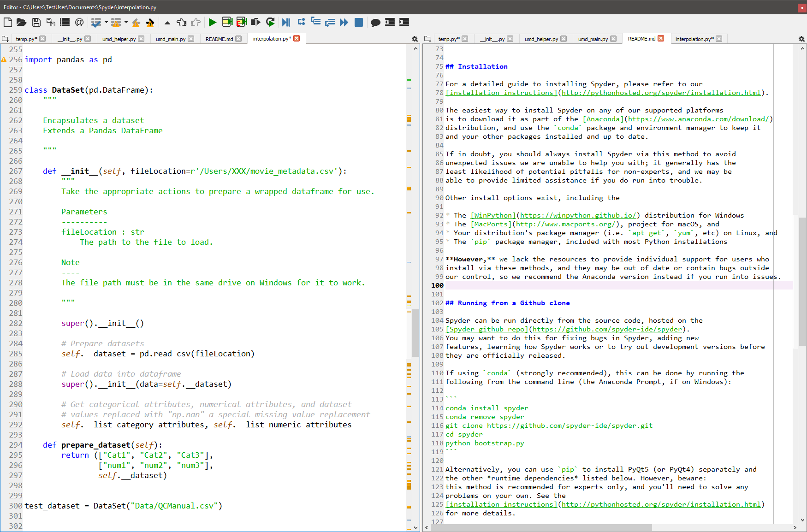
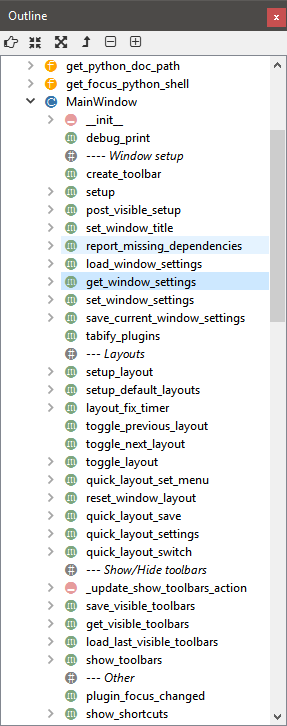
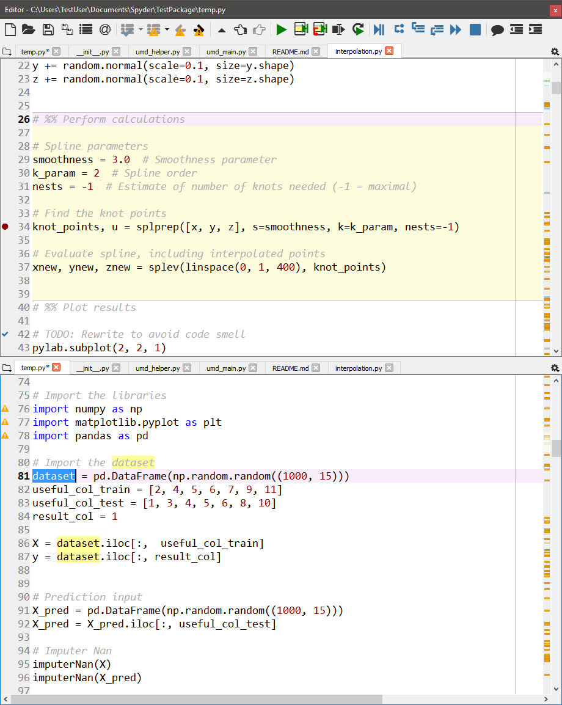
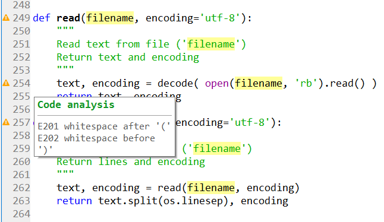
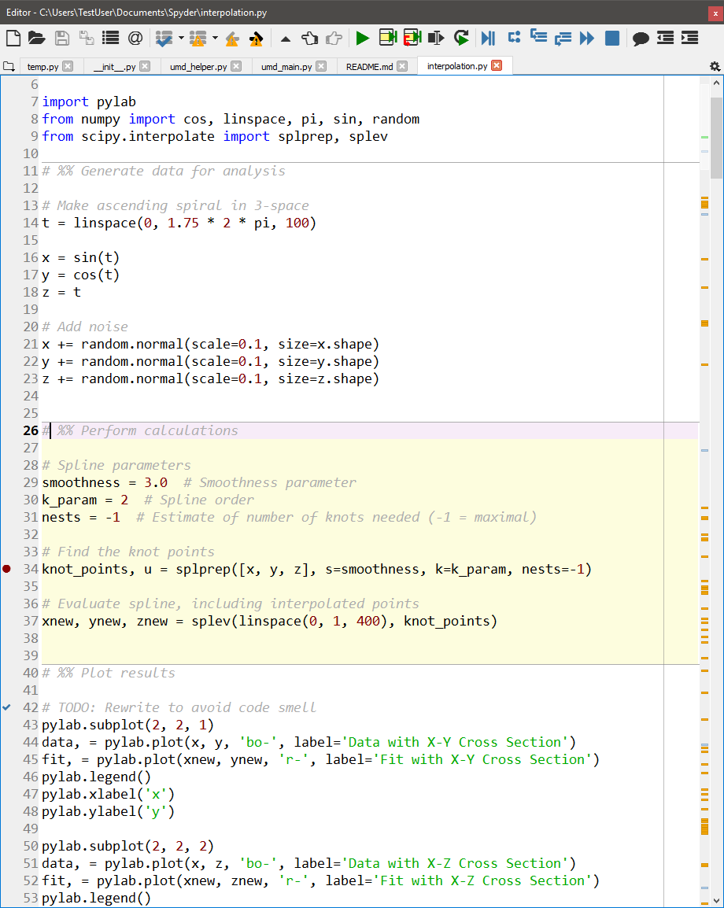

Editor
======

Spyder's text **Editor** is a multi-language editor with features such as syntax
coloring, code analysis (real-time code analysis powered by `pyflakes` and
advanced code analysis using `pylint`), introspection capabilities such as
code completion, calltips and go-to-definition features (powered by `rope`),
function/class browser, horizontal/vertical splitting features, etc.

|

Function/class/method browser and horizontal/vertical splitting feature:

|outline| |split|

|

Code analysis with `pyflakes`:

How to define a code cell
--------------------------

A "code cell" is a concept similar to MATLAB's "cell" (except that there is
no "cell mode" in Spyder), i.e. a block of lines to be executed at once in the
current interpreter (Python or IPython). Every script may be divided in as
many cells as needed.

|

Cells are separated by lines starting with:

* `#%%` (standard cell separator)
* `# %%` (standard cell separator, when file has been edited with Eclipse)
* `# <codecell>` (IPython notebook cell separator)

Related components
~~~~~~~~~~~~~~~~~~

* :doc:`fileexplorer`
* :doc:`findinfiles`
* :doc:`ipythonconsole`
* :doc:`projects`
* :doc:`pylint`
