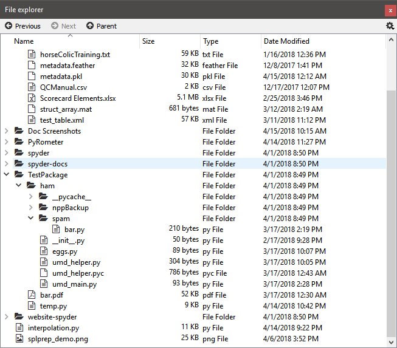
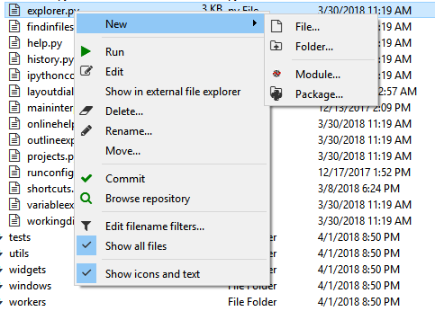

#############
File Explorer
#############

The **File Explorer** pane is a built-in filesystem and directory browser allowing you to view and filter files and their properties, open them with the :doc:`editor` or an external tool, and perform common management tasks (varies by platform).

|

==========================
Performing file operations
==========================

You can use context menus to access a number of functions on a per-file and per-directory basis, including running scripts, creating, renaming, moving, editing or deleting files, performing basic operations with ``git``, and (on Windows) opening an external file explorer.

|

Related components
~~~~~~~~~~~~~~~~~~

* :doc:`editor`
* :doc:`findinfiles`
* :doc:`projects`
