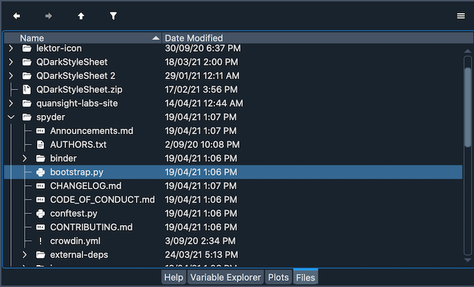

#####
Files 
#####

The **Files** pane is a built-in filesystem and directory browser that allows you to view and filter files according to their type and extension. You can also open files with the :doc:`editor` or an external tool, and perform some operations.

===============
File Operations
===============

To browse between the files in your system, you can use the arrows in the top of the pane. You can expand/contract the folders displayed in the pane to deploy the files and subfolders hierarchically. Double cliking a folder will open it showing the files on it and changing your working directory.

[GIF showing browsing files and showing changing the working directory]

To open a file in the editor from the file pane, double click over its name. If you right click over it, you will see a context menu that allows you to access a number of functions including running scripts, creating, renaming, moving, deleting and showing files in your computer's file manager.

[Screenshot showing context menu]

You can also copy and paste one or several files in the folder where you are located in the pane, or copy their absolute and relative's path in the clipboard to paste it as text.

[GIF showing copy path and pasting it in console]

Additionally, the Files pane allows you to perform basic operations with ``git`` like commiting the changes of a file and browsing the repository from which the file is part of.

[GIF showing commiting change of file and then showing repo]

============
Options Menu
============

The options menu in the top right of the Find pane offers several ways to customize how your files are displayed.

By default, the option Show all files is activated, which displays all your files in your working directory without filtering. However, if you deactivate this option, you can filter the files that the pane displays according to their extensions by clicking the corresponding option.

[GIF showing deactivating show all files and changing some extensions to hide some files]

You can also activate the Show hidden files option which will show files that are not by default displayed in your file manager.

You can change what kind of information you want to see of files in the pane by hiding or displaying "kind", "size" and "date modified" columns. For this, check these columns in the options menu.

[Screenshot showing files pane with kind, size and date modified columns and the options menu with these activated]

The options menu also gives you the option to open files and directories with a single-click instead of a double-click, to suit different user preferences. With the option Single click to open files checked, only a single click is needed to open a file either externally or in Spyder.

=================
File associations
=================

You can associate different external applications with specific file extensions they can open. Under the File associations tab of the Files preferences pane, you can add file types and set the external program used to open each of them by default. 

[GIF opening file associations preference and setting LibreOffice for csv files]

Once you've set this up, files will automatically launch in the associated application when opened from the Files pane in Spyder. Additionally, when you right-click a file you will find an Open with... option that will show the application associated with this extension.

[GIF showing Open with...` option over a csv file and opening it with LibreOffice]

==================
Related components
==================

* :doc:`editor`
* :doc:`findinfiles`
* :doc:`projects`
