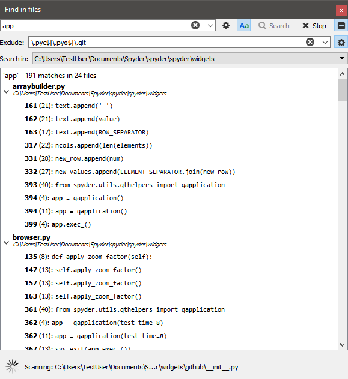

#############
Find in Files
#############

The **Find in Files** pane allows to you perform full-text, recursive content search in a user-defined scope, with advanced features to filter your results.

|

=======================
Choosing search options
=======================

The :guilabel:`Find in Files` tool allows you to select from a number of options to enable searches as broad or refined as you need:

* To enable case sensitivity, controlling whether matches are returned with a different case than your search text, toggle the :guilabel:`Aa` button on.
* To parse your search string as a regular expression, allowing for highly expressive search queries, toggle the :guilabel`Gear` button on.
* To exclude certain filenames, types, or directories from your search, use the :guilabel:`Exclude:` text box, which can similarly be parsed as a regular expression with the :guilabel:`Gear` button to its right.
* To select whether to search in a specific file, in the current working directory, in a new or previously-used custom directory, or even in entire :doc:`projects`, use the :guilabel:`Search In` menu.

Related components
~~~~~~~~~~~~~~~~~~

* :doc:`editor`
* :doc:`fileexplorer`
