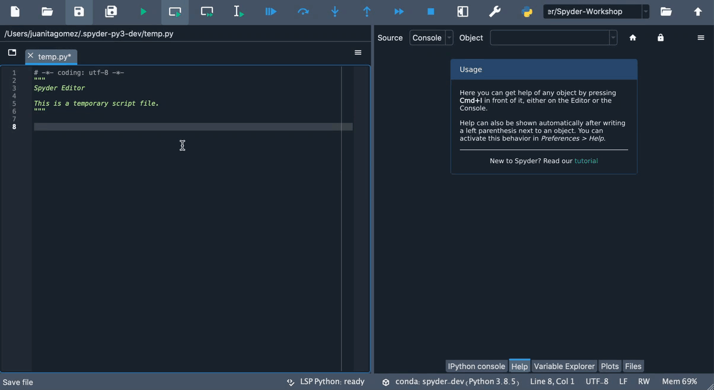
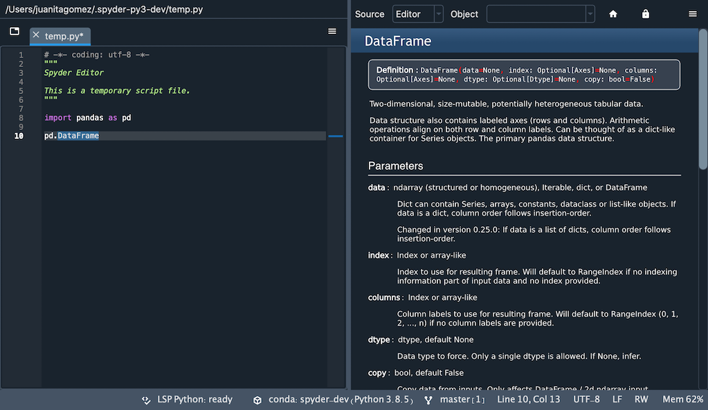
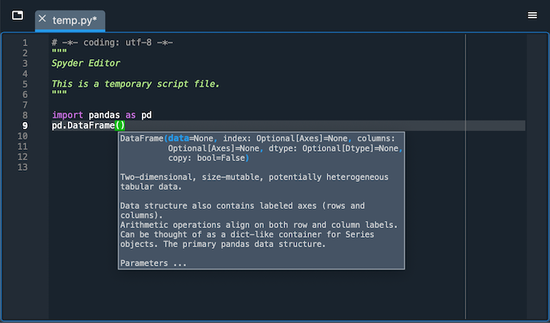

####
Help
####

You can use the **Help** pane to find, render and display rich documentation for any object with a docstring, including modules, classes, functions and methods. This allows you to access documentation easily directly from Spyder not having to break your workflow.

|

|

You can also access Spyder's tutorial from here, which will guide you through some basic steps for using its key features.

|

============
Getting help
============

Help can be retrieved both by static analysis of open files in the :doc:`editor`, or by dynamically inspecting an object in an :doc:`ipythonconsole`.

|

You can trigger help manually by pressing the configurable help shortcut (:kbd:`Ctrl-I` by default), or automatically if enabled when typing a left parenthesis (``(``) after a function or method name.

.. image:: images/help/help-automatic-connections.gif
   :align: center
   :alt: Spyder console and help pane showing automatic help with parenthesis

|

You can also manually enter the object's name into the :guilabel:`Object` textbox at the top of the pane, if :guilabel:`Console` is selected as the :guilabel:`Source`.

.. image:: images/help/help-object-box.png
   :width: 500
   :align: center
   :alt: Spyder Help pane, displaying documentation for an object whose name was written in the object text box

|

Automatic help can be individually enabled for both the :guilabel:`Editor` and the :guilabel:`Console` under :menuselection:`Preferences --> Help --> Automatic Connections`, and turned on and off dynamically via the :guilabel:`lock` icon in the top right corner of the :guilabel:`Help` pane.

========================
Understanding help modes
========================

You can use the options menu (:guilabel:`Gear` icon) in the top right of the :guilabel:`Help` pane to toggle the help display mode.

:guilabel:`Rich Text` mode renders the object's docstrings with ``Sphinx``, :guilabel:`Plain Text` mode displays the docstring without formatting while :guilabel:`Show Source` displays the docstring inline with the code for the selected object, or any Python portion of it (if the object is not pure Python). The latter can be useful when docstrings are not available or insufficient to document the object.

.. image:: images/help/help-modes.gif
   :align: center
   :alt: Spyder help pane showing different modes

========================
Getting help by hovering
========================

You can also get summary help for objects by hovering over them in the :guilabel:`Editor`.
Clicking the hover popup will open the full documentation in the :guilabel:`Help` pane.

|

========================
Control automatic import
========================

When you get help in the :guilabel:`IPython Console` for an object that has not been previously imported, it is automatically loaded in the :doc:`internalconsole` so that documentation can be shown when available.
This can be disabled in the :guilabel:`Help` pane's top-right options menu so that only documentation from imported objects is displayed.

Related components
~~~~~~~~~~~~~~~~~~

* :doc:`editor`
* :doc:`ipythonconsole`
* :doc:`onlinehelp`
