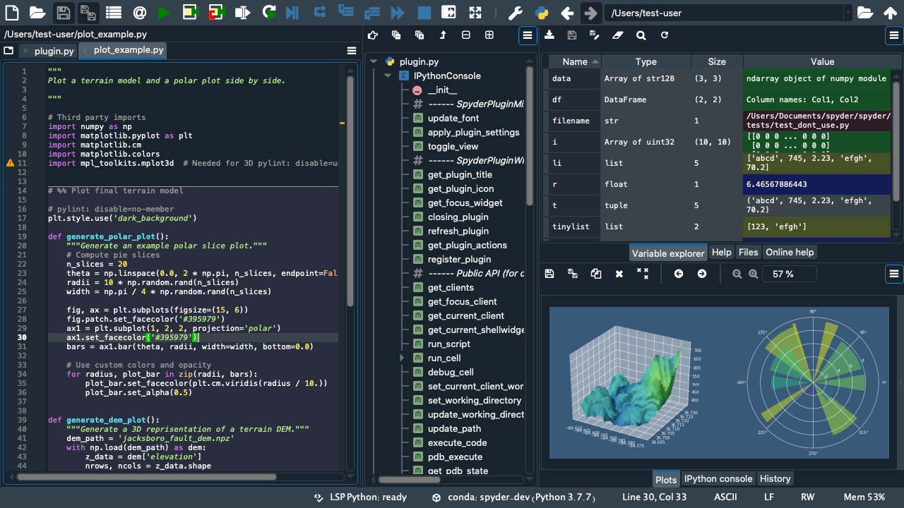

#####################################################################
Spyder: The Scientific Python Development Environment — Documentation
#####################################################################

|

|

Spyder is a powerful scientific environment written in Python, for Python, and designed by and for scientists, engineers and data analysts.
It features a unique combination of the advanced editing, analysis, debugging, and profiling functionality of a comprehensive development tool with the data exploration, interactive execution, deep inspection, and beautiful visualization capabilities of a scientific package.
Furthermore, Spyder offers built-in integration with many popular scientific packages, including `NumPy`_, `SciPy`_, `Pandas`_, `IPython`_, `QtConsole`_, `Matplotlib`_, `SymPy`_, and more.

.. _NumPy: https://www.numpy.org/
.. _SciPy: https://www.scipy.org/
.. _Pandas: https://pandas.pydata.org/
.. _IPython: https://ipython.org/
.. _QtConsole: https://qtconsole.readthedocs.io/en/stable/
.. _Matplotlib: https://matplotlib.org/
.. _SymPy: https://www.sympy.org/en/index.html

Beyond its many built-in features, Spyder's abilities can be extended even further via its plugin system and API.
Spyder can also be used as a PyQt5 extension library, allowing you to build upon its functionality and embed its components, such as the interactive console, in your own software.

========
Contents
========

.. toctree::
    :maxdepth: 2
    :glob:

    overview
    installation
    options
    editor
    ipythonconsole
    variableexplorer
    help
    debugging
    pylint
    profiler
    projects
    fileexplorer
    findinfiles
    onlinehelp
    historylog
    internalconsole
