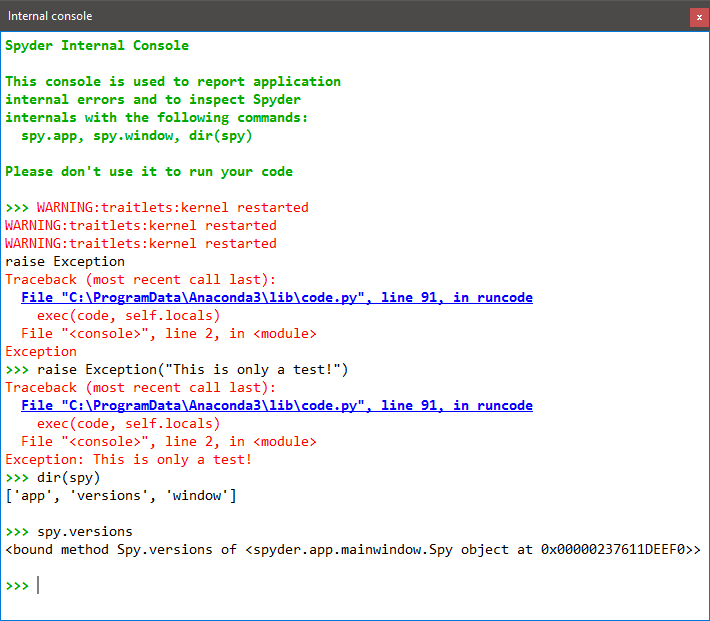

################
Internal Console
################

You can use the **Internal Console** to control and debug Spyder itself, or as an embedded Python console in your own application.

|

Supported features
==================

The Internal Console supports code completion and calltips, just like a normal IPython Console, along with a number of GUI selection, line-wrapping, buffer, and clear/copy/paste options.
You can toggle and customize these behaviors under Internal console settings from the context menu.
Additionally, you can use a number of special commands can be used to open a file in a Spyder or external editor, edit or remove variables, run scripts or system commands, get help, and more.
See the Help dialog in the context menu for more details on these.

By default, all the commands entered in the Internal Console are executed in the same process as Spyder's.
However, you can run the Internal Console in a separate thread by passing ``--multithread`` as one of Spyder's :doc:`options` on launch.

Related components
~~~~~~~~~~~~~~~~~~

* :doc:`ipythonconsole`
