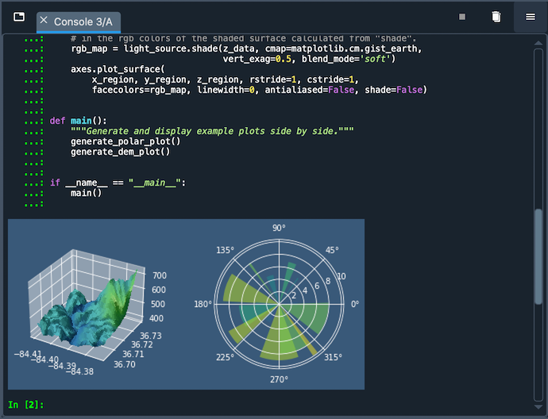

###############
IPython Console
###############

The **IPython Console** allows you to execute commands and enter, interact with and visualize data inside `IPython`_ interpreters.

.. _IPython: https://ipython.org/

To launch a new IPython instance, go to :guilabel:`New console (default settings)` under the :guilabel:`Consoles` menu, the :guilabel:`IPython Console` pane menu or its context menu, or use the keyboard shortcut (:kbd:`Ctrl-T` by default).

(Gif with Open Ipython Console)

From any of the three menus, you can stop currently executing code with :guilabel:`Interrupt kernel`, clear a console's namespace with :guilabel:`Remove all variables`, or relaunch a fresh one with :guilabel:`Restart`.
As each Console is executed in a separate process, this won't affect the others or Spyder itself, and you will be able to easily test your code in a clean environment without disrupting your primary session.

.. _connecting-external-kernel:

=============================
Connect to an external kernel
=============================

Connect to a local kernel
~~~~~~~~~~~~~~~~~~~~~~~~~

You can connect to external local and remote kernels, including those managed by QtConsole sessions or the Jupyter Notebook, through the :guilabel:`Connect to an existing kernel` dialog under the same menus.
External kernels still support :ref:`many <console-features>` (though not all) of Spyder's advanced capabilities.

.. image:: images/console/console-menu.png
   :alt: Spyder IPython Console as above, with the options menu open

Connect to a remote kernel
~~~~~~~~~~~~~~~~~~~~~~~~~~

To connect to an external kernel,

#. Launch an IPython kernel on the local or remote host if one is not already running.

   * If using Spyder 3.3.0 or later, you'll need to launch the kernel with ``python -m spyder_kernels.console`` (after you've first installed ``spyder-kernels`` on the host with ``<conda/pip> install spyder-kernels``).
   * If using a version of Spyder before 3.3.0, ``ipython kernel`` should work to launch the kernel, albeit without certain Spyder-specific features.

#. Copy the connection file (:file:`{jupyter/runtime/dir/path}/kernel-{pid}.json`) to the machine you're running Spyder on (if remote) or note its location (if local).

   You can get :file:`{jupyter/runtime/dir/path}` by executing ``jupyter --runtime-dir`` in the same Python environment as the kernel.

#. Click :guilabel:`Connect to an existing kernel` from the :guilabel:`Console` menu or the :guilabel:`IPython Console` pane's "Gear" menu.

#. Browse for or enter the path to the connection file from the previous step.
   If you're connecting to a local kernel, click :guilabel:`Ok` and Spyder should connect to the kernel; if a remote kernel, proceed to the final step.

   As a convenience, kernel ID numbers (e.g. ``1234``) entered in the connection file path field will be expanded to :file:`{jupyter/runtime/dir/path}/kernal-{id}.json` on your local machine.

#. If connecting to a remote kernel over ``ssh``, check the appropriate box and type the full hostname you're connecting to (in the form :file:`{username}@{hostname}:{port-number}`).
   Then, enter *either* :file:`{username}` 's password on the remote machine, or your user SSH keyfile (typically :file:`.perm`) (only one is needed to connect), and press :guilabel:`Ok`.

   The port number is the one on which the SSH daemon (``sshd``) is running, typically 22 unless you or your administrator has configured it otherwise.

(Gif of connecting to external kernel SSH ->CAM)

For more technical details about connecting to remote IPython kernels, see the `Connecting to a remote kernel`_ page in the IPython Cookbook.
Just remember to enter the appropriate details into Spyder's :guilabel:`Connect to an existing kernel` dialog instead of launching a new frontend on the client with ``--existing``.

.. _Connecting to a remote kernel: https://github.com/ipython/ipython/wiki/Cookbook:-Connecting-to-a-remote-kernel-via-ssh

================
Special consoles
================

Spyder also supports several types of specialized consoles.
A `Cython console`_ will allow you to use Cython language to speed up your code and call C functions directly from Python.
A `Sympy console`_ allows creating and displaying symbolic math expressions right inside Spyder.
Finally, a `Pylab console`_ loads common Numpy and Matplotlib functions by default; while this is deprecated and not recommended for new code, it can be used for older scripts that need this.

.. _Cython console: https://cython.org/#documentation
.. _Sympy console: https://docs.sympy.org/latest/index.html
.. _Pylab console: https://matplotlib.org/faq/usage_faq.html#matplotlib-pyplot-and-pylab-how-are-they-related

(Gif opening menu and showing opening one of the special consoles)

.. _console-features:

==================
Supported features
==================

Any :guilabel:`IPython Console`, whether :ref:`external<connecting-external-kernel>` or started by Spyder, supports:

* Automatic code completion
* Real-time function calltips
* Full GUI integration with the enhanced Spyder :doc:`debugging`.
* The :doc:`variableexplorer`, with GUI-based editors for many built-in and third-party Python objects.
* Display of Matplotlib graphics in Spyder's :doc:`plots` pane, if the :guilabel:`Inline` backend is selected under :menuselection:`Preferences --> IPython console --> Graphics --> Graphics backend`, and inline in the console if :guilabel:`Mute inline plotting` is unchecked under the :guilabel:`Plots` pane's options menu.

.. image:: images/console/console-completion.png
   :alt: Spyder IPython Console, with a popup list of code completion guesses

For information on the features, commands and capabilities built into IPython itself, see the `IPython documentation`_.

.. _IPython documentation: https://ipython.readthedocs.io/en/stable/overview.html

============
Options menu
============

The options menu allows you to inspect your current environment variables and the contents of your system's ``PATH`` in Spyder :doc:`variableexplorer` browsers with :guilabel:`Show environment variables` and :guilabel:`Show sys.path contents` respectively, and you can have each kernel display how long it has been running with :guilabel:`Show elapsed time`.

(Screenshot of options menu)

You can also change the name of the current :guilabel:`IPython console` tab by simply double-clicking it, or with the :guilabel:`Rename tab` option.

(Gif of changing name)

.. _umr-section:

===================================
Using UMR to reload changed modules
===================================

When working in an interactive session, Python only loads a module from its source file once, the first time it is ``import``-ed.

Spyder's :guilabel:`User Module Reloader` (UMR) automatically reloads modules right in your existing IPython consoles whenever they are modified and re-imported.
With UMR enabled, you can test changes to your code without restarting the kernel.

(Screenshot Editor split in two: Module and code with import of module / Console to show message of the module reloaded)

UMR is enabled by default, and it will provide you with a red ``Reloaded modules:`` message in the console listing the files it has refreshed when it activates.
If desired, you can turn it and the message on or off, and prevent specific modules from being reloaded, under :menuselection:`Preferences --> Python interpreter --> User Module Reloader (UMR)`.

(Screenshot of preferences)

==================
Related components
==================

* :doc:`debugging`
* :doc:`editor`
* :doc:`help`
* :doc:`historylog`
* :doc:`variableexplorer`
