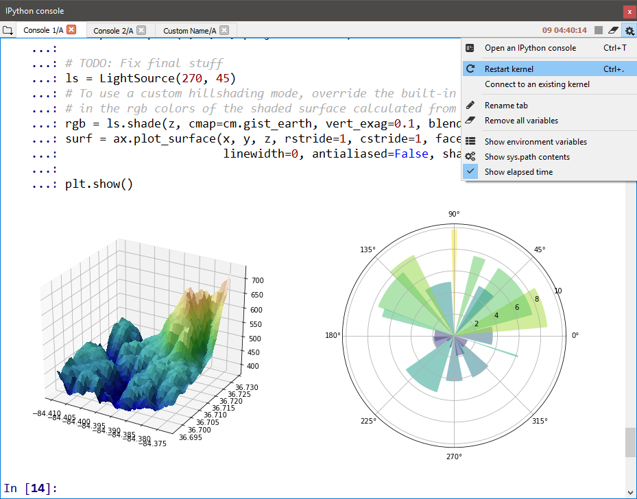

###############
IPython Console
###############

The **IPython Console** allows you to execute commands and enter, interact with and visualize data inside any number of fully featured `IPython`_ interpreters.
Each console is executed in a separate process, allowing you to run scripts, interrupt execution and restart or terminate a shell without affecting the others or Spyder itself, and easily test your code in a clean environment without disrupting your primary session.

.. _IPython: https://ipython.org/

|

=======================
Connecting to a console
=======================

Spyder can launch new IPython instances itself, through "Open an IPython console" under the :guilabel:`Consoles` menu, the :guilabel:`IPython Console` pane menu or its context menu (:kbd:`Ctrl-T` by default), to take advantage of the full suite of Spyder's features.
Each console implements a robust two-process IPython session, with a lightweight front-end interface connected to a full kernel back end.
You can also connect to external local and remote kernels, including those managed by QtConsole sessions or the Jupyter Notebook, through the :guilabel:`Connect to an existing kernel` dialog under the same menus
External kernels still support :ref:`many <console-features>` (though not all) of Spyder's advanced capabilities.

|

Connect to an external kernel
~~~~~~~~~~~~~~~~~~~~~~~~~~~~~

.. note::
   If on Windows and connecting to a remote machine over ``ssh``, you'll need to install the ``paramiko`` python package first, *e.g.* with ``conda install paramiko`` if using Anaconda.

To connect to an external kernel,

#. Launch an IPython kernel on the local or remote host if one is not already running.

   * If using Spyder 3.3.0 or later, you'll need to launch the kernel with ``python -m spyder_kernels.console`` (after you've first installed ``spyder-kernels`` on the host with ``<conda/pip> install spyder-kernels``).
   * If using a version of Spyder before 3.3.0, ``ipython kernel`` should work to launch the kernel, albeit without certain Spyder-specific features.

#. Copy the connection file (:file:`{jupyter/runtime/dir/path}/kernel-{pid}.json`) to the machine you're running Spyder on (if remote) or note its location (if local).

   You can get :file:`{jupyter/runtime/dir/path}` by executing ``jupyter --runtime-dir`` in the same Python environment as the kernel.

#. Click :guilabel:`Connect to an existing kernel` from the :guilabel:`Console` menu or the :guilabel:`IPython Console` pane's "Gear" menu.

#. Browse for or enter the path to the connection file from the previous step.
   If you're connecting to a local kernel, click :guilabel:`Ok` and Spyder should connect to the kernel; if a remote kernel, proceed to the final step.

   As a convenience, kernel ID numbers (e.g. ``1234``) entered in the connection file path field will be expanded to :file:`{jupyter/runtime/dir/path}/kernal-{id}.json` on your local machine.

#. If connecting to a remote kernel over ``ssh``, check the appropriate box and type the full hostname you're connecting to (in the form :file:`{username}@{hostname}:{port-number}`).
   Then, enter *either* :file:`{username}` 's password on the remote machine, or your user SSH keyfile (typically :file:`.perm`) (only one is needed to connect), and press :guilabel:`Ok`.

   The port number is the one on which the SSH daemon (``sshd``) is running, typically 22 unless you or your administrator has configured it otherwise.

|

For more technical details about connecting to remote IPython kernels, see the `Connecting to a remote kernel`_ page in the IPython Cookbook.
Just remember to enter the appropriate details into Spyder's :guilabel:`Connect to an existing kernel` dialog instead of launching a new frontend on the client with ``--existing``.

.. _Connecting to a remote kernel: https://github.com/ipython/ipython/wiki/Cookbook:-Connecting-to-a-remote-kernel-via-ssh

.. _console-features:

==================
Supported features
==================

Any :guilabel:`IPython Console` in Spyder, internally or externally created, supports additional features including:

.. image:: images/console/console_completion.png
   :align: right
   :width: 50%
   :alt: Spyder IPython Console, with a popup list of code completion guesses

* Automatic code completion
* Real-time function calltips
* Debugging toolbar integration for launching the debugger and controlling execution flow

Spyder-created consoles support even more advanced capabilities, such as:

* The :doc:`variableexplorer`, with GUI-based editors for many built-in and third-party Python objects
* Full GUI integration with the enhanced IPython debugger, ``ipdb``, including viewing and setting normal and conditional breakpoints interactively in any file, a :guilabel:`Breakpoints` pane, and following along with execution flow in the in the :doc:`editor` (see the :doc:`debugging` documentation for more details)
* The :ref:`User Module Reloader <umr-section>`, which can automatically re-import modified packages and files
* Inline display of Matplotlib graphics, if the ``Inline`` backend is selected under :menuselection:`Preferences --> IPython console --> Graphics --> Graphics backend`

For information on the features, commands and capabilities built into IPython itself, see the `IPython documentation`_.

.. _IPython documentation: https://ipython.readthedocs.io/en/stable/overview.html

.. _umr-section:

===================================
Using UMR to reload changed modules
===================================

When working with scripts and modules in an interactive session, Python only loads a module from its source file once, the first time it is ``import``-ed.
During this first ``import``, the bytecode (``.pyc`` file) is generated if necessary and the imported module object is cached in ``sys.modules``.
If you subsequently re-import the module anytime in the same session without Spyder, this cached code object will be used even if its source code (``.py{w}`` file) has changed in the meantime.
While efficient for final production code, this behavior is often undesired when working interactively, such as when analyzing data or testing your own modules.
In effect, you're left with no way to update or modify any already-imported modules, aside from manually removing the relevant ``.pyc`` files, or restarting the console entirely.

Fortunately, in Spyder, there's an easy solution: the :guilabel:`User Module Reloader` (UMR), a Spyder-exclusive feature that, when enabled, automatically reloads modules right in the existing IPython shell whenever they are modified and re-imported, without any of the downsides of the above workarounds.
Even better, Spyder also loads the ``%autoreload`` magic by default into any kernels it starts, allowing changes in already imported modules to be automatically picked up the as soon as the modified file is saved, without any additional user action.
With UMR enabled, you can test complex applications within the same IPython interpreter without having to restart it every time you make a change, saving large amounts of manual tedium and long restart times.
Or, if you're analyzing data step by step using your own custom libraries, you can easily add or tweak a function in the latter and see the results reflected in the former, all without the overhead of reloading the data and re-running your whole script to restore your session to the same point.

UMR is enabled by default, and will do its work automatically without user intervention, although it will provide you with a red ``Reloaded modules:`` message in the console listing the files it has refreshed when it activates.
If desired, you can turn it and the message on or off, and prevent specific modules from being reloaded, under :menuselection:`Preferences --> Python interpreter --> User Module Reloader (UMR)`.

Related components
~~~~~~~~~~~~~~~~~~

* :doc:`debugging`
* :doc:`editor`
* :doc:`help`
* :doc:`historylog`
* :doc:`variableexplorer`
