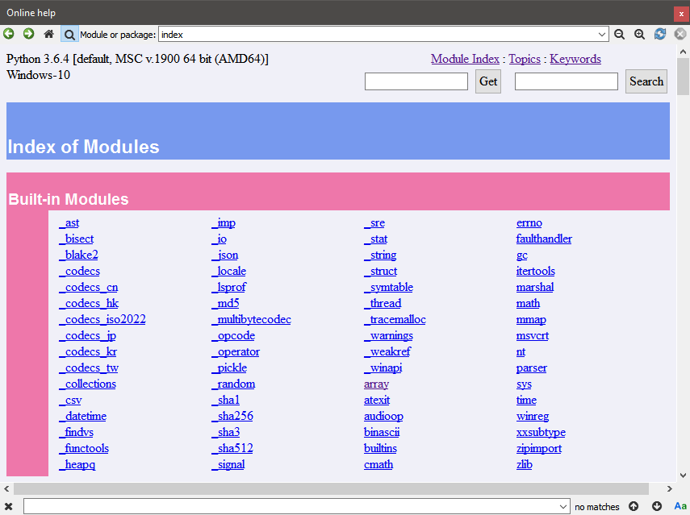

Online help
===========

The online help plugin provides an internal web browser to explore dynamically
generated Python documentation on installed module, including your own modules
(this documentation is provided by a pydoc server running in background).

|

Related components
~~~~~~~~~~~~~~~~~~

* :doc:`help`
