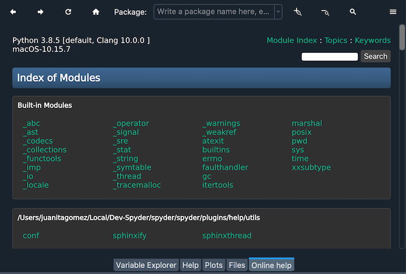
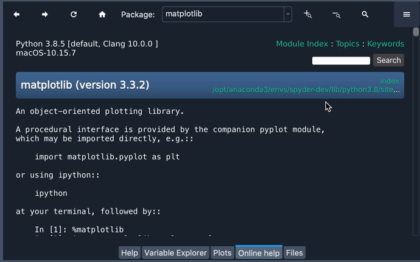
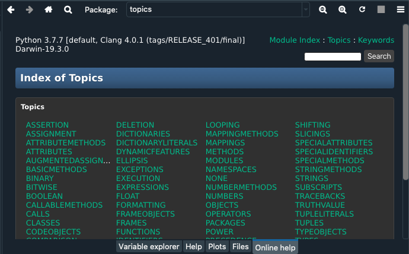

###########
Online Help
###########

The **Online Help** pane provides a built-in web browser to explore dynamically generated Python documentation on installed modules—including your own—rendered by a ``pydoc`` server running in the background.

|

=====================
Using the Online Help
=====================

The Online Help's home, shows an index where you can browse between built-in modules, your installed anaconda packages or other site-packages corresponding to your Python installation.
Click on the name of any module to open its documentation. 

.. image:: images/online_help/online-help-browse.gif
   :alt: Spyder Online Help pane showing module browsing

|

Enter the name of the item you'd like documentation on in the :guilabel:`Module or package` field, or the :guilabel:`Get` field, to load its doc directly.

.. image:: images/online_help/online-help-name.gif
   :alt: Spyder Online Help pane showing module browsing by name

|

The module's file location is linked to the right of the doc's title, which you can click to view its source code.

|

Standard library modules also have a link to the corresponding `Python docs`_, which can be viewed right inside of the pane.

.. _Python docs: https://docs.python.org/

.. image:: images/online_help/online-help-python-docs.gif
   :alt: Spyder Online Help pane showing python docs embedded in pane

|

If you're not sure of the name of the object you want help on, or are looking for a specific keyword, use the :guilabel:`Search` field to get a list of results.

.. image:: images/online_help/online-help-search.gif
   :alt: Spyder Online Help pane showing search of a keyword

|

The Online Help also provides an index of topics that might be useful for your search and an index of keywords corresponding to reserved words in Python.

|

===============
Toolbar Options
===============

You navigate previous pages with the forward and back buttons (top left, left and right arrows), and go back to the homepage with the home button (house icon top left) or the ``Module Index`` link top right.

.. image:: images/online_help/online-help-navigation.gif
   :alt: Spyder Online Help pane showing navigation with arrows

|

Perform a realtime search within a page's content with the :guilabel:`Find` button (magnifying glass icon top left) or :kbd:`Ctrl-F`, navigate through matches with the Up and Down buttons, and make matching case sensitive with the :guilabel:`Aa` button.

.. image:: images/online_help/online-help-find.gif
   :alt: Spyder Online Help pane showing finding a word on a module

|

You can view and re-run previous searches with the drop-down menu or the :kbd:`Down Arrow` key in the :guilabel:`Module or package field`.

.. image:: images/online_help/online-help-history.png
   :alt: Spyder Online Help pane showing previous searches

|

You can use the zoom in/out buttons (:guilabel:`-` and :guilabel:`+`, top right), to change the font size to suit your preferences.

.. image:: images/online_help/online-help-zoom.gif
   :alt: Spyder Online Help pane showing changing the font

|

Finally, to cancel searching or page loading, click the stop button (red :guilabel:`X`, top right) and to reload the help content you're seeing to the most current version on disk (such as when you change your package's documentation), hit the refresh button (circular arrows, top right).

.. image:: images/online_help/online-help-refresh.gif
   :alt: Spyder Online Help pane showing refreshing pane when updating docs

|

Related components
~~~~~~~~~~~~~~~~~~

* :doc:`help`
