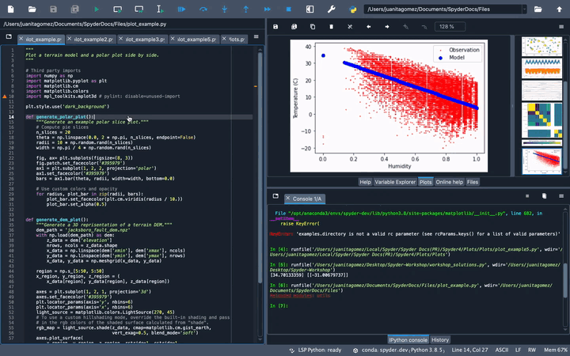
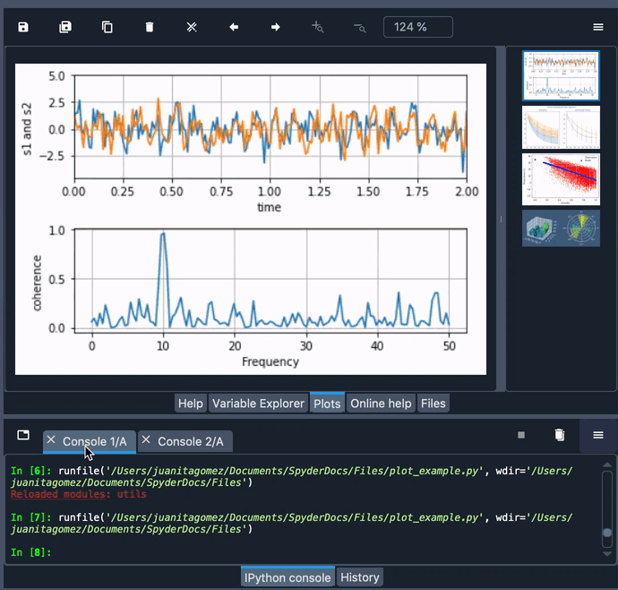
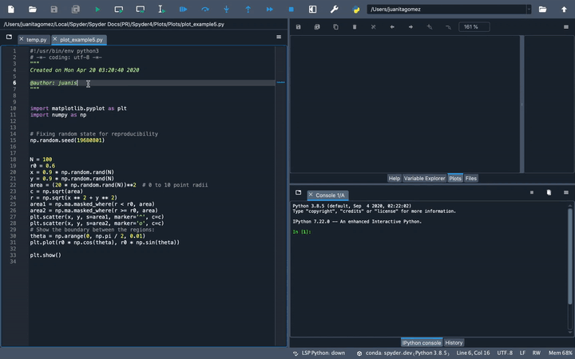
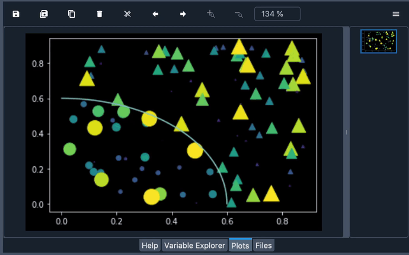
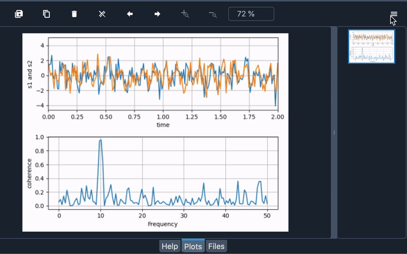
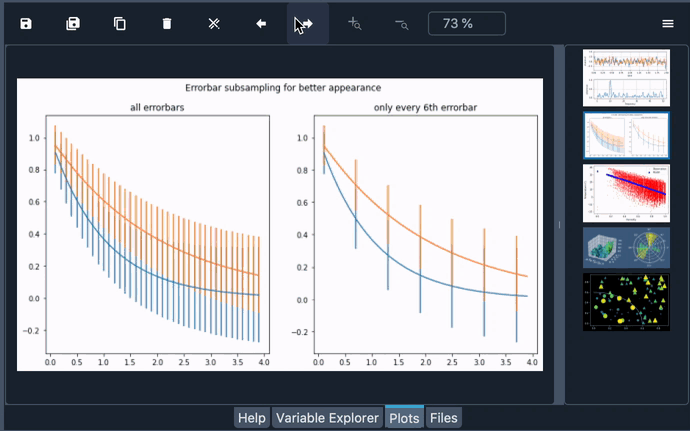
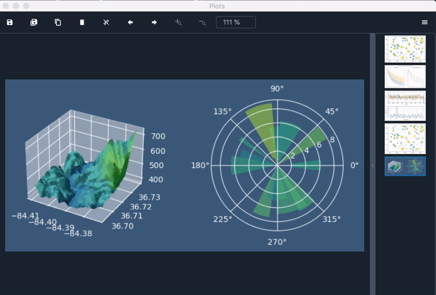
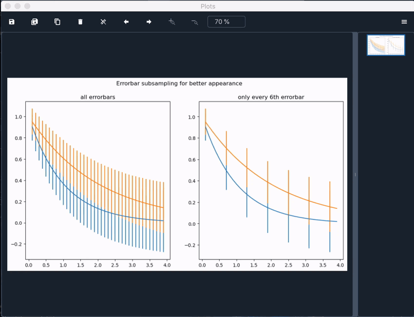
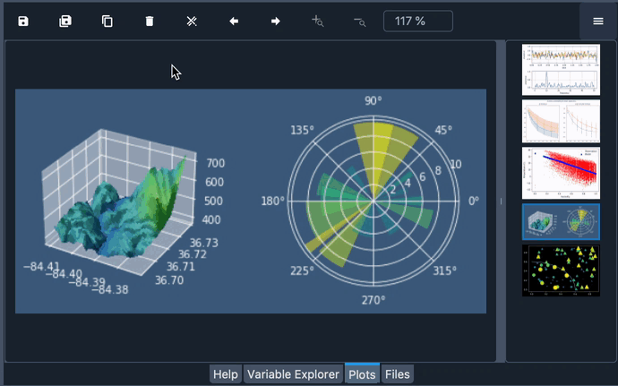

#################
Plots
#################

The **Plots** pane shows the static figures and images created during your session.
It will show you plots from the :doc:`ipythonconsole`, produced by your code in the :doc:`editor` or generated by the :doc:`variableexplorer` allowing you to interact with them in several ways.

|

The plots in the Plot's plane depend on the Console you are working on. 
This means that when switching to another console, the plots from your previous one will disappear, showing you a blank pane.

|

====================
Options Menu
====================

The options menu in the top right of the :guilabel:`Plots` pane offers several options to customize your plots visualization.

~~~~~~~~~~~~~~~~~~~~
Mute inline plotting
~~~~~~~~~~~~~~~~~~~~

The :guilabel:`Mute inline plotting` option is enabled by default, preventing the figures from also appearing in the Console. 
If you deactivate this option, the plots are generated will appear in the Console every time you run your code.

|

~~~~~~~~~~~~~~~~~
Show plot outline
~~~~~~~~~~~~~~~~~

The :guilabel:`Show plot outline` option shows an outline box surrounding the area of the plot, with which you can export the plots.

|

~~~~~~~~~~~~~~~~~~~
Fit plots to window
~~~~~~~~~~~~~~~~~~~

The :guilabel:`Fit plots to Window` option is also enabled by default making the figures' size to match the size of the pane's window. 
Disabling it will allow you to zoom the plots in or out using the Zoom buttons at the top of the pane.

|

====================
Toolbar Options
====================

On top of the Plots pane you will find the Toolbar, which provides several useful features that allow you interact with the plots. 
For example, you can navigate through the plots in the pane visible in the thumbnails by using the arrows.

|

You can also save one or all the plots in the pane as PNG's by clicking the "Save" icon in the Toolbar.

|

Additionally, if you want to use a plot in another document, you can click the “Copy to Clipboard” button and paste your plot wherever you want, such as a word processor.

|

Finally, you can use the "Remove" buttons in the Toolbar to delete one or all the plots in the pane.

|

~~~~~~~~~~~~~~~~~~
Related components
~~~~~~~~~~~~~~~~~~

* :doc:`variableexplorer`

