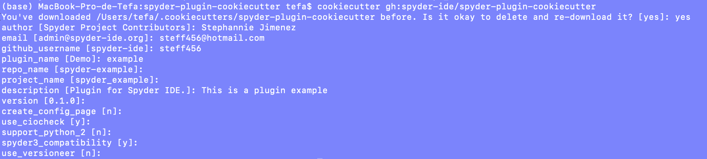
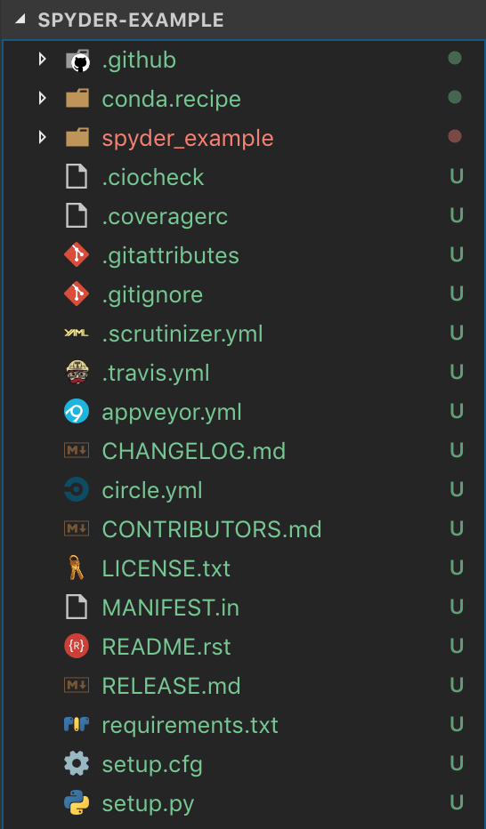

##############
Spyder plugins
##############

Spyder is made up of multiple plugins that perform a specific task, 
for instance spyder-terminal or the variable explorer. As well, plugins are
able to communicate among others and with spyder. In this way, 
some of the new functionalities for Spyder require a brand new plugin. 

============================
Creating a new spyder plugin
============================

So, you want to build a spyder plugin but you are not sure of how to start?
This documentation will guide you throghout the process.

Please before starting the tutorial, make sure you have the following dependencies installed:

- Git
- Spyder
- Python
- Anaconda

Getting started
---------------
All spyder plugins have the same structure and it is important for the new ones to follow the same set of rules.
We developed a template that all the plugins must follow that is available as a `cookiecutter <https://github.com/spyder-ide/spyder-plugin-cookiecutter>`_.

1. Clone or download `spyder-pugin-cookiecutter <https://github.com/spyder-ide/spyder-plugin-cookiecutter>`_
2. Install cookiecutter with conda

.. code-block:: bash

   conda install -c conda-forge cookiecutter

3. Run against the repo

.. code-block:: bash

   cookiecutter gh:spyder-ide/spyder-plugin-cookiecutter

In this step you will need to input some values for your plugin as shown below.
Normally, you don't need to change *project_name* and *repo_name*.

After finishing these steps, you will find a new folder with the specified name of the project. 
In this example we created a new python project under the folder *spyder-example*.
You can create a new repository with these folder, because normally spyder-plugins manage their own
repository, releases and versions.

Configuring the plugin
----------------------
Once you have the template for your brand new plugin, you will notice multiple new files.

**Folders**
- *.github*: Controls the github repository for contributions and versions
- *spyder_example*: Main folder for the plugin logic
- *.circleci*: Base configuration file for circle CI

**Files**
- *.scrutinizer.yml*: Base configuration file for scrutinizer CI
- *.travis.yml*: Base configuration file for travis CI
- *appveyor.yml*: Base configuration file for appveyor CI
- *CHANGELOG.md*: File for mantaining a log of important changes given in the repo
- *CONTRIBUTORS.md*: File for having the contributors of the project
- *LICENSE.txt*: File for specifying the MIT license in the repo
- *README.rst*: Introduction file for the project
- *requirements.txt*: File for specifying the versions and requirements for the spyder plugin
- *setup.py*: Main file for starting the plugin

You can remove the files that you don't need, but we highly recommend using at least one CI
and maintaining the readme, license and requirements files.

The chore for the plugin will be under the folder *project_name*, in this example
it is called *spyder_example*. Within this folder, we will see three folders and the
main file called *exampleplugin.py*.

This file is the one that we want to modify. Your new plugin will inherit from
*SpyderPluginWidget* class. The main configuration for your plugin will be to implement
all the functions inside the class. This is the logic part of your plugin, so all the
chore functionalities should be done in here.

Creating the QtWidget
---------------------
Once the chore functionalities for your plugin are made, we can start building
the QtWidget that will be in charge of the visual part for the user. Inside the *widgets*
folder you will find the *examplegui.py* file. Your main challenge will be to implement
a QtWidget. For this you can use the docs for Qt.

Installing your spyder-plugin
-----------------------------
In order to use your brand new spyder-plugin in spyder, you need to install it
in your conda environment. For this, you can go to the root of the project and 
execute the following command:

.. code-block:: bash

   pip install -e .

Once you run spyder, it will try to load your plugin as a third party one and you
will be able to use it freely inside our IDE.