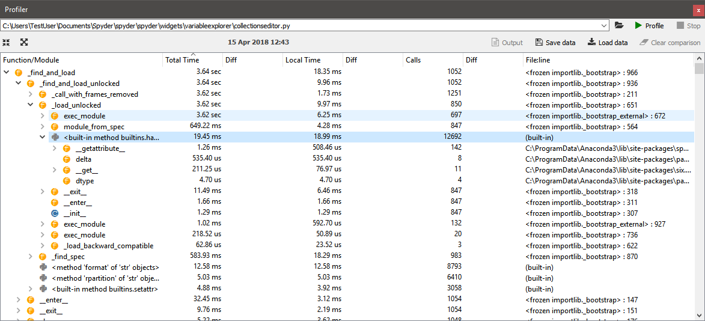
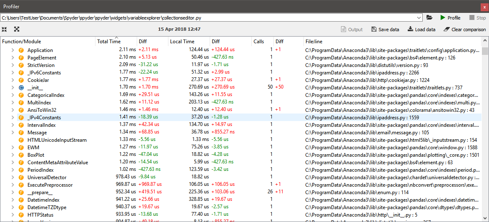

########
Profiler
########

The **Profiler** pane recursively determines the run time and number of calls for every function and method called in a file, whether directly or indirectly, breaking down each procedure into its smallest individual units.
This allows you to easily identify the bottlenecks in your code, points you toward the exact statements most critical for optimization, and measures the performance delta after followup changes.

|

====================
Running the Profiler
====================

You can select the file to run in Spyder's :guilabel:`Profiler` by simply clicking within it in the :doc:`editor`, or you can manually enter the name/path in the :guilabel:`Profiler`'s path box (top left of the pane).
Either way, you can then run it on the file by clicking :menuselection:`&Run --> Profile`, clicking :guilabel:`Profile` in the :guilabel:`Profiler` pane, or by using a configurable shortcut (:kbd:`F10` by default).
If you'd like to cancel an in-progress run, click the :guilabel:`Stop` button in the top right, and if profiling fails for any reason, click the :guilabel:`Output` button to consult the log as to why.

.. important::

   Currently, the :guilabel:`Profiler` only runs files with their working directory set to that of their file location on disk. Therefore, relative paths assuming a different working directly won't work as intended, and should be replaced with absolute ones or should assume the working directory is that of the file. This limitation is planned to be resolved in a future version of Spyder.

To open and go directly to the file and line in the :doc:`editor` where an item is the profiler was called, just double-click it.
Increase the number of hierarchical levels displayed for a particular object by clicking the dropdown arrows to the left of the name, or increase/decrease the depth shown for all levels with the buttons in the top left, to the left of the timestamp.
You can click the dropdown or press the :kbd:`Down Arrow` key in the filename field to recall paths of previous profiled files.
You can save the data for a given run to disk with the :guilabel:`Save data` button, and it can be loaded to compare with another run with the :guilabel:`Load data` button.
To remove the loaded data, click the :guilabel:`Clear comparison` button.

========================
Interpreting the results
========================

Results are broken down by top-level function/method/statement, with each sub-element listed hierarchically under the top-level item that called them.
:guilabel:`Total Time` is that taken by the specified item and every function "underneath" (*i.e.* called by) it, while :guilabel:`Local Time` only counts the time spent in the particular callable object's own scope.
The :guilabel:`Calls` column displays the total number of times the specified object was called at that level inside its parent calling function (or within the ``__main__`` scope, if a top-level object).
Finally, the numbers in the :guilabel:`Diff` columns for each of the three appear if a comparison is loaded, and indicate the deltas between each measurement.

|

For example, suppose you ran the :guilabel:`Profiler` on a file calling a function ``print_wrapper()`` that in turn called the ``print()`` function, and the ``print_wrapper()`` function took a total of 3 ms to run, with 2 ms of that spent executing the ``print()`` function inside it.
Therefore, if ``print()`` called nothing else itself, its :guilabel:`Total Time` and :guilabel:`Local Time` would both be identical, at 2 ms.
Meanwhile, :guilabel:`Total Time` for ``print_wrapper()`` would be 3 ms, but :guilabel:`Local Time` only 1 ms as the rest of that time was spend inside the ``print()`` function it called.

Related components
~~~~~~~~~~~~~~~~~~

* :doc:`ipythonconsole`
* :doc:`pylint`
