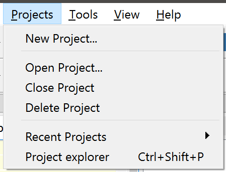
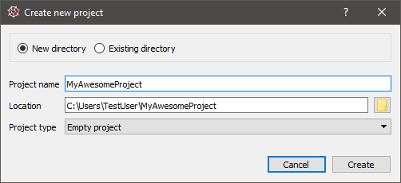
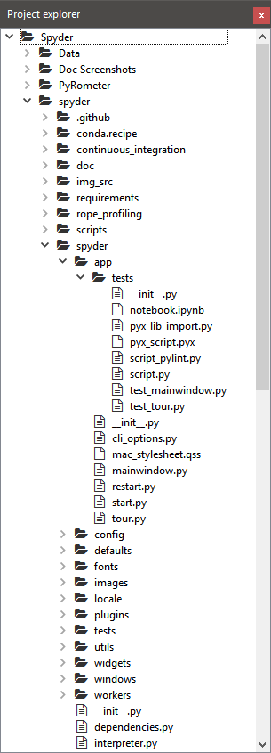
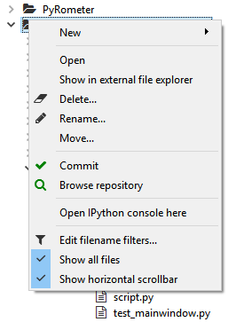
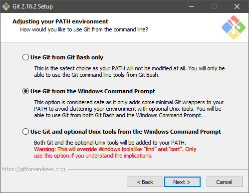

########
Projects
########

Spyder allows users to associate a given directory with a **Project**, which offers several main advantages:

* Opening, closing or switching to a :guilabel:`Project` automatically saves and restores your :doc:`editor` panes and open files to exactly how you left off.
  This allows you to easily switch between many different development tasks without having to manually re-create your session for each one.
* Your project's root directory is automatically added to the ``PYTHONPATH``, so you can easily ``import`` and work with any modules and packages you create with zero setup.
* The project path is also used to automatically set your working directory, and can be used as an automatic preset for several modules, such as the :doc:`findinfiles` search location.
* You can browse all your :guilabel:`Project` files from the :ref:`Project Explorer <project-explorer>`, regardless of your current working directory or :doc:`fileexplorer` location.
* :guilabel:`Projects` are :ref:`integrated <vcs-section>` with the ``git`` version control system, allowing you to commit files and open them or your repository in the ``gitk`` GUI right from within Spyder.

.. note::

   :guilabel:`Projects` are completely optional and not imposed on users.
   All of Spyder' functionality (session saving, File Explorer, working directory, etc) is available without creating a :guilabel:`Project`, just on a global rather than :guilabel:`Project`-specific basis.

==================
Creating a Project
==================

To create a :guilabel:`Project`, click the :guilabel:`New Project` entry in the :guilabel:`Projects` menu, choose whether you'd like to associate a :guilabel:`Project` with an existing directory or make a new one, and enter the :guilabel:`Project` 's name and path:

|projectsmenu| |newprojectdialog|

|

.. _project-explorer:

==========================
Using the Project Explorer
==========================

Once a :guilabel:`Project` is opened, the :guilabel:`Project Explorer` pane is shown, presenting a tree view of the current :guilabel:`Project` 's files and directories.
This pane allows you to perform all the same operations as a normal Spyder :doc:`fileexplorer`.

|projectexplorer| |projectcontextmenu|

|

.. _vcs-section:

============================
Working with version control
============================

Spyder has basic integration with the `Git`_ distributed version control system.
You can commit or browse (in the ``gitk`` GUI) a file, directory or the entire repository via the commands in the context menu for the relevant object (right-click).

.. _Git: https://git-scm.com/

To use this functionality, the :guilabel:`Project` must be located in a ``git`` repository and the ``git`` and ``gitk`` commands must be on the system path.
For Windows systems, the `Git for Windows`_ package provides a convenient installer and the option to place common git commands on the system path without creating conflicts with Windows system tools.
The second option in the dialog below is generally a safe approach.

.. _Git for Windows: https://gitforwindows.org/

|

Related components
~~~~~~~~~~~~~~~~~~

* :doc:`editor`
* :doc:`fileexplorer`
