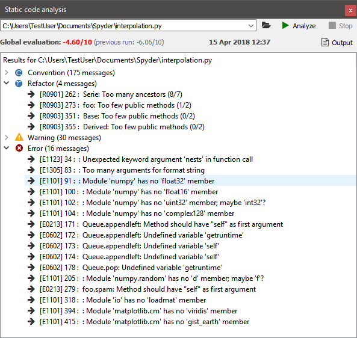

####################
Static Code Analysis
####################

The **Static Code Analysis** pane detects style issues, bad practices, potential bugs, and other quality problems in your code, all without having to actually execute it.
Spyder's static analyzer is powered by the best in class `Pylint`_ back-end, which can intelligently detect an enormous and customizable range of problem signatures.

.. _Pylint: https://www.pylint.org/

|

=========================
Using the static analyzer
=========================

You can select the desired file to analyze directly in the :doc:`editor` by clicking anywhere within it, or you can manually enter the Python module or package path you'd like it to check in the path entry textbox in the :guilabel:`Static Code Analysis` pane.
The analyzer works with both ``.py`` (or ``.pyw``) Python scripts and whole Python packages (directories containing an :file:`__init__.py` file).
Then, to run it, select :menuselection:`Sour&ce --> Run static code analysis` from the menubar, click the :guilabel:`Analyze` button in the pane, or press the configurable static analysis shortcut (:kbd:`F8` by default).
Cancel analyzing a file with the :guilabel:`Stop` button, and if analysis fails, click the :guilabel:`Output` button to find out why.

To go directly to the file and line in the :doc:`editor` highlighted by a failed check, just click its name.
You can click the dropdown or press the :kbd:`Down Arrow` key in the filename field to view results of previous analyses; the number of recent runs Spyder should remember can be customized in the :guilabel:`History` dialog from the :guilabel:`Static Code Analysis` context menu.
All standard checks are run by default.
You can turn certain messages off at the line, block or file/module level by adding a ``# pylint: disable=<list of message names>`` comment at the respective level, where the ``<...>`` portion should be replaced with a comma-separated list (or single value) without the ``<``/``>`` of Pylint message names (*e.g.* ``multiple-statements``, or ``fixme, line-too-long``; you can also use error codes like ``C0321`` although names are preferred for clarity).
Or, you can globally suppress certain messages by editing the :file:`.pylintrc` configuration file in your user home directory.
For more details on configuring Pylint, see the `Pylint documentation`_.

.. _Pylint documentation: https://pylint.readthedocs.io/en/latest/faq.html#message-control

Related components
~~~~~~~~~~~~~~~~~~

* :doc:`editor`
* :doc:`profiler`
