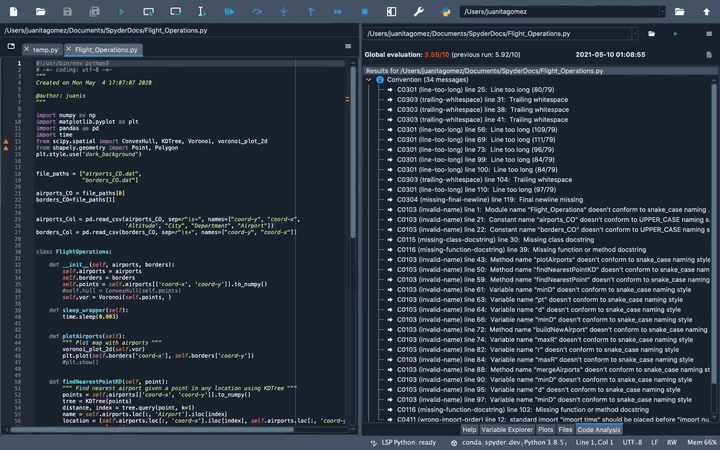

#############
Code Analysis
#############

The **Code Analysis** pane detects style issues, bad practices, potential bugs, and other quality problems in your code, all without having to actually execute it.
Based on this, it gives you a global evaluation of your code reflected on a score from 0 to 10.
Spyder's code analyzer is powered by the best-in-class `Pylint`_ back-end, which can intelligently detect an enormous and customizable range of problem signatures.

.. _Pylint: https://www.pylint.org/

.. image:: images/pylint/code-analysis-standard.png
   :align: center
   :alt: Spyder Pylint pane, showing numerous issues discovered in a file

|

=======================
Using the code analyzer
=======================

You can select the desired file to analyze directly in the :doc:`editor` by clicking anywhere within it.
To run it, click the :guilabel:`Analyze` button in the pane, press the configurable code analysis shortcut (:kbd:`F8` by default) or select :menuselection:`Source --> Run code analysis` from the menu bar.
All standard checks are run by default.
To go directly to line in the :doc:`editor` highlighted by a failed check, just click its name.

.. image:: images/pylint/code-analysis-editor.gif
   :alt: Spyder Pylint pane, showing running analysis and clicking failed check

|

You can manually enter the Python module or package path you'd like it to check in the path entry textbox in the :guilabel:`Code Analysis` pane. 
The analyzer works with both ``.py`` (or ``.pyw``) Python scripts and whole Python packages (directories containing an :file:`__init__.py` file).

|

Cancel analyzing a file with the :guilabel:`Stop` button, and if analysis fails, click the :guilabel:`Output` button to find out why. 
If Pylint does succeed, the :guilabel:`Output` will show the full plain text of the same messages displayed in the pane.

.. image:: images/pylint/code-analysis-output.png
   :align: center
   :alt: Spyder Pylint pane, showing output

|

You can click the dropdown or press the dropdown arrow in the filename field to view results of previous analyses.

.. image:: images/pylint/code-analysis-history.png
   :align: center
   :alt: Spyder Pylint pane, showing history

|

============
Options menu
============

The number of recent runs Spyder should remember can be customized in the :guilabel:`History` dialog, available from the :guilabel:`Code Analysis` options menu.

.. image:: images/pylint/code-analysis-history-custom.gif
   :alt: Spyder Pylint pane, customizing history dialog

|

You can also expand or collapse one or all the sections in the pane by using the corresopnding options in the context menu.

.. image:: images/pylint/code-analysis-expand-collapse.gif
   :alt: Spyder Pylint pane, expanding and collapsing sections

|

================
Advanced options
================

You can turn certain messages off at the line, block or file/module level by adding a ``# pylint: disable=<list of message names>`` comment at the respective `level`_, (LINK) where the ``<...>`` portion should be replaced with a comma-separated list (or single value) without the ``<``/``>`` of Pylint message names (*e.g.* ``multiple-statements``, or ``fixme, line-too-long``; you can also use `error codes`_ like ``C0321`` although names are preferred for clarity).  

.. _scope: http://pylint.pycqa.org/en/latest/user_guide/message-control.html

.. _Pylint message names: http://pylint.pycqa.org/en/latest/technical_reference/features.html#pylint-checkers-options-and-switches

.. image:: images/pylint/code-analysis-pylint-disable.gif
   :alt: Spyder Pylint pane, showing disabling a message locally

|

Or, you can globally suppress certain messages by editing the :file:`.pylintrc` configuration file in your user home directory.
For more details on configuring Pylint, see the `Pylint documentation`_.

.. _Pylint documentation: https://pylint.readthedocs.io/en/latest/faq.html#message-control

|

Related components
~~~~~~~~~~~~~~~~~~

* :doc:`editor`
* :doc:`profiler`
