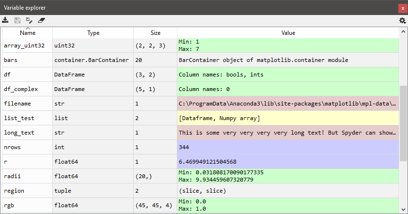
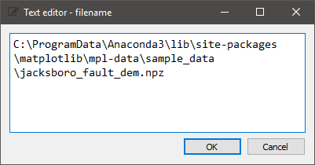
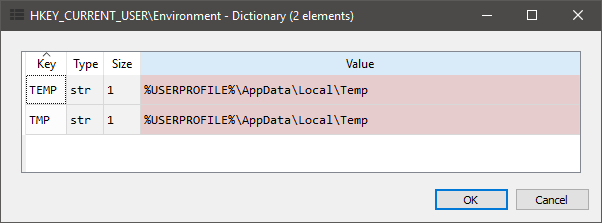
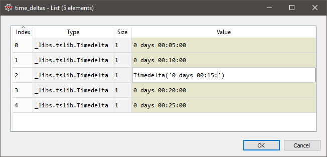
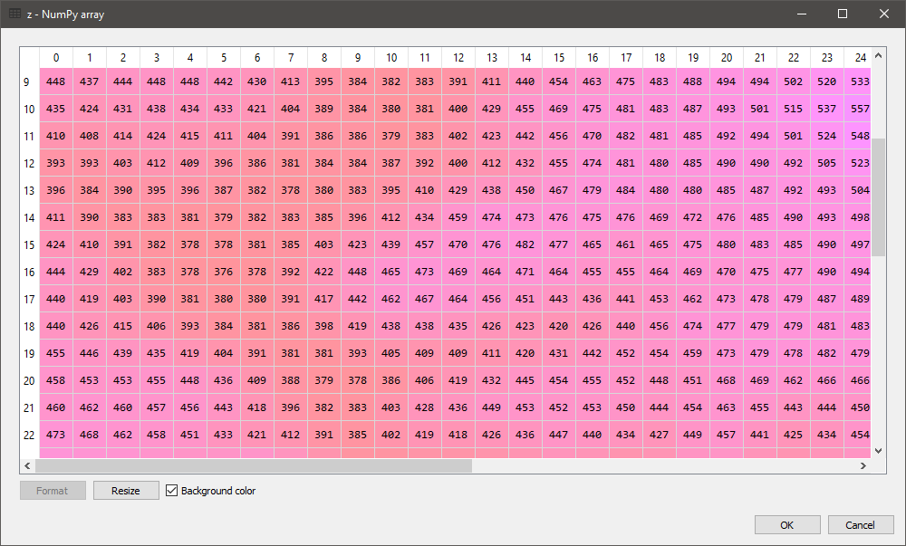
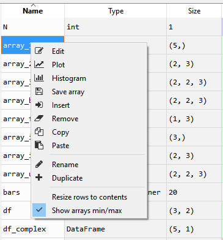
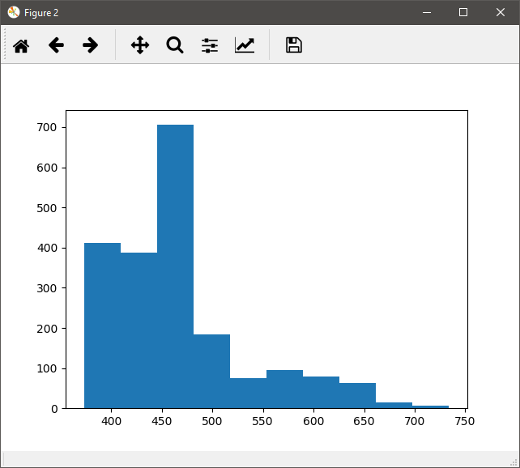
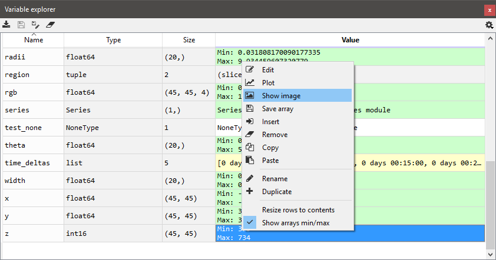
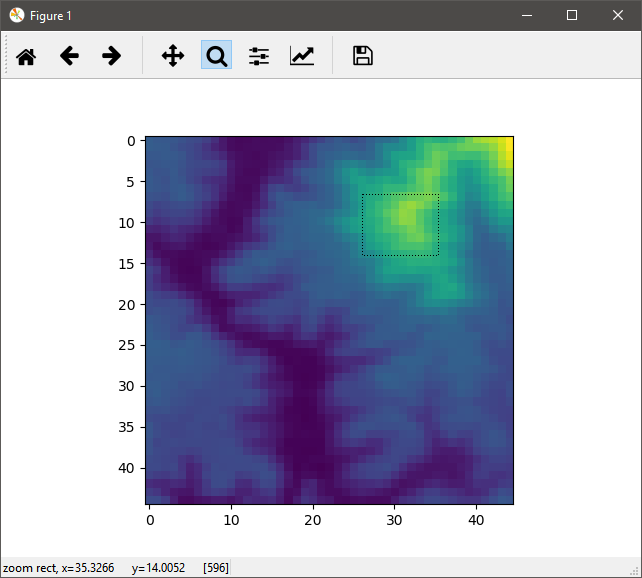

Variable Explorer
=================

The variable explorer shows the namespace contents (i.e. all global object
references) of the current console

|

The following screenshots show some interesting features such as editing
lists, strings, dictionaries, NumPy arrays, or plotting/showing NumPy arrays
data.

|

|

|

|

|

|contextmenu| |histogram|

|

|

Supported types
---------------

The variable explorer can't show all types of objects. The ones currently
supported are:

#. `Pandas` DataFrame, TimeSeries and Index objects
#. `NumPy` arrays and matrices
#. `PIL/Pillow` images
#. `datetime` dates
#. Integers
#. Floats
#. Complex numbers
#. Lists
#. Sets
#. Dictionaries
#. Tuples
#. Strings

Related plugins:

* :doc:`ipythonconsole`
