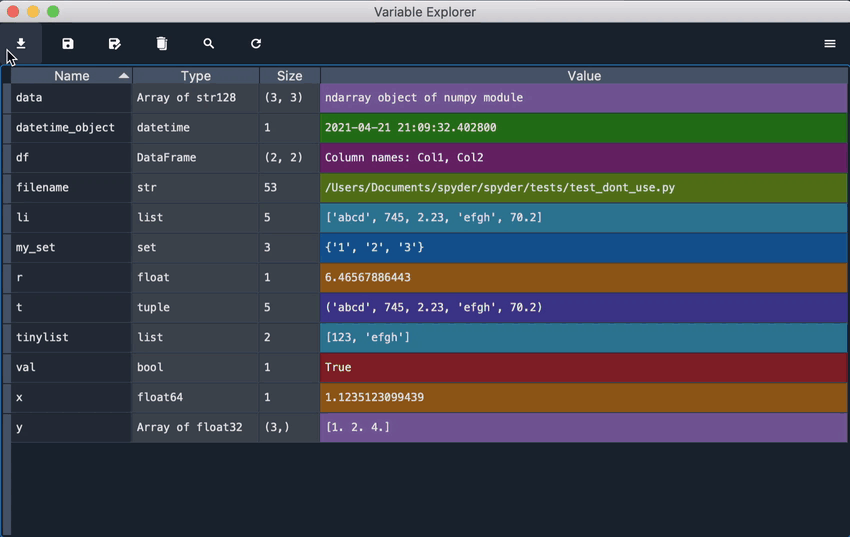
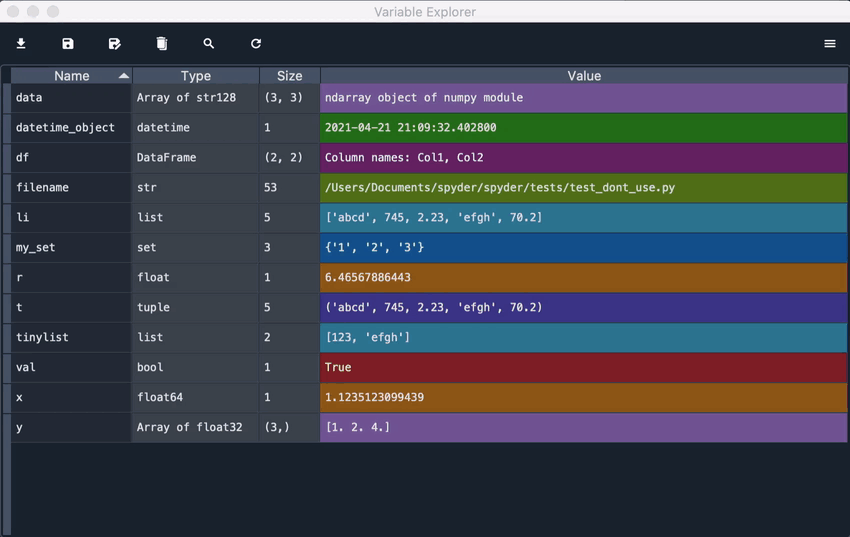
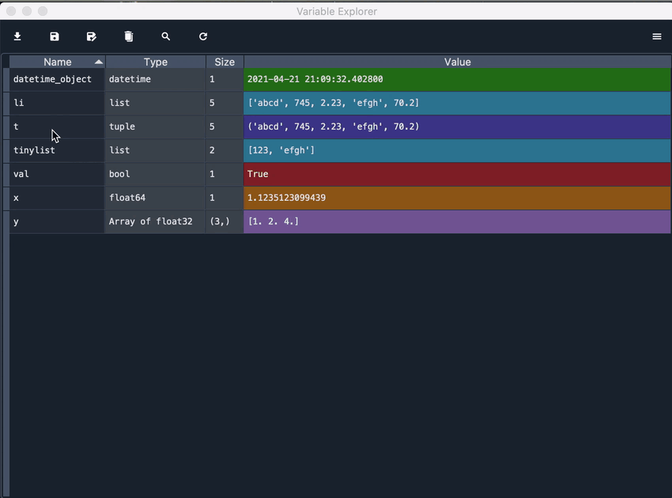

#################
Variable Explorer
#################

The **Variable Explorer** allows you to view and manage interactively the variables previously generated after code execution in the IPython Console. 

.. image:: images/variable_explorer/variable-explorer-standard.png
   :align: center
   :alt: Spyder Variable Explorer, with a list of variables and their contents

|

It shows the namespace contents (all global object references, such as variables, class instances, etc.) of the currently selected :doc:`ipythonconsole` session, and allows you to modify their value, add more values or delete them through a variety of GUI-based editors.

.. image:: images/variable_explorer/variable-explorer-execution.gif
   :align: center
   :alt: Spyder Variable Explorer execution with a variable of type list

|

The Variable Explorer gives you information on the name, size, type and value of each one of the variables. To modify the value of one of them, you can double click it in the pane and write its new value.

.. image:: images/variable_explorer/variable-explorer-modifying.gif
   :align: center
   :alt: Spyder Variable Explorer modifying value of a variable 

|

==============
Object Viewers
==============

Spyder's :guilabel:`Variable Explorer` offers built in support for editing lists, strings, dictionaries, NumPy arrays, Pandas DataFrames and Series, and more, and can also plot them, or even display some as an RGB image. Several examples of this functionality are shown below:

|

~~~~~~~
Strings
~~~~~~~

When a string variable is longer than forty characters, you can double click it to see its value in a text editor where you can modify it.

.. image:: images/variable_explorer/variable-explorer-text-long.png
   :align: center
   :alt: Variable Explorer text editor, displaying a long string in a window

|

~~~~~~~~~~~~
Dictionaries
~~~~~~~~~~~~

When the type of a variable is a dictionary, double clicking it will show a viewer displaying each one of the keys of the dictionary along with its associated value. You can double click any of the values to modify it. 

.. image:: images/variable_explorer/variable-explorer-dictionary.png
   :align: center
   :alt: Dictionary editor displaying keys and their types, sizes, and values

|

~~~~~
Lists
~~~~~

For variables that are of type list, the Variable Explorer only displays the first ten values of the list. If you want to see them all, double click the variable to open a viewer that will display the index, type, size and value of each element of the list. You can also modify any value by double clicking it in the viewer and writing the new one.

.. image:: images/variable_explorer/variable-explorer-list.png
   :align: center
   :alt: List editor displaying a list, showing one being edited

|

~~~~~~~~~~~~
Numpy Arrays
~~~~~~~~~~~~

For Numpy Arrays, the Variable Explorer only shows some of their values. By double-clicking them, a viewer will be shown graphically displaying the array values in a "heat map", i.e. it displays each value in a colored box, depending on the size of the value. You can deactivate the background color by unchecking the option in the viewer. If the array is too large, the background color will be automatically deactivated.

.. image:: images/variable_explorer/variable-explorer-array-2D-resize.png
   :align: center
   :alt: Array editor with a 2D int array, displaying a "heatmap" of its values

|

If possible, you can also change the format of the values in the array, choosing the number of decimals that you want the array to display. For this, click the option format and in the new window that appears you can set the desired format, using ``printf`` formatting. For more information about this, please go to "https://docs.python.org/3/library/stdtypes.html#printf-style-bytes-formatting".

Additionally, you can adjust the size of the rows and columns of the array by expanding or contracting the column headers. Clicking the option Resize will bring the chart back to its default size.

.. image:: images/variable_explorer/variable-explorer-array-resize.gif
   :align: center
   :alt: Array editor with a 2D int array, showing resizing of columns
 

~~~~~~~~~~
DataFrames
~~~~~~~~~~

For DataFrames, same as Numpy Arrays, you can see their values in a viewer where you can deactivate background color, change the format and resize the rows and columns of the table in which information is displayed. 

.. image:: images/variable_explorer/variable-explorer-dataframe.png
   :align: center
   :alt: Dataframe editor showing data frame "heatmap"

|

============
Options Menu
============

The options menu on the top right of the Variable Explorer allows you to control what you are able to see in it. 

.. image:: images/variable_explorer/variable-explorer-menu.png
   :align: center
   :alt: Spyder Variable Explorer, with options menu

|

It also allows you to show the min and max values of Numpy arrays, instead of its values.

.. image:: images/variable_explorer/variable-explorer-array-min&max.png
   :align: center
   :alt: Variable Explorer showing max and min values of numpy array

|

===============
Toolbar Options
===============

On top of the Variable Explorer, you can find the toolbar options, which allow other interactions with the variables in the explorer. For example, you can save the data in the Variable Explorer as a file with spydata extension, which can be later imported to recover all the variables stored.

|

You will also find the option to remove all variables from the Variable Explorer and the option to search variables by its name or type, filtering according to the text entered in the search box.

.. image:: images/variable_explorer/variable-explorer-search.gif
   :align: center
   :alt: Variable Explorer showing how to search variables

|

Finally you will find an option to refresh the Variable Explorer while running code in the IPython console.

(MISSING GIF)

================
Advanced Options
================

You can also get an additional menu of options by right clicking on top of any of the variables. Through this menu, you can rename, remove or edit any variable. You can also make a copy of it by clicking the option "duplicate", which will open a dialog box in which you can write the name of the new copy of this variable.

| 

Besides, you can copy and paste the value of a variable, saving it in the Variable Explorer with any name that you choose. This allows you to change the type of the variable that you are pasting which turns out to be really useful, for example if you want to copy the elements of a list into an array.

| 

Additionally, you can create a variable from zero directly in the Variable Explorer by clicking the option Insert, which allows you to write the key (which should be in quotation marks) and the value for the variable that you want to insert.

.. image:: images/variable_explorer/variable-explorer-insert.gif
   :align: center
   :alt: Variable Explorer showing insertion of a new variable

| 

For lists and Numpy arrays, you will find more advanced options which include plotting or making a histogram using the data of the variable.

.. image:: images/variable_explorer/variable-explorer-histogram.png
   :align: center
   :alt: Plot window showing a histogram, generated via the previous options

|

.. image:: images/variable_explorer/variable-explorer-plot.png
   :align: center
   :alt: Plot window showing a plot, generated via the previous options

|

You can save an array in disk too, in a file with npy extension, by clicking the option on this menu. 

.. image:: images/variable_explorer/variable-explorer-contextmenu-array.png
   :align: center
   :alt: Context menu for an int array, with the Show image option selected

|

In the case of two-dimensional arrays, you can also show an image representing pixels using the numbers of the array as RGB values. For this, Spyder uses Matplotlib's colormaps, which can be easily changed according to your own preferences. To learn how to do this, you can go to "https://matplotlib.org/3.1.0/tutorials/colors/colormaps.html"

.. image:: images/plot-window/plot-window-show-image.png
   :align: center
   :alt: Plot window showing an interactive image based on the array's data

|

~~~~~~~~~~~~~~~~~~
Related components
~~~~~~~~~~~~~~~~~~

* :doc:`debugging`
* :doc:`ipythonconsole`
