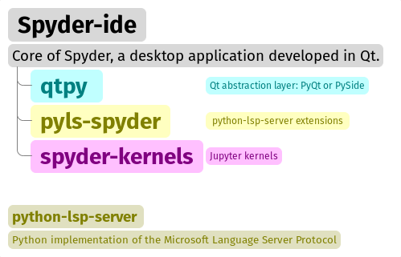
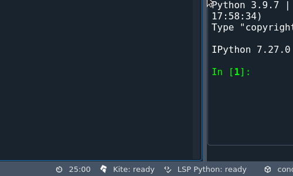
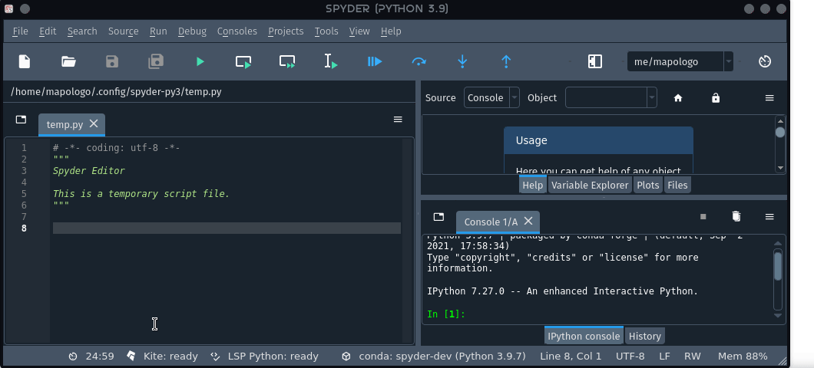
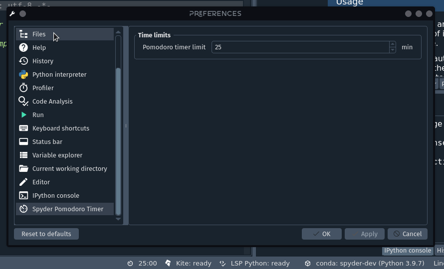

##############################
Plugin Development with Spyder
##############################

This workshop consists of a review of the features and possibilities of the API offered by `Spyder`_ 5, the recently released version of our favorite IDE for Scientific Python, to develop plugins to extend its functionality.

As a practical exercise, we will develop a simple plugin that incorporates a configurable pomodoro timer in the status bar and some toolbar buttons to interact with it.

.. _Spyder: https://www.spyder-ide.org

=============
Prerequisites
=============

You will need to have Spyder installed. Visit our :doc:`installation guide<../installation>` for more information.

.. important::

   Spyder now offers :ref:`standalone_installers_ref` for Windows and macOS, making it easier to get up and running with the application without having to download Anaconda or manually install it in your existing environment.
   However, readers of this workshop should install Spyder using Anaconda or Miniconda, as standalone installers currently do not allow to add extra packages like the plugin we are going to develop in this workshop.

It is also desirable to have the following prior knowledge:

* Basic level of Python. You can visit `The Python Tutorial`_ to learn the basics of this programming language.
* Know the basics of Qt application development using Python, either with `PyQT`_ or `PySide`_.

To quickly get started in desktop application development with Qt and Python here is a set of open access resources:

* `Tutorials Point - PyQt tutorial`_
* `Real Python - PyQt entries`_
* `Guru99 - PyQt tutorial`_
* `Python GUIs - PyQt and PySide tutorials`_

.. _The Python Tutorial: https://docs.python.org/3/tutorial/
.. _PyQt: https://www.riverbankcomputing.com/static/Docs/PyQt5/
.. _PySide: https://doc.qt.io/qtforpython-5/index.html
.. _Tutorials Point - PyQt tutorial: https://www.tutorialspoint.com/pyqt/index.htm
.. _Real Python - PyQt entries: https://realpython.com/search?q=pyqt
.. _Guru99 - PyQt tutorial: https://www.guru99.com/pyqt-tutorial.html
.. _Python GUIs - PyQt and PySide tutorials: https://www.pythonguis.com/

==============
Learning Goals
==============

By the end of this workshop participants will know:

* The basics to develop plugins for Spyder, and get a general idea of its inner workings.
* What types of plugins can be developed with Spyder.
* The structure of a plugin and the functionality of each component and how it connects to Spyder to extend its features.
* How to package and publish our plugin so that it can be easily installed and used by others.

=====================
Spyder for developers
=====================

The best place to find information about contributing to Spyder or developing for Spyder is its Github repository, in particular the `contribution guide`_.

* The core of **Spyder** is `Spyder-IDE`_ , a desktop application developed in *Qt*, which requires for its operation two packages with it is closely related (and without which it cannot work): *spyder-kernels* and *python-lsp-server*.

* `Qt`_ is an open source multiplatform widget toolkit for creating native graphical user interfaces. Qt is a very complete development framework that offers utilities for building applications, and has extensions for Networking, Bluetooth, Charts, 3D rendering, Navigation (as GPS), among others.

* Spyder uses `qtpy`_ which is an abstraction layer that allows you to work with Qt from Python regardless of whether you use either of the two reference libraries: PyQt or PySide.

* `spyder-kernels`_ provide Jupyter kernels to Spyder, for use within its consoles.

.. important::

   Spyder is currently developed in such a way that most of its features are implemented as plugins.

.. _contribution guide: https://github.com/spyder-ide/spyder/blob/master/CONTRIBUTING.md
.. _Qt: https://www.qt.io/
.. _qtpy: https://github.com/spyder-ide/qtpy
.. _spyder-kernels: https://github.com/spyder-ide/spyder-kernels
.. _pyls-spyder: https://github.com/spyder-ide/pyls-spyder
.. _python-lsp-server: https://github.com/python-lsp/python-lsp-server

=========================================
Types of plugins we can develop in Spyder
=========================================

.. image:: images/workshop-3/pd_spyder_plugins.png
   :alt: Types of Spyder plugins.

.. note::

    A plugin is a component that adds functionality to an application, it can be a graphical component, for example, to display maps, or a non-graphical one that adds additional syntax coloring schemes.

Formally, plugins are instances of Qt classes that modify the behavior of Spyder.
Aside from a few fundamental components, most of Spyder's functionality arises from the interaction of plugins of two types:

SpyderDockablePlugin
~~~~~~~~~~~~~~~~~~~~

It is a plugin that works as a `QDockWidget`_, this is a Qt class that provides a graphical control that can be docked inside a `QMainWindow`_ or floated as a top-level window on the desktop.

.. _QDockWidget: https://doc.qt.io/archives/qtforpython-5.12/PySide2/QtWidgets/QDockWidget.html
.. _QMainWindow: https://doc.qt.io/archives/qtforpython-5.12/PySide2/QtWidgets/QMainWindow.html

SpyderPluginV2
~~~~~~~~~~~~~~

``SpyderPluginV2`` is a plugin that does not create a new dock widget on Spyder's main window. In fact, ``SpyderPluginV2`` is the parent class of ``SpyderDockablePlugin``.

Discovering Spyder plugins
~~~~~~~~~~~~~~~~~~~~~~~~~~

.. topic:: ``SpyderDockablePlugin``

   If we look at the Spyder interface, we can find a number of different panes on the right side (with the default layout), such as *Help*, *Variable Explorer*, *Plots*, *Files* and *History*.

   * Each of these panes is a ``SpyderDockablePlugin`` that offers an *Undock* option by clicking the hamburger menu button in the upper right corner.

   * These plugins can also be hidden or shown via their entry in the *View > Panes* menu, or using its corresponding keyboard shortcut displayed there.

.. topic:: ``SpyderPluginV2``

   High-level interface elements that do not offer an undocking option are basically instances of ``SpyderPluginV2``. These are typically used to handle more abstract functionality.

   * Examples of this are the *appearance* and *layout* plugins that manage Spyder's code color schemes and window layouts respectively.

   * Other examples of this type of plugins are the *main menu* and keyboard *shortcuts*. Some graphical elements, such as the main toolbar and the status bar are also instances of the ``SpyderPluginV2`` class.

================
What will we do?
================

Our practical work will consist in the implementation of the Pomodoro technique for time management in the Spyder interface.

.. image:: images/workshop-3/pd_pomodoro_timer.png
   :alt: Description of the pomodoro technique.

.. note::

   The `Pomodoro Technique`_, designed by Francesco Cirillo, is a time management practice used to increase your focus and productivity when trying to complete assignments or meet deadlines.
   Choosing to use a Pomodoro Timer can help to give a task your full, undivided attention.

The typical process of the Pomodoro Technique consists of the following six
steps:

1. Choose a task to be done.
2. Set the Pomodoro Timer (default is 25 minutes).
3. Work only on that task until the timer ends.
4. When the timer rings, put a checkmark on a piece of paper, this is called "a pomodoro".
5. If you have less than 3 checkmarks take a short break (by default, 5 minutes), and return to step 2.
6. When you have completed four Pomodoro cycles, you deserve a longer break (our default is 15 minutes). Checkmarks are reset to zero, go back to step 1.

.. _Pomodoro Technique: https://francescocirillo.com/pages/pomodoro-technique

Steps
~~~~~

These are the general steps that we will be following throughout this workshop:

* Select the most suitable plugin type and create its initial structure using `cookiecutter`_.
* Install the plugin in development mode in the virtual environment from which we run Spyder.
* Implement the functionality of our plugin using the Spyder classes and following the guidelines indicated in the plugin structure.
* Build a configuration page for our plugin, which would appear in Tools > Preferences.

.. figure:: images/workshop-3/pd_spyder_wireframe.png
   :alt: Location of Spyder Pomodoro Timer widgets in Spyder.

   Location of Spyder Pomodoro Timer widgets in Spyder.

.. figure:: images/workshop-3/pd_preferences_wireframe.png
   :alt: Spyder Pomodoro Timer in the preferences window.

   Spyder Pomodoro Timer in the preferences window.

Features
~~~~~~~~

A minimal planning to organize ideas.

* Pomodoro Timer

  - Status bar widget: to display the time for the current pomodoro interval.
  - State: we have three activity states: *pomodoro*, *short-break* and *long-break*. We can show a message (with `QMessageBox`_) to tell users that the time to take a break has arrived.
  - Interactions: the user could use Start, Stop and Reset buttons to handle the Pomodoro Timer. This can be implemented adding `QAction`_ instances in a menu on the toolbar.

* Tasks Logger
  - Counter: We need a variable to count the number of pomodoros completed.

* Notifications

  - Dialog: Each time a pomodoro or break interval is completed, a message should appear to prompt the user to start working on a task or take a break.

  When working on a plugin for any system, we must check the data structures and functions available in that system that can facilitate our development.
  This involves spending considerable time understanding its inner workings.

.. _QTimer: https://doc.qt.io/archives/qtforpython-5.12/PySide2/QtCore/QTimer.html
.. _QToolButton: https://doc.qt.io/archives/qtforpython-5.12/PySide2/QtWidgets/QToolButton.html
.. _QAction: https://doc.qt.io/archives/qtforpython-5.12/PySide2/QtWidgets/QAction.html
.. _QLabel: https://doc.qt.io/archives/qtforpython-5.12/PySide2/QtWidgets/QLabel.html
.. _QLineEdit: https://doc.qt.io/archives/qtforpython-5.12/PySide2/QtWidgets/QLineEdit.html
.. _QMessageBox: https://doc.qt.io/archives/qtforpython-5.12/PySide2/QtWidgets/QMessageBox.html

================================
Set up a development environment
================================

In principle, we could use any Spyder installed within a `conda environment`_ according to the instructions given in the `installation guide`_.

However, if you use a working environment that has other dependencies and you want to keep your plugin development independent of them, it is recommended to create a new environment which only has Spyder with the minimum dependencies needed for your plugin.

.. image:: images/workshop-3/pd_dev_environment.png
   :alt: Spyder development environment.

We can install it in the following way:

.. code-block:: bash

   $ conda activate base
   $ conda install -c conda-forge mamba # A personal recommendation
   $ mamba create -n spyder-dev -c conda-forge python=3
   $ mamba activate spyder-dev
   $ mamba install spyder

.. note::

   * `Anaconda Individual Edition`_ is a Python distribution for data science and machine learning to be used in a single machine.
   * `Conda`_ is an Anaconda tool that manages virtual environments and their packages.
   * Conda can work with *channels* that allow the use of packages that are not part of the official distribution. The most important channel is `conda-forge`_, where a more extensive and updated list of packages than those offered by Anaconda Individual Edition are maintained.
   * Finally, `mamba`_, is an optimized implementation of conda's package management features, that resolves dependencies and installs packages much faster than conda.

.. _conda environment: https://conda.io/projects/conda/en/latest/user-guide/concepts/environments.html#virtual-environments
.. _installation guide: https://docs.spyder-ide.org/5/installation.html
.. _Anaconda Individual Edition: https://www.anaconda.com/products/individual
.. _Conda: https://docs.conda.io/en/latest/
.. _conda-forge: https://conda-forge.org/
.. _mamba: https://github.com/mamba-org/mamba

===================
Create a repository
===================

Now that we have our local virtual environment, it is good practice to manage our source code with a version control system, and the most widely used web service for this purpose is currently Github. Here you can find, for example, the Spyder and Python repositories.

.. image:: images/workshop-3/pd_github_repo.png
   :alt: Git and Github repository concepts.

To create a git repository on Github, we need to follow these steps:

#. Log in to your Github account.
#. Click on the "New repository" option in the "+" menu at the top right next to your profile picture.
#. A dialog will appear where you can insert the repository name and some basic options, e.g. to initialize the repository with a README or license files.
#. Click the “Create repository” button.
#. In the main window of the recently created repository, click on the green "Code" button an copy the clone link.
#. In your local command line run ``$ git clone [repo-link]``. You must have git installed and configured on your computer. If you don't have experience using git we recommend The Carpentries workshop `Version control with git`_.

A detailed description of `repository creation`_ could be found in the official Github documentation, and a `hello world`_ tutorial with basic git operations from the Github interface.

.. _Version control with git: https://swcarpentry.github.io/git-novice/
.. _repository creation: https://docs.github.com/en/get-started/quickstart/create-a-repo
.. _hello world: https://docs.github.com/en/get-started/quickstart/hello-world

=================
Let's get started
=================

We already have a git repository and a virtual environment where Spyder 5 is installed.

Let's activate our environment and go into the local folder of our repository.

.. code-block:: shell

   mamba activate spyder-dev
   cd /path/to/your/repository

Then we need to use ``cookiecutter`` to create the initial structure of our plugin. `cookiecutter`_ is a tool made in Python specifically designed to create project templates.
We have developed one of these templates to generate the basic structure of a plugin, it can be found at: https://github.com/spyder-ide/spyder5-plugin-cookiecutter

.. _cookiecutter: https://cookiecutter.readthedocs.io

.. image:: images/workshop-3/pd_plugin_structure.png
   :alt: Folder structure of our plugin.

Let's run cookiecutter to generate our

.. code-block:: shell

   $ cookiecutter https://github.com/spyder-ide/spyder5-plugin-cookiecutter
   You\'ve downloaded /home/mapologo/.cookiecutters/spyder5-plugin-cookiecutter before. Is it okay to delete and re-download it? [yes]:
   full_name [Spyder Bot]: Francisco Palm # It's your name, better John Doe
   email [spyder.python@gmail.com]: fpalm@qu4nt.com
   github_username [spyder-bot]: map0logo
   github_org [spyder-ide]:
   project_name [Spyder Boilerplate]: Spyder Pomodoro Timer
   project_short_description [Boilerplate needed to create a Spyder Plugin.]: A very simple pomodoro timer that shows in the status bar.
   project_pypi_name [spyder-pomodoro-timer]:
   project_package_name [spyder_pomodoro_timer]:
   pypi_username [map0logo]:
   Select plugin_type:
   1 - Spyder Dockable Plugin
   2 - Spyder Plugin
   Choose from 1, 2 [1]: 2
   Select open_source_license:
   1 - MIT license
   2 - BSD license
   3 - ISC license
   4 - Apache Software License 2.0
   5 - GNU General Public License v3
   6 - Not open source
   Choose from 1, 2, 3, 4, 5, 6 [1]: 1

The plugin structure
~~~~~~~~~~~~~~~~~~~~

After ``cookicutter`` finishes its job, you'll get the following tree structure in your repository

.. code-block:: bash

   .
   ├── [Some info files]
   ├── Makefile
   ├── setup.py
   ├── spyder_pomodoro_timer
   │   ├── __init__.py
   │   └── spyder
   │       ├── __init__.py
   │       ├── api.py
   │       ├── confpage.py
   │       ├── container.py
   │       ├── locale
   │       │   └── spyder_pomodoro_timer.pot
   │       ├── plugin.py
   │       └── widgets.py
   └── tests

In the root folder you'll find two important files:

* The Makefile, which has several useful commands:

.. code-block:: bash

   clean                remove all build, test, coverage and Python artifacts
   clean-build          remove build artifacts
   clean-pyc            remove Python file artifacts
   clean-test           remove test and coverage artifacts
   test                 run tests quickly with the default Python
   docs                 generate Sphinx HTML documentation, including API docs
   servedocs            compile the docs watching for changes
   release              package and upload a release
   dist                 builds source and wheel package
   install              install the package to the active Python's site-packages
   develop              install the package to the active Python's site-packages

* ``setup.py``, which helps you to install, package and distribute your plugin with ``setuptools``, the standard for distributing Python Modules.
  On this file the ``entry_points`` parameter of ``setup`` is quite important, as it is the one that allows Spyder to identify this package as a plugin, and to know how to access its functionalities.

The ``spyder-pomodoro-timer`` folder has the name you introduced when running ``cookiecutter``. Inside this you'll see a folder called ``spyder``, where we will place the code of our plugin.

In the ``spyder`` directory you'll find the following files:

* ``api.py``: where the functionality of the plugin is exposed to the rest of Spyder. That would allow additional functionality to be added from other plugins.

* ``plugin.py``: is the core of the plugin. Depending on the type of plugin we created, here you'll see an instance of ``SpyderDockablePlugin`` or ``SpyderPluginV2``.

  * If it is a ``SpyderPluginV2`` you should set a constant class named ``CONTAINER_CLASS`` with an instance of ``PluginMainContainer``.
  * If it is a ``SpyderDockablePlugin`` you should set a constant class named ``WIDGET_CLASS`` with an instance of ``PluginMainWidget``.

* ``container.py``: only used for ``SpyderPluginV2`` plugins. This file contains an instance of ``PluginMainContainer`` that holds a reference to all graphical elements (or widgets) that the plugin is going to add to the interface. This is necessary because Qt requires widgets to be children of other widgets before using them (otherwise they appear as floating windows). Since ``SpyderPluginV2`` is not a widget, we need a data structure (i.e. the container) that is a widget for that.

* ``widgets.py``: in this file we will add the graphical components of our plugin. If it is of type ``SpyderPluginV2`` and it does not have widgets, then it is not necessary.
  We can also place here the instance of ``PluginMainWidget`` necessary for ``SpyderDockablePlugin``, if we are developing that kind of plugin.

* ``confpage.py``: this is where you specify the configuration page that will be displayed in ``Preferences``, so that the user can adjust the options of our plugin.

=========================
Building our first plugin
=========================

From now on we will be building the plugin step by step. In the `spyder pomodoro timer repository`_ you will find the final version of the code for you to take a look at it, in case we are missing any detail.

.. _spyder pomodoro timer repository: https://github.com/map0logo/spyder-pomodoro-timer

Widgets
~~~~~~~

The best way to start building our plugin is by implementing its graphical components first in ``widgets.py``

Let's call the initial version, without any editing ``INITIAL``.
In `INITIAL`_, widgets.py is as follows:

.. code-block:: python

   # Spyder imports
   from spyder.api.config.decorators import on_conf_change
   from spyder.api.translations import get_translation

   from spyder.api.widgets.mixins import SpyderWidgetMixin

   # Localization
   _ = get_translation("spyder_pomodoro_timer.spyder")

.. hint::

   The preset imports are a guide to what we will need in our plugin. The ``on_conf_change`` decorator will allow us to propagate the changes in configuration. ``get_translation`` helps us to generate translation strings for the plugin and ``SpyderWidgetMixin`` adds to any widget the attributes and methods needed to integrate it with Spyder (icon, style, translation, actions and extra options).

When taking a look at the Spyder ``api`` module, we can find that in Spyder there are two types of predefined components for the status bar:

* ``StatusBarWidget``, a class derived from ``QWidget`` and ``SpyderWidgetMixin``, which contains an icon, a label and a spinner (to show the plugin loading).
* ``BaseTimerStatus``, a class derived from ``StatusBarWidget`` with an internal ``QTimer`` to periodically update its content.

.. note::

   Below, we will be indicating links in github with the diffs between the tags, this as an aid to check the progressive changes that will be made in the code.

The first version that we are going to reach after the first editions will be called ``HELLO WORLD``.

`INITIAL -> HELLO WORLD widgets.py diff`_

.. _INITIAL -> HELLO WORLD widgets.py diff: https://github.com/map0logo/spyder-pomodoro-timer/compare/v0.0.1-dev0...v0.0.2-dev0#diff-f156d182eb57c9fa20d1ca4b9677d13b158447c04f90724d936bb77a50df31bc

Since we want a widget that shows the pomodoro countdown and is periodically updated, we will use a ``BaseTimerStatus`` instance.

So, we can substitute

.. code-block:: python

   from spyder.api.widgets.mixins import SpyderWidgetMixin

with

.. code-block:: python

   from spyder.api.widgets.status import BaseTimerStatus
   from spyder.utils.icon_manager import ima

Add an initial import:

.. code-block:: python

   # Third party imports
   import qtawesome as qta

With that, we can write our first widget like this

.. code-block:: python

   class PomodoroTimerStatus(BaseTimerStatus):
       """Status bar widget to display the pomodoro timer"""

       ID = "pomodoro_timer_status"
       CONF_SECTION = "spyder_pomodoro_timer"

       def __init__(self, parent):
           super().__init__(parent)
           self.value = "25:00"

       def get_tooltip(self):
           """Override api method."""
           return "I am the Pomodoro timer!"

       def get_icon(self):
           return qta.icon("mdi.av-timer", color=ima.MAIN_FG_COLOR)

.. hint::

    Spyder needs ``ID`` to be defined for ``BaseTimerStatus``. Its constructor calls the parent class constructor and initializes the label with ``value``.

We add a tooltip to verify the presence of our widget. Since Spyder uses ``qtawesome`` (another of our projects that eases the incorporation of iconic fonts into PyQt applications), we can select an appropriate icon by running the ``qta-browser`` command on a terminal.

.. code-block:: bash

   (spyder-dev) $ qta-browser

From here we can select and copy the name of the icon of our preference.

.. image:: images/workshop-3/pd_qta-browser_timer.png
   :alt: qta browser dialog

To finish the implementation of our widget, we need to add the following method:

.. code-block:: python

   # ---- BaseTimerStatus API
   def get_value(self):
       """Get current time of the timer"""

       return self.value

``BaseTimerStatus`` requires this method to be implemented to update its content every time it is requested by the internal timer.

The container
~~~~~~~~~~~~~

The next step in the development of our plugin is to create an instance of the widget we wrote above, so we can add it to Spyder's status bar. For that, we need to use a container. Due to Qt specifics, we need an instance of ``QWidget`` (the container) to be the parent of all other widgets part of our plugin (as mentioned above).

Thus, the `COOKIECUTTER`_ version of ``container.py`` is:

.. code-block:: python

   from spyder.api.config.decorators import on_conf_change
   from spyder.api.translations import get_translation
   from spyder.api.widgets.main_container import PluginMainContainer

   _ = get_translation("spyder_pomodoro_timer.spyder")

   class SpyderPomodoroTimerContainer(PluginMainContainer):

       # Signals

       # --- PluginMainContainer API
       # ------------------------------------------------------------------------
       def setup(self):
           pass

       def update_actions(self):
           pass

`INITIAL -> HELLO WORLD container.py diff`_

.. _INITIAL -> HELLO WORLD container.py diff: https://github.com/map0logo/spyder-pomodoro-timer/compare/v0.0.1-dev0...v0.0.2-dev0#diff-cd6991f5ce0c63fdcbdc3ae3f5d9ac1f685ebc59c5517d5208e85ff30e3da050

In this case ``SpyderPomodoroTimerContainer`` is already defined, and we must implement the ``setup`` and ``update_actions`` methods.

Now we are going to add the widget created earlier to the container. To do so, first we need to import the widget.

.. code-block:: python

   # Local imports
   from spyder_pomodoro_timer.spyder.widgets import PomodoroTimerStatus

Then we edit the ``setup`` method to add an instance of our widget.

.. code-block:: python

       def setup(self):
           # Widgets
           self.pomodoro_timer_status = PomodoroTimerStatus(self)

Plugin
~~~~~~

Finally, we define our plugin so that it is registered within Spyder.
The `INITIAL`_ version (i.e. the one created by cookiecutter)  for ``plugin.py`` is:

* Imports:

.. code-block:: python

    # Third-party imports
    from qtpy.QtGui import QIcon

    # Spyder imports
    from spyder.api.plugins import Plugins, SpyderPluginV2
    from spyder.api.translations import get_translation

    # Local imports
    from spyder_pomodoro_timer.spyder.confpage import SpyderPomodoroTimerConfigPage
    from spyder_pomodoro_timer.spyder.container import SpyderPomodoroTimerContainer

    _ = get_translation("spyder_pomodoro_timer.spyder")

* Plugin class:

.. code-block:: python

    class SpyderPomodoroTimer(SpyderPluginV2):
        """
        Spyder Pomodoro Timer plugin.
        """

        NAME = "spyder_pomodoro_timer"
        REQUIRES = []
        OPTIONAL = []
        CONTAINER_CLASS = SpyderPomodoroTimerContainer
        CONF_SECTION = NAME
        CONF_WIDGET_CLASS = SpyderPomodoroTimerConfigPage

        # --- Signals

        # --- SpyderPluginV2 API
        # ------------------------------------------------------------------------
        def get_name(self):
            return _("Spyder Pomodoro Timer")

        def get_description(self):
            return _("A very simple pomodoro timer")

        def get_icon(self):
            return QIcon()

        def register(self):
            container = self.get_container()
            print('SpyderPomodoroTimer registered!')

        def check_compatibility(self):
            valid = True
            message = ""  # Note: Remember to use _("") to localize the string
            return valid, message

        def on_close(self, cancellable=True):
            return True

`INITIAL -> HELLO WORLD plugin.py diff`_

.. _INITIAL -> HELLO WORLD plugin.py diff: https://github.com/map0logo/spyder-pomodoro-timer/compare/v0.0.1-dev0...v0.0.2-dev0#diff-1e1feff1c9cd8690a64077ba61b59db060cae1212f9da8ce0522d3e027d09b0d

First, we need to declare the dependencies of our plugin, by defining the ``REQUIRES`` class constant. Since we're going to add a status bar widget, we require the ``StatusBar`` plugin, as shown below.

.. code-block:: python

       REQUIRES = [Plugins.StatusBar]

Then we need to set the icon for our plugin. For that, we substitute

.. code-block:: python

   from qtpy.QtGui import QIcon

   # ...

and

.. code-block:: python

       def get_icon(self):
           return QIcon()

by

.. code-block:: python

   # Third-party imports
   import qtawesome as qta

   # Spyder imports
   from spyder.utils.icon_manager import ima

and

.. code-block:: python

       def get_icon(self):
           return qta.icon("mdi.av-timer", color=ima.MAIN_FG_COLOR)

Due to recent changes to the Spyder API, we need to add to the spyder imports

.. code-block:: python

   # Spyder imports
   from spyder.api.plugin_registration.decorators import on_plugin_available

and change,

.. code-block:: python

       def register(self):
           container = self.get_container()
           print('SpyderPomodoroTimer registered!')

to

.. code-block:: python

       def on_initialize(self):
           print("SpyderPomodoroTimer registered!")

       @on_plugin_available(plugin=Plugins.StatusBar)
       def on_statusbar_available(self):
           statusbar = self.get_plugin(Plugins.StatusBar)
           if statusbar:
               statusbar.add_status_widget(self.pomodoro_timer_status)

With these changes, Spyder will be aware of the presence of our plugin, and that this plugin adds a new widget to the status bar.

Finally, we add the following method to our plugin:

.. code-block:: python

   @property
   def pomodoro_timer_status(self):
       container = self.get_container()
       return container.pomodoro_timer_status

In this way, ``SpyderPomodoroTimer`` can access ``pomodoro_timer_status`` of ``SpyderPomodoroTimerContainer`` as if it were its own property.

In summary, we did the following:

.. image:: images/workshop-3/pd_plugin_build.png
   :alt: Basic structure of Pomodoro Timer Spyder plugin.

We created a widget, then we added it to the container, which is registered in the plugin through the ``CONTAINER_CLASS`` constant. In the plugin, we accessed the instance of that widget and added it to the status bar.

.. _INITIAL: https://github.com/map0logo/spyder-pomodoro-timer/tree/v0.0.1-dev0

======================
How to test our plugin
======================

Now it is time to see how our plugin looks in the Spyder interface.

From the root folder of our plugin, we activate the environment where Spyder is installed, and run:

.. code-block:: bash

   (base) $ mamba activate spyder-dev
   (spyder-dev) $ pip install -e .

Now we can see two outputs. The first one is shown in the command line:

.. code-block:: bash

   (spyder-dev) $ spyder
   SpyderPomodoroTimer registered!

And in Spyder you'll see our plugin in the status bar with the tooltip "I am the Pomodoro tooltip".

.. image:: images/workshop-3/pd_hello_world.png
   :alt: First version of our plugin

Keep in mind that every time we make a change to our code, it is necessary to restart Spyder so that the plugin is reloaded and we can check the changes.

====================
Enhancing our plugin
====================

From now on we are going to go into details of how things are implemented in Qt. So in case you have any doubts, the Qt documentation will be your best guide.
We created an annex to this workshop that quickly explains way the fundamental concepts of Qt for those in a hurry: :ref:`qt-fundamentals`

Timer updates
~~~~~~~~~~~~~

The first problem with our plugin is that its pomodoro timer is not being updated. To activate it we can use the ``QTimer`` in ``PomodoroTimerStatus``, which is present because it's an instance of ``BaseTimerStatus``.

The second version where the value in the status bar is updated is called ``TIMER``.

Let's go back to ``widgets.py`` and add this constant below the import lines (line 22).

`HELLO WORLD -> TIMER widgets.py diff`_

.. _HELLO WORLD -> TIMER widgets.py diff: https://github.com/map0logo/spyder-pomodoro-timer/compare/v0.0.2-dev0...v0.0.3-dev0

.. code-block:: python

   # --- Constants
   # ------ Time limits by default

   POMODORO_DEFAULT = 25 * 60 * 1000  # 25 mins in milliseconds
   INTERVAL = 1000

``POMODORO_DEFAULT`` is to set the pomodoro time limit in milliseconds, and ``INTERVAL`` to the timer update rate.

Now, in the ``__init__`` method of ``PomodoroTimerStatus`` we need to add:

.. code-block:: python

       # Actual time limits
       self.pomodoro_limit = POMODORO_DEFAULT
       self.countdown = self.pomodoro_limit

       self._interval = INTERVAL
       self.timer.timeout.connect(self.update_timer)
       self.timer.start(self._interval)

Up to this point, we created a default value (``POMODORO_DEFAULT``) for the timer duration during pomodoros; we added it to the ``pomodoro_limit`` attribute to be able to configure it; and with that value we initialized the ``countdown`` attribute that will be modified over time.
As for the update interval of the timer, we set it to to the value of ``INTERVAL``, which corresponds to 1 second (one thousand milliseconds).

The function of ``self.timer`` is to update our timer periodically. This is done through the method ``timeout.connect()``, to which we pass as parameter the reference to the ``update_timer`` function that will perform the required adjustments.

Now let's implement ``update_timer`` at the end of the file:

.. code-block:: python

       def display_time(self):
           """Calculate the time that should be displayed."""

           minutes = int((self.countdown / (1000 * 60)) % 60)
           seconds = int((self.countdown / 1000) % 60)
           return f"{minutes:02d}:{seconds:02d}"

       def update_timer(self):
           """Updates the timer and the current widget. Also, update the
           task counter if a task is set."""

           if self.countdown > 0:
               # Update the current timer by decreasing the current running time by one second
               self.countdown -= INTERVAL
               self.value = self.display_time()

Here we rely on the ``display_time`` method that converts the current ``countdown`` value, which is measured in milliseconds, into a human-readable format. And ``update_timer`` simply keeps updating the countdown until it reaches zero.

If we run Spyder again we will find that our timer has come to life.

==============
Timer controls
==============

Now we need a way to control our timer. We can achieve this by adding some buttons to Spyder's toolbar, which will be useful to learn how to work with toolbars, menus and actions in Spyder.

PomodoroTimerToolbar
~~~~~~~~~~~~~~~~~~~~

The next version where actions are added to the toolbar is called ``ACTIONS``.

`TIMER -> ACTIONS widgets.py diff`_

.. _TIMER -> ACTIONS widgets.py diff: https://github.com/map0logo/spyder-pomodoro-timer/compare/v0.0.3-dev0...v0.0.4-dev0#diff-f156d182eb57c9fa20d1ca4b9677d13b158447c04f90724d936bb77a50df31bc

Let's go back to ``widgets.py`` and import the Spyder application toolbar class:

.. code-block:: python

   from spyder.api.widgets.toolbars import ApplicationToolbar

And create an instance of it by adding the following code before the definition of ``PomodoroTimerStatus``:

.. code-block:: python

   class PomodoroTimerToolbar(ApplicationToolbar):
       """Toolbar to add buttons to control our timer."""

       ID = 'pomodoro_timer_toolbar'

As you can see, this statement is very simple. It only needs to declare an ``ID``, that serves to identify our toolabr among the rest.

It is possible to include other Qt widgets in our toolbar, but in this case it's better to use the appropriate Spyder methods for that in order to maintain their relationship with the rest of the application. In other words, as long as the widget you need exists in ``spyder.api.widgets``, use it!

Next, we need to declare a boolean variable in our status widget to indicate if the countdown is paused or not. For that, let's add the following inside the ``__init__`` method of ``PomodoroTimerStatus``:

.. code-block:: python

   self.pause = True

And inside the ``update_timer`` method, substitute

.. code-block:: python

           if self.countdown > 0:
               ...

by

.. code-block:: python

           if self.countdown > 0 and not self.pause:
               ...

Create the Pomodoro Toolbar
~~~~~~~~~~~~~~~~~~~~~~~~~~~

Now we are going to create a new section in our toolbar and associate some functionality to it by means of actions. This particular information is recommended to be included in the ``api.py`` file because this way we can offer endpoints to the rest of Spyder and new plugins for tweaking the behavior of our plugin.

`TIMER -> ACTIONS api.py diff`_

.. _TIMER -> ACTIONS api.py diff: https://github.com/map0logo/spyder-pomodoro-timer/compare/v0.0.3-dev0...v0.0.4-dev0#diff-8b754f536d1a4dce97591575bff0afd8b9f72c8fd3514886cb998ee288615686

Let's add the following to the end of ``api.py``:

.. code-block:: python

   class PomodoroToolbarActions:
       Start = 'start_timer'
       Pause = 'pause_timer'
       Stop = 'stop_timer'

   class PomodoroToolbarSections:
       Controls = "pomodoro_timer"

   class PomodoroMenuSections:
       Main = "main_section"

With these we are telling the rest of Spyder, and our own plugin, that we are going to have a new toolbar section called "pomodoro_timer". This section will consist of a button containing a menu (with a single section "main_section") and actions identified as "start_timer", "pause_timer" and "stop_timer", to start, pause and stop (resetting) our timer, respectively.

Note that these are simple class definitions with class constants, to ease the encapsulation and exchange of this information in a simple way.

Add actions to the toolbar
~~~~~~~~~~~~~~~~~~~~~~~~~~

`TIMER -> ACTIONS container.py diff`_

.. _TIMER -> ACTIONS container.py diff: https://github.com/map0logo/spyder-pomodoro-timer/compare/v0.0.3-dev0...v0.0.4-dev0#diff-cd6991f5ce0c63fdcbdc3ae3f5d9ac1f685ebc59c5517d5208e85ff30e3da050

Now let's go to ``container.py``, where we are going to implement the behavior of our new toolbar and its actions.
In this case, we are not going to specify the internal behavior of our plugin, but the relationship between its widgets and other areas of Spyder, so it is more convenient to do it in the container.

As we did with ``PomodoroTimerStatus``, we are going to use ``qtawesome`` icons for our actions. For this purpose, let's add at the beginning of our imports:

.. code-block:: python

   # Third party imports
   import qtawesome as qta
   from qtpy.QtWidgets import QToolButton

We also imported ``QToolButton`` because it will be used to set the button that we will add in our toolbar.

At the end of the Spyder imports we also need:

.. code-block:: python

   from spyder.utils.icon_manager import ima

Now, let's include ``PomodoroTimerToolbar`` and the actions and sections we just declared in ``api.py`` in our local imports:

.. code-block:: python

   from spyder_pomodoro_timer.spyder.widgets import (
       PomodoroTimerStatus,
       PomodoroTimerToolbar,
   )
   from spyder_pomodoro_timer.spyder.api import (
       PomodoroToolbarActions,
       PomodoroToolbarSections,
       PomodoroMenuSections,
   )

Next, we need to do following things in the ``setup`` method of ``SpyderPomodoroTimerContainer``.

The first one is to create an instance of the toolbar class we declared earlier:

.. code-block:: python

           title = _("Pomodoro Timer Toolbar")
           self.pomodoro_timer_toolbar = PomodoroTimerToolbar(self, title)

The second one is to create the actions corresponding to Start, Pause and Stop our pomodoro timer:

.. code-block:: python

           # Actions
           start_timer_action = self.create_action(
               PomodoroToolbarActions.Start,
               text=_("Start"),
               tip=_("Start timer"),
               icon=qta.icon("fa.play-circle", color=ima.MAIN_FG_COLOR),
               triggered=self.start_pomodoro_timer,
           )

           pause_timer_action = self.create_action(
               PomodoroToolbarActions.Pause,
               text=_("Pause"),
               tip=_("Pause timer"),
               icon=qta.icon("fa.pause-circle", color=ima.MAIN_FG_COLOR),
               triggered=self.pause_pomodoro_timer,
           )

           stop_timer_action = self.create_action(
               PomodoroToolbarActions.Stop,
               text=_("Stop"),
               tip=_("Stop timer"),
               icon=qta.icon("fa.stop-circle", color=ima.MAIN_FG_COLOR),
               triggered=self.stop_pomodoro_timer,
           )

The third one is to create the menu that will contain our actions and add them to it.

.. code-block:: python

           self.pomodoro_menu = self.create_menu(
               "pomodoro_timer_menu",
               text=_("Pomodoro timer"),
               icon=qta.icon("mdi.av-timer", color=ima.MAIN_FG_COLOR),
           )

           # Add actions to the menu
           for action in [start_timer_action, pause_timer_action, stop_timer_action]:
               self.add_item_to_menu(
                   action,
                   self.pomodoro_menu,
                   section=PomodoroMenuSections.Main,
               )

The fourth one is to create a button that will contain the menu and configure it as ``PopupMode``, so that it is displayed when clicked.

.. code-block:: python

           self.pomodoro_button = self.create_toolbutton(
               "pomodoro_timer_button",
               text=_("Pomodoro timer"),
               icon=qta.icon("mdi.av-timer", color=ima.MAIN_FG_COLOR),
           )

           self.pomodoro_button.setMenu(self.pomodoro_menu)
           self.pomodoro_button.setPopupMode(QToolButton.InstantPopup)

And finally, the fifth one is to add the button to our toolbar:

.. code-block:: python

           # Add menu to toolbar
           self.add_item_to_toolbar(
               self.pomodoro_button,
               self.pomodoro_timer_toolbar,
               section=PomodoroToolbarSections.Controls,
           )

When creating the actions, we indicate by means of the ``triggered`` parameter the methods to be executed when they are activated, i.e. when the corresponding buttons on the toolbar are clicked.

We can insert these methods at the end of the ``SpyderPomodoroTimerContainer`` declaration, in the section that our cookiecutter template indicates as ``# --- Public API``.

.. code-block:: python

           def start_pomodoro_timer(self):
               """Start the timer."""
               self.pomodoro_timer_status.timer.start(1000)
               self.pomodoro_timer_status.pause = False

           def pause_pomodoro_timer(self):
               """Pause the timer."""
               self.pomodoro_timer_status.timer.stop()
               self.pomodoro_timer_status.pause = True

           def stop_pomodoro_timer(self):
               """Stop the timer."""
               self.pomodoro_timer_status.timer.stop()
               self.pomodoro_timer_status.pause = True
               self.pomodoro_timer_status.countdown = self.pomodoro_timer_status.pomodoro_limit

These methods simply manipulate the ``pause`` field of ``pomodoro_timer_status``, and in the case of ``stop_pomodoro_timer`` the countdown is restarted.

Register the toolbar
~~~~~~~~~~~~~~~~~~~~

`TIMER -> ACTIONS plugin.py diff`_

.. _TIMER -> ACTIONS plugin.py diff: https://github.com/map0logo/spyder-pomodoro-timer/compare/v0.0.3-dev0...v0.0.4-dev0#diff-1e1feff1c9cd8690a64077ba61b59db060cae1212f9da8ce0522d3e027d09b0d

A final mandatory step is to go to ``plugin.py`` and register this new toolbar component.

To do this, add ``Plugins.Toolbar`` to the plugin requirements:

.. code-block:: python

       REQUIRES = [Plugins.StatusBar, Plugins.Toolbar]

And use this plugin's API to add the toolbar we have created in the container to Spyder's toolbar.

.. code-block:: python

       @on_plugin_available(plugin=Plugins.Toolbar)
       def on_toolbar_available(self):
           container = self.get_container()
           toolbar = self.get_plugin(Plugins.Toolbar)
           toolbar.add_application_toolbar(container.pomodoro_timer_toolbar)

Review the changes
~~~~~~~~~~~~~~~~~~

The first thing we can notice is that we already have the corresponding buttons in the toolbar.

.. image:: images/workshop-3/pd_toolbar_actions.gif
   :alt: Pomodoro timer toolbar buttons

The strings that were entered as the ``tip`` parameter in the creation of the actions are shown here as the buttons' tooltips.

Also, if we check the menu "View > Toolbars", we find that there is a new entry there corresponding to our toolbar.

.. image:: images/workshop-3/pd_view_pomodoro_toolbar.png
   :alt: View > Toolbars menu with "Pomodoro Timer Toolbar" option.

Finally, let's check how the new Pomodoro Timer control buttons in the toolbar interact with the component in the status bar.

========================
Add a Configuration Page
========================

Another feature of Spyder plugins is that they can have configurable options that appear in Spyder's Preferences window.

Configuration defaults
~~~~~~~~~~~~~~~~~~~~~~

The final version in which we add a configurable parameter will be called ``CONFPAGE``.

The first step is to define what options we want to offer to our users. For this we must create a new file, which we can call ``conf.py``. In this file we will write the following:

`ACTIONS -> CONFPAGE config.py diff`_

.. _ACTIONS -> CONFPAGE config.py diff: https://github.com/map0logo/spyder-pomodoro-timer/compare/v0.0.4-dev0...v0.0.5-dev0#diff-c42d6af375b7edb0140c4c0ca179f249d3101baedd9c869269cf6755f52376b9

.. code-block:: python

   """Spyder terminal default configuration."""

   # --- Constants
   # ------ Time limits by default

   POMODORO_DEFAULT = 25 * 60 * 1000  # 25 mins in milliseconds

   CONF_SECTION = "spyder_pomodoro_timer"

   CONF_DEFAULTS = [
       (
           CONF_SECTION,
           {
               "pomodoro_limit": POMODORO_DEFAULT / (60 * 1000),
           },
       ),
       ("shortcuts", {"pomodoro-timer start/pause": "Ctrl+Alt+Shift+P"}),
   ]

We must highlight the declaration of ``CONF_SECTION``, which is the internal name of the section in Preferences corresponding to our plugin; and the dictionary keys associated with ``CONF_DEFAULTS``. In this case, we are indicating that ``pomodoro_limit`` is a configurable parameter within the ``spyder_pomodoro_timer`` section.

At the end of this file it is necessary to set another important constant, ``CONF_VERSION``, which must be updated when adding, removing or renaming configurable parameters in successive versions of the plugin.

.. code-block:: python

   # IMPORTANT NOTES:
   # 1. If you want to *change* the default value of a current option, you need to
   #    do a MINOR update in config version, e.g. from 1.0.0 to 1.1.0
   # 2. If you want to *remove* options that are no longer needed in our codebase,
   #    or if you want to *rename* options, then you need to do a MAJOR update in
   #    version, e.g. from 1.0.0 to 2.0.0
   # 3. You don't need to touch this value if you're just adding a new option
   CONF_VERSION = "1.0.0"

Note that we are moving the definition of ``POMODORO_DEFAULT`` from ``widgets.py`` to ``conf.py``, since we now have a dedicated place for default configuration values.

Configuration page
~~~~~~~~~~~~~~~~~~

Now, we need to build the page that will appear in the Preferences window. For this, we edit the ``confpage.py`` file generated by cokkiecutter as follows:

`ACTIONS -> CONFPAGE confpage.py diff`_

.. _ACTIONS -> CONFPAGE confpage.py diff: https://github.com/map0logo/spyder-pomodoro-timer/compare/v0.0.4-dev0...v0.0.5-dev0#diff-f6d15740b70da8d64979fb4e655d5363de0539ef44b58e9935d70ea60f386d3d

.. code-block:: python

   """
   Spyder Pomodoro Timer Preferences Page.
   """
   from qtpy.QtWidgets import QGridLayout, QGroupBox, QVBoxLayout
   from spyder.api.preferences import PluginConfigPage
   from spyder.api.translations import get_translation

   from spyder_pomodoro_timer.spyder.config import POMODORO_DEFAULT

   _ = get_translation("spyder_pomodoro_timer.spyder")

   class SpyderPomodoroTimerConfigPage(PluginConfigPage):

       # --- PluginConfigPage API
       # ------------------------------------------------------------------------
       def setup_page(self):
           limits_group = QGroupBox(_("Time limits"))
           pomodoro_spin = self.create_spinbox(
               _("Pomodoro timer limit"),
               _("min"),
               "pomodoro_limit",
               default=POMODORO_DEFAULT,
               min_=5,
               max_=100,
               step=1,
           )

           pt_limits_layout = QGridLayout()
           pt_limits_layout.addWidget(pomodoro_spin.plabel, 0, 0)
           pt_limits_layout.addWidget(pomodoro_spin.spinbox, 0, 1)
           pt_limits_layout.addWidget(pomodoro_spin.slabel, 0, 2)
           pt_limits_layout.setColumnStretch(1, 100)
           limits_group.setLayout(pt_limits_layout)

           vlayout = QVBoxLayout()
           vlayout.addWidget(limits_group)
           vlayout.addStretch(1)
           self.setLayout(vlayout)

This mostly corresponds to the regular code for user interfaces based on Qt widgets. In this case, our options section corresponds to a ``QGroupBox``, where the parameters are organized vertically using a ``QVBoxLayout``, and each parameter corresponds to a ``QGridLayout`` where labels and inputs are distributed (in this case a ``QSpinBox``).

Configuration pages in Spyder provide some helper methods to facilitate this work. For instance, ``create_spinbox`` allows to instantiate and initialize in a single step the widgets corresponding prefix an suffix labels together with the spinbox.

Propagate configuration changes
~~~~~~~~~~~~~~~~~~~~~~~~~~~~~~~

Since we moved all the configuration information to ``conf.py``, now we have to import it from there into ``widgets.py``.

`ACTIONS -> CONFPAGE widgets.py diff`_

.. _ACTIONS -> CONFPAGE widgets.py diff: https://github.com/map0logo/spyder-pomodoro-timer/compare/v0.0.4-dev0...v0.0.5-dev0#diff-f156d182eb57c9fa20d1ca4b9677d13b158447c04f90724d936bb77a50df31bc

.. code-block:: python

   # Local imports
   from spyder_pomodoro_timer.spyder.config import (
       CONF_SECTION,
       CONF_DEFAULTS,
       CONF_VERSION,
   )

Now we can access the configuration options from anywhere in our plugin using the ``get_conf`` method. In this case we use it to access the value of ``pomodoro_limit`` from the configuration instead of the constant ``POMODORO_DEFAULT``.

.. code-block:: python

           self.pomodoro_limit = self.get_conf(
               "pomodoro_limit"
           )

Now we can add a method that updates our configurable parameter ``pomodoro_limit``. The ``@on_conf_change`` decorator is the one in charge of capturing the signal that is generated when applying the change of a specific option.

.. code-block:: python

       @on_conf_change(option="pomodoro_limit")
       def set_pomodoro_limit(self, value):
           self.pomodoro_limit = int(value) * 1000 * 60
           self.countdown = self.pomodoro_limit
           self.value = self.display_time()

Registering preferences
~~~~~~~~~~~~~~~~~~~~~~~

Finally, it is necessary to activate the use of preferences in ``plugin.py``, by requiring the Preferences plugin

`ACTIONS -> CONFPAGE plugin.py diff`_

.. _ACTIONS -> CONFPAGE plugin.py diff: https://github.com/map0logo/spyder-pomodoro-timer/compare/v0.0.4-dev0...v0.0.5-dev0#diff-1e1feff1c9cd8690a64077ba61b59db060cae1212f9da8ce0522d3e027d09b0d

.. code-block:: python

   class SpyderPomodoroTimer(SpyderPluginV2):
       ...
       REQUIRES = [Plugins.Preferences, Plugins.StatusBar, Plugins.Toolbar]

and registering our plugin in a method with the decorator ``@on_plugin_available``.

.. code-block:: python

       @on_plugin_available(plugin=Plugins.Preferences)
       def on_preferences_available(self):
           preferences = self.get_plugin(Plugins.Preferences)
           preferences.register_plugin_preferences(self)

Now we can access the Preferences window either from the toolbar or from the "Tools > Preferences" menu. There we will find a section called *Spyder Pomodoro Timer* and inside it is the *Pomodoro timer limit* parameter. If we change that value, we will see how the corresponding label in the status bar changes.

Now your plugin is in an initial version ready to publish...

======================
Publishing your plugin
======================

Since the recommended way to install Spyder is through conda, the obvious choice would be to publish our plugin through a channel like conda-forge, but this is a task that is beyond the scope of this workshop due to its complexity.

However, the tools used to publish packages in conda are usually based on the packages published in PyPI. So let's see how to publish our plugin there.

.. image:: images/workshop-3/pd_plugin_publish.png
   :alt: Publish your plugin in PyPI.

PyPI and TestPyPI
~~~~~~~~~~~~~~~~~

The first thing we have to do is to create an account on the `PyPI`_ and `TestPyPI`_ websites. Although our package will be finally published in PyPI, it is advisable to use TestPyPI to test that our package can be published properly without generating additional load to the PyPI servers or affecting their logs.

Next, we need edit the ``setup.py`` file at the root of our project with our own data. Fortunately, cookiecutter created one for us.

To upload our package to PyPI we have to use a tool called `Twine`_ that makes this task much easier. And we can install it in our conda environment using:

.. code-block:: shell

   $ mamba install twine

Build and check the package
~~~~~~~~~~~~~~~~~~~~~~~~~~~

Before publishing our plugin we must package it. To do it we must write the following from the root folder of our project (where ``setup.py`` is placed):

.. code-block:: bash

   $ python setup.py sdist bdist_wheel

After that we will see that the following files are generated in the ``dist`` folder:

.. code-block:: bash

   spyder_pomodoro_timer
   └── dist
       ├── spyder_pomodoro_timer-0.0.1.dev0-py3-none-any.whl
       └── spyder-pomodoro-timer-0.0.1.dev0.tar.gz

On Linux and macOS we can check that the newly built distribution packages contain the expected files by inspecting the contents of the ``tar`` file:

.. code-block:: bash

   $ tar tzf dist/spyder-pomodoro-timer-0.0.1.dev0.tar.gz

You can also use ``twine`` to run a check on the created files in ``dist``:

.. code-block:: bash

   $ twine check dist/*
   Checking dist/spyder_pomodoro_timer-0.0.1.dev0-py3-none-any.whl: PASSED
   Checking dist/spyder-pomodoro-timer-0.0.1.dev0.tar.gz: PASSED

Upload to PyPI
~~~~~~~~~~~~~~

Now we can use twine to upload the distribution packages we have built. First, we will upload them to TestPyPI to make sure everything works:

.. code-block:: bash

   $ twine upload --repository-url https://test.pypi.org/legacy/ dist/*

This command will prompt you for the username and password with which you registered in TestPyPI.

If we open https://test.pypi.org/project/spyder-pomodoro-timer/ in the browser we will be able to see the package we have just published.

There we'll see that some details are missing, like the package description, and that our package is marked as ``Development Status 5-Stable``.

To fix the first one, we can follow the instructions in `Making a PyPI-friendly README`_. Since we already have a README file, we simply add the following lines to the beginning of our ``setup.py`` file:

.. code-block:: python

   # read the contents of your README file
   from pathlib import Path
   this_directory = Path(__file__).parent
   long_description = (this_directory / "README.md").read_text()

   setup(
       name="spyder-pomodoro-timer",
       # ...
       long_description=long_description,
       long_description_content_type='text/markdown'
   )

We can also change the classifiers of our package using the following site as a guide: https://pypi.org/classifiers. Here we can simply copy the classifiers we consider appropriate and then paste them into our code.
Specifically in ``setup.py``, within the list that enters as the ``classifier`` argument in the call to function ``setup``.

With these changes, and by bumping our plugin's version in the ``__init__.py`` file inside the ``spyder_pomodoro_timer`` folder, we can repeat the cycle of building a new version of our package, loading it into TestPyPI for checking, and finally loading it into PyPI by using:

.. code-block:: bash

   $ twine upload dist/

And check the result in https://pypi.org/project/spyder-pomodoro-timer/

Once this is done, anyone can install our plugin in their environments simply by running:

.. code-block:: bash

   $ pip install spyder-pomodoro-timer

.. _PyPI: https://pypi.org
.. _TestPyPI: https://test.pypi.org
.. _Twine: https://twine.readthedocs.io
.. _Making a PyPI-friendly README: https://packaging.python.org/guides/making-a-pypi-friendly-readme/

===========
Final words
===========

The possibility of making a tool extensible through plugins, extensions or addons, as they are usually called, is a fundamental feature that allows taking advantage of the talent of third-party developers to respond to needs and enhancements that are beyond the scope of the application's core development team.

Similarly, a plugin-based system makes the application much easier to maintain. Eventually, the ability to enable and disable plugins makes it more adaptable to different use cases. For instance, at present it would be inconceivable to think of a web browser that does not have extensions to block advertising or organize links, even if those features don't come by default on them.

In Spyder we have put special interest in consolidating an API that allows the development of plugins in a consistent way. The main focus of the development effort between versions 4 and 5 was in this direction and we are at a key moment where we expect to capitalize on all this work.

In this workshop you have learned how to:

- Identify the basic building blocks in Spyder development.
- Identify the different types of plugins that can be implemented in Spyder.
- Recognize the types of plugins that are part of Spyder.
- Plan the development of a new Spyder plugin.
- Build a development environment for Spyder plugin development.
- Generate the basic structure of a Spyder plugin using Cookiecutter.
- Understand the file structure of a Spyder plugin.
- Add and register Qt widgets in the Spyder status bar.
- Add and register Qt widgets in the Spyder toolbar.
- Add a menu with actions in the toolbar.
- Add configuration options to our plugin and display them appear in the Preferences window.
- Edit the description and classifiers of the installable package of our plugin.
- Publish our plugin to TestPyPI and PyPI.

With these skills we hope to ease the way for you to develop your own Spyder plugins.

If you have ideas for plugin development feel free to contact us through the `Spyder-IDE`_ Github organization space.

If you are interested in an introduction to scientific computing with Spyder, you can visit the workshop :doc:`Scientific Computing and Visualization with Spyder <../workshops/scientific-computing>`.

If you are interested in an introduction to financial analysis with Spyder, you can visit the workshop :doc:`Financial Data Analysis with Spyder<../workshops/financial>`.

.. _Spyder-IDE: https://github.com/spyder-ide

Homework
~~~~~~~~

As you may have noticed, there were some features left to implement such as notifications when pomodoros are completed. Try to implement them and do not hesitate to contact us if you have any doubts.

===============
Further reading
===============

In the `plugin-examples`_ repository you can find additional examples that will surely be useful for you to further understand Spyder plugin development.

A more in-depth review of the Spyder repository itself, especially its simpler plugins, such as History, Plots or Working directory, may help you understand it better. As well as a review of the various helper functions, widgets and mixins present in ``spyder.api``.

.. _plugin-examples: https://github.com/spyder-ide/plugin-examples
