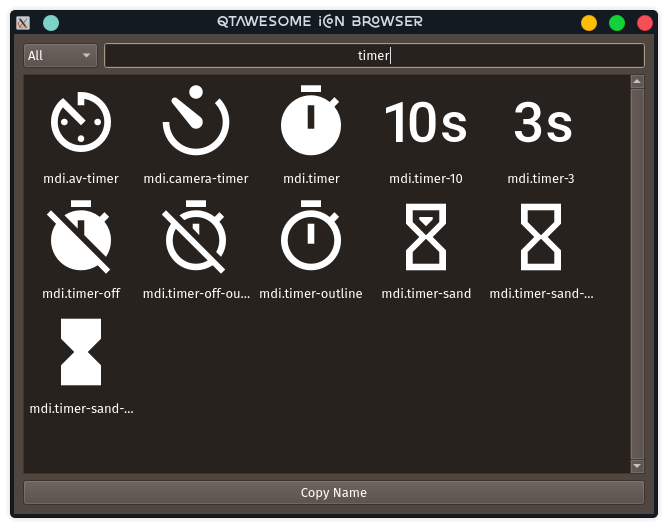
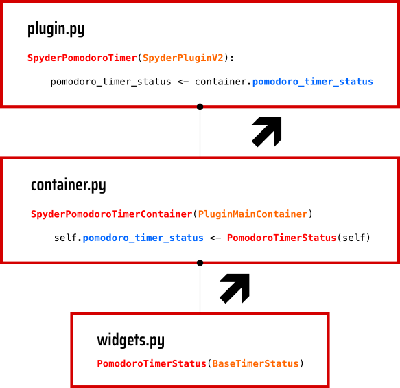
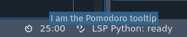

##############################
Plugin Development with Spyder
##############################

============
Introduction
============

This workshop consists of a review of the features and possibilities of the API offered by Spyder 5, the recently released version of our favorite IDE for scientific python, to develop plugins to extend its functionality.
As a practical exercise, we will develop a pair of simple plugins that incorporate a configurable pomodoro timer in the status bar and a task manager as a dockable widget.

By the end of this workshop participants will know the basics to develop plugins for Spyder, and get a general idea of its inner workings. We will review what types of plugins can be developed with Spyder, the structure of a plugin, the functionality of each component and how it connects to Spyder to extend its features. Finally, we will learn how to package and publish our plugin so that it can be easily installed and used by others.

Spyder for developers
~~~~~~~~~~~~~~~~~~~~~

The best place to understand the process and technologies that make up spyder is its Github repository, in particular the `contribution guide`_.

The core of **Spyder** is `spyder-ide`_, a desktop application developed in *Qt*, which requires for its operation two packages with it is closely related (and without which it cannot work): *spyder-kernels* and *spyder-lsp-server*.

**Qt** is a multiplatform widget toolkit for creating native graphical user interfaces. Qt is a very complete development framework that offers utilities for building applications, and libraries of extensions for Networking, Bluetooth, Charts, 3D rendering, Navigation (as GPS), among others.

Spyder uses `qtpy`_ which is an abstraction layer that allows you to work with Qt from Python regardless of whether you use either of the two reference libraries: PyQt or PySide.

`spyder-kernels`_ provide Jupyter kernels to Spyder for use within its consoles.

`pyls-spyder`_ which provides ``python-lsp-server`` extensions specifically designed for Spyder. And `python-lsp-server`_ is a python implementation of the Microsoft Language Server Protocol in which the Spyder team actively participates. ``python-lsp-server`` connects to an Editor to provide features such as autocomplete, go to definition, find all references, etc.

These three packages: ``spyder-ide``, ``qtpy`` and ``pyls-spyder`` have been developed entirely by the Spyder team, consolidating a huge effort over the years, and a way to secure Spyder's future by making it a robust and versatile tool.

In turn, spyder-ide is currently developed in such a way that most of its features are implemented as extensions or plugins to allow third-party developers to extend its functionality.
In this workshop we will focus on the development of ``spyder-ide`` plugins on the main application window. That is to say, the features related to ``qtpy``, and with the Spyder components that make use of Qt. Therefore, the fundamental concepts of Qt operation must be understood.

.. _contribution guide: https://github.com/spyder-ide/spyder/blob/master/CONTRIBUTING.md
.. _qtpy: https://github.com/spyder-ide/qtpy
.. _spyder-ide: https://github.com/spyder-ide/spyder
.. _spyder-kernels: https://github.com/spyder-ide/spyder-kernels
.. _pyls-spyder: https://github.com/spyder-ide/pyls-spyder
.. _python-lsp-server: https://github.com/python-lsp/python-lsp-server

================================
Set up a development environment
================================

In principle, we could use any Spyder installed within a new conda environment according to the instructions given in the installation guide: https://docs.spyder-ide.org/5/installation.html

However, if it is a working environment that has other dependencies and you want to keep your plugin development independent of them, it is recommended to create a new environment which only have Spyder with the minimum dependencies needed for your plugin.

We can install it in the following way:

.. code-block:: bash

   $ conda config --add channels conda-forge
   $ conda config --set channel_priority strict
   $ conda create -n spyder-ide python=3
   $ conda activate spyder-ide
   $ conda install mamba # A personal recommendation
   $ mamba install spyder

The following concepts can be reviewed while the packages are being installed.

===================
Create a repository
===================

Now that we have our local virtual environment, it is good practice to manage our source code with a version control system, and the most widely used web service for this purpose is currently Github. Here you can find, for example, the Spyder and Python repositories.

* Log in to your github account.
* Click on the "New repository" option in the "+" menu at the top right next to your profile picture.
* A dialog will appear where you can insert the repository name and some basic options, e.g. to initialize the repository with README or license files.
* Click the “Create repository” button.
* In the main window of the recently created repository, click on the green "Code" button an copy the clone link.
* In your local command line run ``$ git clone [repo-link]``. You must have git installed and configured on your computer, if you don't have experience using git we recommend The Carpentries workshop `Version control with git`_.

.. _Version control with git: https://swcarpentry.github.io/git-novice/

=========================================
Types of plugins we can develop in Spyder
=========================================

Formally, plugins are instances of Qt classes that modify the behavior of Spyder.
Aside from a few fundamental components, most of Spyder's functionality arises from the interaction of plugins. There are two types of plugins available:

SpyderDockablePlugin
~~~~~~~~~~~~~~~~~~~~

It is a plugin that works as a ``QDockWidget``, this is a QT class that provides a graphical control that can be docked inside a ``QMainWindow`` or floated as a top-level window on the desktop.

SpyderPluginV2
~~~~~~~~~~~~~~

``SpyderPluginV2`` is a plugin that does not create a new dock widget on Spyder's main window. In fact, ``SpyderPluginV2`` is the parent class of ``SpyderDockablePlugin``.

.. note:: ``SpyderPluginV2`` will be renamed to ``SpyderPlugin`` once the migration to the new API is finished

Some Spyder-IDE plugins
~~~~~~~~~~~~~~~~~~~~~~~

If we look at the Spyder interface we can find a number of different panes on the right side (with the Spyder Default Window Layout), such as *Help*, *Variable Explorer*, *Plots*, *Files* and *History*.

Each of these panels is a ``SpyderDockablePlugin`` that offers an *Undock* option by clicking the hamburger menu button in the upper right corner. If this option is selected, the pane will become an independent floating window. They can be enabled or disabled via the *View > Panes menu*, or using the corresponding key combination.

High-level interface elements that do not offer an undocking option are basically instances of ``SpyderPluginV2``. These are typically used to handle more abstract functionality. Examples of this are *appearance* and *layout* plugins that manage Spyder's code color schemes and window layouts respectively. Other examples of this type of plugins are the *main menu* and keyboard *shortcuts*. Some graphical controls, such as toolbar buttons or status bar elements could also be instances of ``SpyderPluginV2`` class.

================
A Pomodoro Timer
================

Our practical work will consist of the implementation of the Pomodoro technique for time management in the Spyder interface.

The `Pomodoro Technique`_ designed by Francesco Cirillo is a time management practice used to increase your focus and productivity when trying to complete assignments or meet deadlines.
Choosing to use a Pomodoro Timer can help to give a task your full, undivided attention.

The typical process of the Pomodoro Technique consists of the following six
steps:

1. Choose a task to be done.
2. Set the Pomodoro Timer (default is 25 minutes).
3. Work only on that task until the timer ends.
4. When the timer rings, put a checkmark on a piece of paper, this is called "a pomodoro".
5. If you have less than 3 checkmarks take a short break (by default, 5 minutes), and return to step 2.
6. When you have completed four Pomodoro cycles, you deserve a longer break (our default is 15 minutes). Checkmarks are reset to zero, go back to step 1.

.. _Pomodoro Technique: https://francescocirillo.com/pages/pomodoro-technique

Steps
~~~~~

* Select the most suitable plugin type and create its initial structure using cookie-cutter.
* Install the plugin in development mode in the virtual environment from which we run Spyder.
* Implement the functionality of our plugin using the Spyder classes and following the guidelines indicated in the plugin structure.
* Build a configuration form for our plugin, which would appear in Tools > Preferences.

Features
~~~~~~~~

A minimal planning to organize ideas.

* Pomodoro Timer

  - Timer: to measure pomodoro time intervals, we can use ``QTimer``.
  - State: we have three activity states: *pomodoro*, *short-break*, *long-break*, and a basic *idle* state. We could change colors or other properties to display it, or use labels. Also, we can use a ``QComboBox`` to set the state directly.
  - Interactions: the user could use Start, Stop and Reset buttons to handle the Pomodoro Timer, this can be implemented with ``QPushButton``.

* Tasks Logger

  - Input: A simple form to introduce tasks, we can use ``QLabel`` and  ``QLineEdit`` arranged in some layout to set tasks.
  - Counter: We need a variable to count the number of pomodoros completed.

* Notifications

  - Dialog: Each time a pomodoro or break interval is completed, a message should appear to prompt the user to start working on a task or take a break.

  When working on a plugin for any system, we must check the data structures and functions available in that system that can facilitate our development.
  This involves spending considerable time understanding its inner workings.

=================
Let's get started
=================

We already have a repository and a virtual environment where Spyder 5 is installed.
Let's activate our environment and go into the local folder of our repository and use cookiecutter to create the initial structure of our plugin.
`cookiecutter`_ is a tool made in Python specifically designed to create project templates.
The Spyder team has developed one of these templates to generate the basic structure of a plugin, and it can be found at: https://github.com/spyder-ide/spyder5-plugin-cookiecutter

.. _cookiecutter: https://cookiecutter.readthedocs.io

Create an initial structure of our plugin
~~~~~~~~~~~~~~~~~~~~~~~~~~~~~~~~~~~~~~~~~

Let's run cookiecutter to generate our

.. code-block:: shell

   $ cookiecutter https://github.com/spyder-ide/spyder5-plugin-cookiecutter
   You\'ve downloaded /home/mapologo/.cookiecutters/spyder5-plugin-cookiecutter before. Is it okay to delete and re-download it? [yes]:
   full_name [Spyder Bot]: Francisco Palm # It's your name, better John Doe
   email [spyder.python@gmail.com]: fpalm@qu4nt.com
   github_username [spyder-bot]: map0logo
   github_org [spyder-ide]:
   project_name [Spyder Boilerplate]: Spyder Pomodoro Timer
   project_short_description [Boilerplate needed to create a Spyder Plugin.]: A very simple pomodoro timer that shows in the status bar.
   project_pypi_name [spyder-pomodoro-timer]:
   project_package_name [spyder_pomodoro_timer]:
   pypi_username [map0logo]:
   Select plugin_type:
   1 - Spyder Dockable Plugin
   2 - Spyder Plugin
   Choose from 1, 2 [1]: 2
   Select open_source_license:
   1 - MIT license
   2 - BSD license
   3 - ISC license
   4 - Apache Software License 2.0
   5 - GNU General Public License v3
   6 - Not open source
   Choose from 1, 2, 3, 4, 5, 6 [1]: 1

The plugin structure
~~~~~~~~~~~~~~~~~~~~

.. code-block:: bash

   .
   ├── [Some info files]
   ├── Makefile
   ├── setup.py
   ├── spyder_pomodoro_timer
   │   ├── __init__.py
   │   └── spyder
   │       ├── __init__.py
   │       ├── api.py
   │       ├── confpage.py
   │       ├── container.py
   │       ├── locale
   │       │   └── spyder_pomodoro_timer.pot
   │       ├── plugin.py
   │       └── widgets.py
   └── tests

The root folder
~~~~~~~~~~~~~~~

* The Makefile has several useful commands:

.. code-block:: bash

   clean                remove all build, test, coverage and Python artifacts
   clean-build          remove build artifacts
   clean-pyc            remove Python file artifacts
   clean-test           remove test and coverage artifacts
   test                 run tests quickly with the default Python
   docs                 generate Sphinx HTML documentation, including API docs
   servedocs            compile the docs watching for changes
   release              package and upload a release
   dist                 builds source and wheel package
   install              install the package to the active Python's site-packages
   develop              install the package to the active Python's site-packages

* ``setup.py`` helps you to package and distribute your plugin with Distutils, which is the standard for distributing Python Modules.
  On this file the ``entry_points`` parameter of ``setup`` is quite important, as it is the one that allows Spyder to identify this package as a plugin, and to know how to access its functionalities.

The spyder folder
~~~~~~~~~~~~~~~~~

The ``spyder-pomodoro-timer` folder has the name you introduced when running ``cookiecutter``, and inside this we have a folder denominated ``spyder`` that is where we must organize the code of our plugin.

So, its files define your plugin as follows:

* ``api.py``: where the functionality of the plugin is exposed to the rest of spyder (which would allow additional functionality to be added from other plugins).

* ``plugin.py``: is the core of the plugin, depending on the type of plugin we create here an instance of ``SpyderDockablePlugin`` or ``SpyderPluginV2``.

  * If it is a ``SpyderPluginV2`` you should set a field named ``CONTAINER_CLASS`` with an instance of ``PluginMainContainer``.
  * If it is a ``SpyderDockablePlugin`` you should set a field named ``WIDGET_CLASS`` with an instance of ``PluginMainWidget`` (that internally it is assigned to ``CONTAINER_CLASS``).

* ``container.py``: only used for ``SpyderPluginV2`` plugins, in this file we create the instance of ``PluginMainContainer`` that we are going to assign to the base class of our plugin.

* ``widgets.py``: in this file is where the graphical components of our plugin are written, if it is of type ``SpyderPluginV2`` and it does not have elements in the interface it is not necessary.
  In this file we create the instance of ``PluginMainWidget`` that we are going to assign to the base class of our ``SpyderDockablePlugin`` plugin, or to our instance of ``PluginMainContainer`` in case our plugin is of type ``SpyderPluginV2``.

* ``confpage.py``: this is where you specify the forms that will be displayed in Tools > Preferences so that the user can adjust the configurable parameters of our plugin.

=========================
Building our first plugin
=========================

Widgets
~~~~~~~

Best is going backwards to build our plugin, let's start by implementing the graphical controls of our plugin in ``widgets.py``

Originally, we have:

.. code-block:: python

   # Spyder imports
   from spyder.api.config.decorators import on_conf_change
   from spyder.api.translations import get_translation

   from spyder.api.widgets.mixins import SpyderWidgetMixin

   # Localization
   _ = get_translation("spyder_pomodoro_timer.spyder")

The preset imports are a guide to what we will need in our plugin. The ``on_conf_change`` decorator will allow us to propagate the changes in the configuration. ``get_translation`` help us to generate the translation strings and ``SpyderWidgetMixin`` adds to any Widget the attributes and methods needed to integrate with Spyder (icon, style, translation, actions and extra options).

After some research in the Spyder source code we can find that in Spyder there are two types of predefined components for the status bar:

* ``StatusBarWidget``, a class derived from ``QWidget`` and ``SpyderWidgetMixin``, which contains an icon, a label and a spinner (to show the plugin loading).
* ``BaseTimerStatus``, a class derived from ``StatusBarWidget`` with an internal ``QTimer`` to periodically update its content.

Since we want a widget that is periodically updated showing the pomodoro countdown, we will use a ``BaseTimerStatus`` instance.

So, we can safely substitute

.. code-block:: python

   from spyder.api.widgets.mixins import SpyderWidgetMixin

with

.. code-block:: python

   from spyder.api.widgets.status import BaseTimerStatus
   from spyder.utils.icon_manager import ima

Add an initial import:

.. code-block:: python

   # Third party imports
   import qtawesome as qta

And add at the end of the file:

.. code-block:: python

   class PomodoroTimerStatus(BaseTimerStatus):
       """Status bar widget to display the pomodoro timer"""

       ID = "pomodoro_timer_status"
       CONF_SECTION = "pomodoro_timer"

       def __init__(self, parent):
           super().__init__(parent)
           self.value = "25:00"

       def get_tooltip(self):
           """Override api method."""
           return "I am the Pomodoro tooltip"

       def get_icon(self):
           return qta.icon("mdi.av-timer", color=ima.MAIN_FG_COLOR)

Spyder needs ``ID`` and ``CONF_SECTION`` to be defined, the constructor calls the parent class constructor and initializes the label ``value``.

We add a tooltip to verify the existence of our plugin. Since Spyder uses ``qtawesome`` (is another spyder team project which makes it easy incorporate iconic fonts into our interface) we can select our icon using ``qta-browser`` from the terminal.

.. code-block:: bash

   (spyder-ide) $ qta-browser

From here we can select and copy the name of the icon of our preference.

At the end of ``widgets.py`` we add:

.. code-block:: python

   # ---- BaseTimerStatus API
   def get_value(self):
       """Get current time of the timer"""

       return self.value

Since BaseTimerStatus requires this method to be implemented to update its content every time it is requested by the internal timer.

Container
~~~~~~~~~

As we are developing a ``SpyderPluginV2``, we need to incorporate this plugin inside a container, which allows us to handle references to other widgets, for example accessing the toolbar or menus.

Thus, ``container.py`` is initially as follows:

.. code-block:: python

   from spyder.api.config.decorators import on_conf_change
   from spyder.api.translations import get_translation
   from spyder.api.widgets.main_container import PluginMainContainer

   _ = get_translation("spyder_pomodoro_timer.spyder")

   class SpyderPomodoroTimerContainer(PluginMainContainer):

       # Signals

       # --- PluginMainContainer API
       # ------------------------------------------------------------------------
       def setup(self):
           pass

       def update_actions(self):
           pass

In this case ``SpyderPomodoroTimerContainer`` is already defined, and we must implement the ``setup`` and ``update_actions`` methods.

For now, we are only going to add the widget created earlier to the container. To do so, we import the widget.

.. code-block:: python

   # Local imports
   from spyder_pomodoro_timer.spyder.widgets import PomodoroTimerStatus

And edit the ``setup`` method, adding an instance of our widget.

.. code-block:: python

       def setup(self):
           self.pomodoro_timer_status = PomodoroTimerStatus(self)

Plugin
~~~~~~

Finally, we define our plugin so that it is registered within Spyder.

Thus, the initial version of plugin.py would be,

* imports:

.. code-block:: python

    # Third-party imports
    from qtpy.QtGui import QIcon

    # Spyder imports
    from spyder.api.plugins import Plugins, SpyderPluginV2
    from spyder.api.translations import get_translation

    # Local imports
    from spyder_pomodoro_timer.spyder.confpage import SpyderPomodoroTimerConfigPage
    from spyder_pomodoro_timer.spyder.container import SpyderPomodoroTimerContainer

    _ = get_translation("spyder_pomodoro_timer.spyder")

* Plugin class:

.. code-block:: python

    class SpyderPomodoroTimer(SpyderPluginV2):
        """
        Spyder Pomodoro Timer plugin.
        """

        NAME = "spyder_pomodoro_timer"
        REQUIRES = []
        OPTIONAL = []
        CONTAINER_CLASS = SpyderPomodoroTimerContainer
        CONF_SECTION = NAME
        CONF_WIDGET_CLASS = SpyderPomodoroTimerConfigPage

        # --- Signals

        # --- SpyderPluginV2 API
        # ------------------------------------------------------------------------
        def get_name(self):
            return _("Spyder Pomodoro Timer")

        def get_description(self):
            return _("A very simple pomodoro timer")

        def get_icon(self):
            return QIcon()

        def register(self):
            container = self.get_container()
            print('SpyderPomodoroTimer registered!')

        def check_compatibility(self):
            valid = True
            message = ""  # Note: Remember to use _("") to localize the string
            return valid, message

        def on_close(self, cancellable=True):
            return True

For now, we only need to define the dependencies of our plugin, redefining ``REQUIRES``.

.. code-block:: python

       REQUIRES = [Plugins.StatusBar]

We can follow a similar approach for the icon, substituting,

.. code-block:: python

   from qtpy.QtGui import QIcon

   # ...

.. code-block:: python

       def get_icon(self):
           return QIcon()

by

.. code-block:: python

   import qtawesome as qta

   # ...

.. code-block:: python

       def get_icon(self):
           return qta.icon("mdi.av-timer", color=ima.MAIN_FG_COLOR)

and change,

.. code-block:: python

       def register(self):
           container = self.get_container()
           print('SpyderPomodoroTimer registered!')

to

.. code-block:: python

       def register(self):
           container = self.get_container()
           statusbar = self.get_plugin(Plugins.StatusBar)
           if statusbar:
               statusbar.add_status_widget(self.pomodoro_timer_status)
           print('SpyderPomodoroTimer registered!')

So, basically, Spyder is aware of the presence of our plugin, and that this plugin adds a new widget to the status bar.

At the end of ``plugin.py`` we add the following:

.. code-block:: python

   @property
   def pomodoro_timer_status(self):
       container = self.get_container()
       return container.pomodoro_timer_status

In this way, ``SpyderPomodoroTimer`` can access ``pomodoro_timer_status`` of ``SpyderPomodoroTimerContainer`` as if it were its own property.

In summary, we have been doing the following:

We have created a widget, then we add the widget to the container, from there we register the container in the plugin next to the status bar. In the plugin, we accessed the widget and inserted it into the status bar.

The use of the container is necessary because Qt requires our widget to be inside another widget before using it (otherwise it would become a floating window). And through the container that is derived from ``SpyderWidgetMixin`` and ``SpyderToolbarMixin`` mixins it gets integrated to the rest of Spyder.

======================
How to test our plugin
======================

Now, it is a good time to see some kind of result in the Spyder interface.

From the root folder of our plugin, we activate the environment where spyder is installed, and run:

.. code-block:: bash

   (base) $ conda activate spyder-ide
   (spyder-ide) $ make develop

This last command is equivalent to running ``make clean`` (which removes all build, test, coverage and Python artifacts) and ``$ pip install -e .``.

Now we can find two "Hello World" outputs, the first one in our command line we have:

.. code-block:: bash

   (spyder-ide) $ spyder
   SpyderPomodoroTimer registered!

And in the Spyder interface we can find in the status bar our plugin with the tooltip "I am the Pomodoro tooltip".

====================
Enhancing our plugin
====================

TODO Enhanced version of the plugin

======================
Publishing your plugin
======================

TODO
