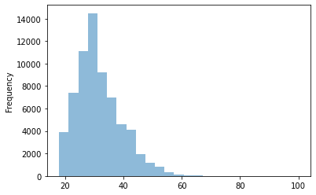
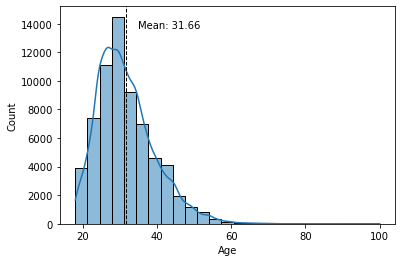

##################################################
Scientific Computing and Visualization with Spyder
##################################################

This workshop allows you to explore some of Spyder's features that make Spyder an ideal IDE for using the scientific tools offered by Python. Throughout the workshop, we will apply the scientific method to answer some questions related to our preferences and cognitive abilities. By the end of this workshop participants will be able to use Spyder to explore data, analyze it with some statistical tools and plot the relationship between variables.

=============
Prerequisites
=============

You will need to have Spyder installed. Visit our :doc:`installation guide<../installation>` for more information.

.. important::

   Spyder now offers :ref:`standalone_installers_ref` for Windows and macOS, making it easier to get up and running with the application without having to download Anaconda or manually install it in your existing environment.
   While we still support Anaconda, we recommend this install method on those platforms to avoid most problems with package conflicts and other issues.

It is also desirable to have the following prior knowledge:

   * Basic level of Python. You can visit `The Python Tutorial`_ to learn the basics of this programming language.
   * Some knowledge of Statistics (`hypothesis testing`_ , `ANOVA`_, `p-value`_)

   .. _The Python Tutorial: https://docs.python.org/3/tutorial/
   .. _hypothesis testing: https://en.wikipedia.org/wiki/Statistical_hypothesis_testing
   .. _ANOVA: https://en.wikipedia.org/wiki/Analysis_of_variance
   .. _p-value: https://en.wikipedia.org/wiki/P-value

==============
Learning goals
==============

After completing this workshop, you should be able to:

* Apply the scientific method to answer questions related to psychometric variables
* Understand how to use Spyder's built-in scientific computing tools

===============
Learner profile
===============

This workshop is intended for people who want to learn how to answer questions scientifically from a dataset. We have also designed it to serve as a tutorial for learning how to use Spyder as a research tool.

=====
Intro
=====

In this workshop we will explore a data set and use it to answer some questions using the scientific method.

Why do scientific research with Python?
~~~~~~~~~~~~~~~~~~~~~~~~~~~~~~~~~~~~~~~

Python is a mature programming language that has been chosen by much of the scientific community to support the research process. There are a few reasons for this:

* It is versatile and easy to learn and use
* It allows for multiple ways to handle inputs and outputs. No matter what format your data is in, in Python there is always a way to import it (and export it in the format of your choice)
* It is interpreted. You don't have to write code from start to finish to see partial results. This makes it especially easy and fast to explore data
* It has built-in support for scientific computing tasks: `SciPy <https://scipy.org>`_, `NumPy <https://numpy.org>`_, `Pandas <https://pandas.pydata.org>`_, and a vast number of other libraries created by and for scientists
* It is the most widely used programming language for Machine Learning (including Keras and TensorFlow)
* It has excellent libraries for plotting
* It can be integrated with `Jupyter Notebooks <https://jupyter.org>`_ and implementations of these in the cloud (`Google Colab <https://colab.research.google.com>`_ or `Binder <https://mybinder.org>`_)

How can Spyder help me in my scientific research?
~~~~~~~~~~~~~~~~~~~~~~~~~~~~~~~~~~~~~~~~~~~~~~~~~

Spyder is a Scientific Integrated Development Environment written in Python, and designed by and for scientists, engineers, and data analysts. It features a unique combination of the advanced editing, analysis, debugging, and profiling functionality of a comprehensive development tool with the data exploration, interactive execution, deep inspection, and beautiful visualization capabilities of a scientific package. Together with Python, it provides a very complete set of tools for scientific computing.

The basic steps of the scientific method
~~~~~~~~~~~~~~~~~~~~~~~~~~~~~~~~~~~~~~~~

The `scientific method <https://en.wikipedia.org/wiki/Scientific_method>`_ is a set of good practices used to achieve new knowledge in a valid way. Broadly speaking, the stages of the scientific method are as follows:

1. Observation: first find something that needs an explanation
2. Search/generate theory: say a thing or two about the state of the world or how it works (an abstract thought about a phenomenon)
3. Hypothesis: identify variables and make predictions
4. Testing/Experiment/More observation: measure relationship between variables
5. Analysis: fit a model/graph data
6. Reporting: share new findings

Throughout this workshop, we will be developing each of these steps in a practical way. We will use Spyder as a research tool and psychometric data from an online dating site to make it easy and fun.

Introduction to scientific research with Spyder
~~~~~~~~~~~~~~~~~~~~~~~~~~~~~~~~~~~~~~~~~~~~~~~

If you're not familiar with Spyder, we recommend you start with our :doc:`Quickstart<../quickstart>`. But if you want a  summary, here's a quick overview.

.. note::

   If you already have experience with Spyder, you can skip to `Preparation work`_ section.

Editor
------

The :doc:`Editor<../panes/editor>` is the place where you write your code and save it as a file (script). It allows you to easily persist your work. This is where you write the code you want to keep from the data analysis you do in IPython Console. **Here you will also be able to read, edit and run the code from this workshop**.

IPython Console
---------------

The :doc:`IPython Console<../panes/ipythonconsole>` is the Spyder's component where you write chunks of code that you want to experiment with. **In this workshop, we are going to give you pieces of code that you can copy and run in this console**.

In essence, the IPython Console allows you to execute commands and interact with data using Python.

Variable Explorer
-----------------

The :doc:`Variable Explorer<../panes/variableexplorer>` is one of Spyder's best features. It allows you to interactively browse and manage the objects generated in the code of the currently selected :doc:`../panes/ipythonconsole` session.

The Variable Explorer is one of the most frequently used components in this workshop. **This is the pane where we will observe the data and most of the results of the scientific analysis, except for the plots**.

Plots pane
----------

The :doc:`Plots pane <../panes/plots>` shows all the static graphs and images created in your IPython Console session. **All plots generated by the code will appear in this component**. You will also be able to save each graphic in a local file or copy it to the clipboard to share it with other researchers.

Code Analysis (share a stylish code!)
-------------------------------------

Wouldn't it be great to have a tool to be able to detect code errors, stylistic problems, bad practices, inconsistencies and other issues? This is precisely the task of the  :doc:`Code Analysis<../panes/pylint>`. Your code can run, but if you are going to share it with other researchers it would be great if it is both readable and neat as well.

================
Preparation work
================

Before starting, you must have installed some packages and libraries needed to run the code. We recommend you to install these requirements in a virtual environment. Here we explain step by step how to do it.

Setting up the Conda environment
~~~~~~~~~~~~~~~~~~~~~~~~~~~~~~~~

If you would like to have Spyder in a dedicated environment to update it separately from your other packages and avoid any conflicts, you can.

You can set up your environment in two different ways.

.. important::

   We recommend creating the virtual environment with `Anaconda <https://www.anaconda.com/products/individual>`_ (or `Miniconda <https://docs.conda.io/en/latest/miniconda.html>`_) as it integrates seamlessly with Spyder. You can find installation instructions in `Anaconda documentation`_.

   .. _Anaconda documentation: https://docs.anaconda.com/anaconda/install/

1. With commands
----------------

Just run the following command in your Anaconda Prompt (Windows) or terminal (other platforms), for a minimal install of Spyder into a new environment called ``scientific-computing``:

.. code-block:: bash

   $ conda create -n scientific-computing

To install Spyder's optional dependencies as well for full functionality, use the following command instead:

.. code-block:: bash

   $ conda create -n scientific-computing spyder=5 numpy scipy pandas matplotlib sympy cython seaborn spyder-kernels pyarrow

.. warning::

   Spyder now offers :ref:`standalone_installers_ref` for Windows and macOS, making it easier to get up and running with the application without having to download Anaconda or manually install it in your existing environment. If you use the standalone installer, there is no need to install ``spyder=5`` with conda.

2. From an environment.yml file
-------------------------------

You can also install the virtual environment easily using the environment file (``scientific-computing.yml``) that we share with you. Just run the following command in the terminal (you must have the environment file in the current directory):

.. code-block:: bash

   $ conda env create -f scientific-computing.yml

Activate environment
--------------------

You can now enter the newly created virtual environment in this way:

.. code-block:: bash

   $ conda activate scientific-computing

Downloading the dataset
~~~~~~~~~~~~~~~~~~~~~~~

We are going to work with a public dataset called OKCupid, collected by Kirkegaard and Bjerrekaer. The dataset is composed of 68,371 records and 2,626 variables.

Download the `OKCupid dataset`_ to a directory of your choice.

.. _OKCupid dataset: https://figshare.com/articles/dataset/OKCupid_Datasets/14987388

Setting up the working directory
~~~~~~~~~~~~~~~~~~~~~~~~~~~~~~~~

The virtual environment and the data file are now ready. The only thing that remains is to create a directory to work in. In your operating system, create a new directory with the name of your choice. Then copy and unzip the dataset file there.

Here is an example (on Linux or macOS):

.. code-block:: bash

   $ mkdir scientific-computing
   $ cd scientific-computing

Keep in mind that in this new directory you must have the data file unzipped.

Launch Spyder:

.. code-block:: bash

   $ spyder

Let's make sure Spyder is ready. First, check that the working directory is correct. You should see in the upper right corner the path to the directory where you have the dataset. Something like this:

Second, let's check that the virtual environment we created is enabled in Spyder. Go to :guilabel:`Preferences` > :guilabel:`Python interpreter`, and use the dropdown under :guilabel:`Use the following Python interpreter` to select the path to your virtual environment. You should see something like this:

.. image:: images/workshop-2/set-up-environment.png
   :alt: Set up environment in Spyder's Preferences

Now, you have everything ready to proceed with the workshop.

Download the code
~~~~~~~~~~~~~~~~~

Although the workshop is designed for you to write the code in the IPython Console, we have created a file that you can :download:`download <scientific-computing.py>`. This script provides all the code you will write in this workshop, and you can use it as a guide if you get lost.

===========
The dataset
===========

OKCupid is a dataset that gathers information obtained from the online dating site OKCupid. It consists of 68,371 records collected automatically employing a scraper that extracted public information.

The dataset contains demographic data (e.g., gender, sexual orientation and age). It also includes answers to general questions used by the website's algorithm to calculate some personality indicators to help find compatible matches.

If you want more information about how this dataset was collected and what kind of information it contains you can get it in this paper: `The OKCupid dataset`_.

.. _The OKCupid dataset: https://doi.org/10.26775/ODP.2016.11.03

Remember to type and run all code for this workshop in the "IPython Console" at the bottom right of Spyder.

.. image:: images/workshop-1/ipython-console-in-context.png
   :alt: IPython Console location in Spyder IDE

You can also write your code or in the Editor (the pane that occupies the entire left side of Spyder). If you use the Editor, you can run the code by selecting it and pressing the :guilabel:`Run selection or current line` button in the :guilabel:`Run toolbar` or by pressing the F9 button.

.. image:: images/workshop-1/editor-in-context.png
      :alt: Editor location in Spyder IDE

To get started, import the libraries.

.. code-block:: python

   import matplotlib.pyplot as plt
   import pandas as pd
   import scipy.stats as stats
   import seaborn as sns

The data you downloaded earlier is in `parquet <https://arrow.apache.org/docs/python/parquet.html>`_ format. This format is very convenient because it is smaller and faster than CSV or JSON files.

Load data:

.. code-block:: python

   data = pd.read_parquet("parsed_data_public.parquet")

You should now be able to see the data you have imported in the Variable Explorer.

.. image:: images/workshop-2/first-object-in-variable-explorer.png
   :alt: Dataset in the Variable Explorer

You can see that the object is of type DataFrame and the number of rows and columns of the object.

===================
Explore the dataset
===================

Age
~~~

Now, let's explore one of the variables, in this case, the numeric variable age (``d_age``).

.. note::

   In the OKCupid dataset, all demographic variables are prefixed with "d\_" and profile variables with "p\_".

.. code-block:: python

   data.d_age.describe()

.. image:: images/workshop-2/data-age-describe-console-output.png
   :alt: Console output for data.d_age.describe()

What happened? We called the ``data`` object and used Python's dot notation to pick the ``d_age`` column. This has a `Pandas Series <https://pandas.pydata.org/pandas-docs/stable/reference/api/pandas.Series.html>`_ type object. To this object we pass the ``describe()`` method that shows a summary of some indicators: count of values, mean, standard deviation, maximum value, minimum value, among others. With these figures we can see that the sample is mainly constituted of young people (the average is 31.65 years old).

The return of a function, method or the attribute of an object can be stored as a variable to have it at hand in the Variable Explorer:

.. code-block:: python

   max_age = data.d_age.min()
   min_age = data.d_age.max()

.. image:: images/workshop-2/min-age-max-age-variables.png
   :alt: More variables in Variable Explorer

The values are floats. The lowest age is 18.0 years and the highest is 100.0 years.

.. note::

   Notice also that each type of variable has a different color to quickly distinguish them.

We already know the minimum and maximum age, and that the mean is around 32 years old. A good way to further explore this variable is to plot a histogram, a type of graph that shows the frequency distributions. In this way we can see if the groups of young people on the platform are more numerous than the older ones.

We can plot a histogram directly from the dataframe. To do this we select the variable (as we did with the ``.describe()``) and invoke the ``.plot.hist()`` method. In this method we will pass as arguments the number of bins and the transparency of the plot (``alpha``).

.. code-block:: python

   data.d_age.plot.hist(bins=25, alpha=0.5)

Another way to generate a simple histogram in Spyder is to use a context menu on an array in the Variable Explorer. But first we must store these values in a list and call that variable ``age``.

.. code-block:: python

   age = data.d_age.tolist()

.. image:: images/workshop-2/histogram-from-variable-explorer.png
   :alt: Age histogram option from Variable Explorer

.. image:: images/workshop-2/histogram-from-variable-explorer-plotted.png
   :alt: Age histogram from Variable Explorer

Frequency distributions come in different sizes and shapes. The shape of a histogram reveals very interesting things about the data. A symmetrical, bell-shaped histogram might indicate that the distribution is normal (most of the scores are close to the center of the distribution). In the age histogram, you can see that it has a "tail" to the right (towards the older ages). Technically this is called "positively `skewed`_". It is also noticeable that it is somewhat pointy (positive `kurtosis`_ or leptokurtic). These two things could suggest that age is not a random variable.

.. _kurtosis: https://en.wikipedia.org/wiki/Kurtosis
.. _skewed: https://en.wikipedia.org/wiki/Skewness

Although we can create the histogram directly from the dataframe, we are going to use a Python library called Seaborn to do the same, because this library will allow us to do more interesting things later.

.. code-block:: python

   sns.histplot(data.d_age, kde=True, bins=25)
   plt.show()

We call ``sns.histplot()`` with three arguments. The first one (``data.d_age``) is a Pandas Series with the **quantitative** variable we want to plot. The second (``kde=True``) adds a curve showing an ideal model of the age distribution (using a method called *Kernel Density Estimator*). And the third one (``bins=25``) indicates that we want 25 bins in the graph.

.. image:: images/workshop-2/age-histogram-2.png
   :alt: Age histogram with Seaborn

The second line (``plt.show()``) is intended to show all the figures not displayed so far. If you have any doubts about how to utilize an object, method or function, you can use the ``help()`` tool in the console. For example:

.. code-block:: python

   help(plt.show)

Or you can also take advantage of the Help pane included in Spyder to get on-screen help:

.. image:: images/workshop-2/help-pane-for-plt.show.png
   :alt: plt.show() help in Spyder's Help pane

With Seaborn, we can add a line representing the mean of the histogram. To do this we will use the ``axvline()`` method and add a text with the value of the mean where ``text()``, ``min_ylim`` and ``max_ylim`` are used to mark the position of the text.

.. code-block:: python

   sns.histplot(data.d_age, kde=True, bins=25)
   plt.xlabel('Age')
   plt.axvline(data.d_age.mean(), color='k', linestyle='dashed', linewidth=1)
   min_ylim, max_ylim = plt.ylim()
   plt.text(data.d_age.mean()*1.1, max_ylim*0.9,
            'Mean: {:.2f}'.format(data.d_age.mean()))
   plt.show()

Religion seriosity
~~~~~~~~~~~~~~~~~~

We know the extent of the dataframe and we have seen how to explore a quantitative variable. Now let's move on to a qualitative variable. The ``columns`` attribute shows a list of column names in the dataframe. We also know that demographic variables are prefixed with "d\_", so we can look for variable names that correspond to this prefix.

.. code-block:: python

   demograph = [v for v in list(data.columns) if v.startswith("d_")]

In the Variable Explorer you will see a new variable ``demograph``. If you double click on it you will see a list of the demographic variables in the dataset. At the end of the list you will see a value ``d_religion_seriosity``. If you right click on it, several options will appear on the screen. You can rename the column, delete it or insert a new one. Let's click on :guilabel:`Copy` to copy the column name into memory.

In the IPython Console, type ``data.`` and then copy the column name. Type a period at the end (no spaces) and hit tab. You should see something like the following:

.. image:: images/workshop-2/console-auto-completion.png
   :alt: IPython Console auto-completion

You can then see a list of all relevant methods and attributes of the class. Right at the end you will see ``value_counts`` that could be used to summarize the variable. It is a method so it must end in parentheses:

.. code-block:: python

   data.d_religion_seriosity.value_counts()

   # but not too serious about it     11142
   # and laughing about it             7307
   # and somewhat serious about it     5372
   # and very serious about it         3290
   # Name: d_religion_seriosity, dtype: int64

In addition to demographic and profile variables, the dataset includes responses to questions on a variety of topics. These questions are coded with a prefix "q" followed by an integer. The text of the questions is stored in a file called :file:`question_data.csv` (which you can download as part of the `OKCupid dataset`_).

We can examine this file in the Variable Explorer:

.. code-block:: python

   question_data = pd.read_csv("question_data.csv", sep=";")

Double click on "question_data" in the Variable Explorer to display each question aligned with its code ("q" + number).

Now that we have learned how to explore the data we can ask interesting questions and try to answer them with the help of the dataset and Spyder.

========================================
Think of a theory and write a hypothesis
========================================

A theory is nothing more than an explanation of something. For example, we could get involved in the eternal conflict between cats and dogs. I, as a dog person, might have a theory (unscientific, of course) that those who prefer to have the companionship of a dog are smarter people than those who prefer a wicked (but lovable) kitty. To test the support of a theory, one can make a prediction based on it and see how this prediction behaves in an experiment or a concrete situation. We call this prediction a hypothesis.

A hypothesis is a statement that can be tested employing the scientific method. They must be verifiable using empirical evidence or data. For example, *green is the best color* is not a hypothesis since it cannot be proven or disproven.

Concerning the above theory of a person's pet preferences, to explore it we should find two variables to relate. The first variable would be related to a **self-identification as a cat person or dog person**. The second variable would be related to a person's **ability to solve problems and situations**.

The OKCupid dataset has useful variables that we can use to investigate this theory. For example, question **q997** (*Are you a cat person or a dog person?* ) provides information about a person's pet preferences. The second variable is slightly more difficult to come up with, as it is somewhat more complex. Fortunately, the researchers who collected the dataset have also selected 14 questions that can serve as a proxy for a cognitive ability test. This selection of questions can be found in the file :file:`test_items.csv` in the `OKCupid dataset`_.

.. code-block:: python

   test_items = pd.read_csv("test_items.csv")

So, let's try to see if there is any evidence in the OKCupid dataset to support the following hypothesis:

*People who prefer dogs to cats would score higher on tests of cognitive ability*.

.. note::

   SPOILER ALERT: If you are a cat person, and feel you should immediately leave this workshop, I suggest you stay. If you're not a cat person, stay too.

==============
Build the test
==============

We already know which questions will be part of the cognitive ability test. Now we are going to process this data to obtain the scores for each person.

First, we make a copy of the original dataset:

.. code-block:: python

   ca_test = data.copy()

Then, we find the correct answer to each test question (these answers are in ``test_items``).

.. code-block:: python

   right_answers = []
   for ID, ROW in test_items.iterrows():
       right_answers.append(ROW.iloc[ROW["option_correct"] + 2])
   test_items["right_answer"] = right_answers

The correct answers have been stored in the ``test_items`` dataframe.

Next, we will indicate, in the ``ca_test`` dataframe, whether the person answered correctly to each question selected in the cognitive ability test. These answers will be entered as a boolean in new variables with the prefix "resp\_" followed by the corresponding question code. The Boolean is calculated with the function ``lambda row: row[q] == a, axis=1``.

.. code-block:: python

   for ID, ROW in test_items.iterrows():
       QUESTION = "q" + str(ROW["ID"])
       ANSWER = str(ROW["right_answer"])
       try:
           ca_test.dropna(subset=[QUESTION], inplace=True)
           ca_test["resp_" + QUESTION] = ca_test.apply(lambda row: row[QUESTION] == ANSWER, axis=1)
       except KeyError:
           print(f"{QUESTION} not found.")

.. important::

   Some ``test_items`` questions are not in the data but don't worry about that. We use a ``try... except`` block to ignore these errors. Answering these questions was optional, so many OkCupid site users did not answer all of them. So we have removed from the records the users who did not answer the 14 questions we have chosen for the cognitive ability test. This reduced the sample size considerably. There are other ways to avoid this reduction, but they are outside the scope of this workshop.

We want to sum the correct answers for each person, but some integer results were stored as strings, so let's fix that:

.. code-block:: python

   ca_test.q18154 = pd.Series(ca_test.q18154, dtype="int")
   ca_test.q18154 = pd.Series(ca_test.q18154, dtype="string")
   ca_test.resp_q18154 = ca_test.apply(lambda row: row["q18154"] == "26", axis=1)

   ca_test.q255 = pd.Series(ca_test.q255, dtype="int")
   ca_test.q255 = pd.Series(ca_test.q255, dtype="string")
   ca_test.resp_q255 = ca_test.apply(lambda row: row["q255"] == "89547", axis=1)

Now that we have the correct answer for each test question, let's add up each correct answer for each person. There are 14 questions, so the maximum score will also be 14:

.. code-block:: python

   cognitive_score = ca_test[list(ca_test.filter(regex="^resp"))].sum(axis=1)
   ca_test["cognitive_score"] = cognitive_score

How do we add up these responses? Remember that each answer was stored as a boolean (True or False) with the prefix "resp\_". So we search in the ``ca_test`` dataframe for the answers of each column starting with "resp" (we use the regular expression ``regex="^resp"`` and the method ``filter``) and sum the True values of each row with ``sum(axis=1)``. Then we store these results in the "cognitive_score" column of the ``ca_test`` dataset.

You can see the results of these operations by typing in the IPython Console ``ca_test.cognitive_score.describe()``. If you do so, in *count* you will see that the new number of records has been reduced to 479 (the rest of the 68,371 users did not answer all of these questions).

Cognitive ability distribution
~~~~~~~~~~~~~~~~~~~~~~~~~~~~~~

Let's draw a histogram of this variable to see the frequency distribution.

.. code-block:: python

   sns.histplot(ca_test.cognitive_score, kde=True, bins=6)
   sns.set_palette(palette)

.. image:: images/workshop-2/cognitive-score-histogram.png
   :alt: Cognitive test score histogram

As you can see, in this case, the distribution is not symmetrical but has a long "tail" on the left (negatively skewed). This means that most of the users who answered all the questions did quite well and that only a few users answered most of the questions in the wrong way.

.. important::

   The values we have calculated in this section were already in the data (``data.CA_items``). However, we have chosen to obtain these results again using code because it is a good way to learn how to use the tools provided by Python and Pandas for data manipulation.

================
Relate variables
================

Remember that the hypothesis relates two variables: which pet do you prefer and cognitive ability. The measurement of pet preferences will be made from question **q997** (categorical or qualitative variable) and cognitive ability will be measured from the sum of the correct answers on the test (quantitative interval variable). With this type of variable we can make some box plots to see if there are differences between the means.

But first, let's change the standard Seaborn palette, to get prettier plots.

.. code-block:: python

   palette = sns.color_palette("husl")
   sns.palplot(palette)

.. note::

   Seaborn allows you to choose from different styles of graphics and color palettes. More information is available at https://seaborn.pydata.org/tutorial/color_palettes.html

Now, we are going to create box plots to observe the relationship between variables. To do this, we will use the ``catplot`` class of Seaborn. The first argument will be the x-axis, which in this case will be the qualitative variable (question **q997**). The second argument will be the y-axis, where we will place the quantitative variable (cognitive score). With the parameter ``kind`` we indicate that it is a box plot. The parameters ``height`` and ``aspect`` regulate the appearance of the graph. The last parameter, ``data``, indicates where the data comes from.

.. code-block:: python

   sns.catplot(x=ca_test.q997, y=ca_test.cognitive_score,
   kind="box", height=5, aspect=2, data=ca_test).set_axis_labels("q997 = Are you a cat person or a dog person?", "cognitive score")
   sns.set_palette(palette)

.. image:: images/workshop-2/pet-preferences-cognitive-score-boxplot.png
   :alt: Pet preferences and cognitive score relationship (boxplot)

Box plots or box-whisker diagrams display, near the center of the box, the **mean** of the data as a horizontal line. The lines bordering the box represent **50% of the observations** (*interquartile range* ). Outside the box, upwards and downwards, we find two whiskers: the lower one represents the **mean of the values in the lower part of the dataset**, and the upper one represents the **mean of the values in the upper part of the dataset**. The points beyond the whiskers are **outliers**.

.. important::

   An outlier is a value that is very different from the rest of the data values. They must be taken into account because they can often create a bias in the model we are trying to fit to the data.

The graph shows four boxes measuring cognitive ability for the following groups:

1. Those who prefer dogs
2. Those who define themselves as cat people and dog people indistinctly.
3. Those who prefer cats
4. Those who like neither cats nor dogs.

The lowest mean is that of those who prefer dogs only, but by very little. The box (and boundaries) representing dog lovers is also "wider," implying a larger variability in the individual test results for this group. But this is not a very different dispersion from that of those who prefer cats. All the means are within the limits of the other boxes (interquartiles), which seems to indicate that, in fact, there are not really important differences in the intelligence test scores for these groups. This seems to undermine support for the initial hypothesis we posed above.

.. note::

   If you want to see the figures, enter ``dog_or_cat = ca_test.groupby("q997")["cognitive_score"].describe()`` in the IPython Console and look at the results in the Variable Explorer. This way you can see how many people prefer cats or dogs, and the means and standard deviation of the cognitive ability test results for each group.

To appreciate in context the real difference in the averages, let's create some bar charts. We are now going to use Seaborn's barplot class. On the x-axis we put again the qualitative variable (**q997**) and on the y-axis the quantitative variable (cognitive_score). The data parameter takes as argument the entire dataset.

.. code-block:: python

   fig_dims = (12, 8)
   fig, ax = plt.subplots(figsize=fig_dims)
   sns.barplot(x=ca_test.q997, y=ca_test.cognitive_score, ax=ax, data=ca_test)
   sns.set_palette(palette)
   plt.xlabel("q997 = Are you a cat person or a dog person?")
   plt.ylabel("cognitive score")

.. image:: images/workshop-2/pet-preferences-cognitive-score-bar-graph.png
   :alt: Pet preferences and cognitive score mean representation (box graph)

If the box plots indicated that the means did not show significant differences (possibly due to chance), the bar plot confirms that these differences are, in proportion, quite modest.

==========
ANOVA test
==========

To make sure that the differences between the means are statistically significant, we will perform an ANOVA (analysis of variance) because we are going to compare the means of more than two groups.

How does ANOVA work? This analysis tells us whether three or more means are equal. If so, this would support the null hypothesis.

.. note::

   The *null hypothesis* is an alternative prediction to the one we have stated in our hypothesis. The null hypothesis simply states that the observed differences in means are due to random variations that occur when samples are collected.

An ANOVA produces an *F-ratio* (also called F-statistic) that compares the amount of systematic variation in the data (variation that can be explained by the model or hypothesis) with the amount of unsystematic variance (variation that cannot be explained by our hypothesis or model). This means that F is the ratio of the model to its error. ANOVA also produces a *p-value* that indicates the probability that the variation can be attributed to the null hypothesis. The smaller the p-value, the less likely it is that the observed variation is due to chance.

Formatting the data
~~~~~~~~~~~~~~~~~~~

To perform an ANOVA, let's start by pivoting the dataset with the cognitive ability test results. The pet preferences values will now be the column names, and each row will represent a person.

.. warning::

   To perform an ANOVA, certain requirements or assumptions must be met. For example, the distributions of the residuals must be normal. This is not the case here. There are more appropriate statistical tests for this example, and the possibility of performing certain transformations on the data in order to apply ANOVA in this case. However, we use ANOVA because it is a fairly popular test, and because the purpose of this workshop is to serve as an introduction to scientific computing with Spyder. We do not intend here to obtain scientific results for publication.

.. code-block:: python

   dog_or_cat_pivot = ca_test.pivot(columns="q997", values="cognitive_score")

You will see that one of the columns includes the answers to the test made by people who did not specify their preferences towards pets. Let's delete that column.

.. code-block:: python

   dog_or_cat_pivot.drop(dog_or_cat_pivot.columns[0], axis=1, inplace=True)

.. image:: images/workshop-2/pets-preferences-pivot-table.png
   :alt: Pet preferences pivot table for ANOVA analysis.

Now let's rename the column names (for simplicity) and remove the records that have missing values (with ``dropna``). The argument ``inplace=True`` allows you to directly modify a dataframe without having to create a new one.

.. code-block:: python

   dog_or_cat_col_names = list(dog_or_cat_pivot.columns)
   dog_or_cat_pivot.columns = ["A", "B", "C", "D"]
   dog_or_cat_pivot.dropna(how="all", inplace=True)

.. note::

   In the variable ``dog_or_cat_col_names`` we have stored the names of the values in order. This implies that: A = Both, B = Cats, C = Dogs, and D = Neither.

To perform ANOVA, we are going to use a Python library called "stats", in particular the ``f_oneway`` function. You can find more information about this library by typing ``stats`` in the Help Pane or learn more about the function by typing ``stats.f_oneway``.

.. image:: images/workshop-2/help-pane-for-stats.f_oneway.png
   :alt: stats.f_oneway() help in Spyder's Help pane

The help notes that this function requires an array-like with the measurements for each group as an input (in our case, one sample for A, one for B, one for C, and one for D). Since we have empty cells in each column, let's remove them from each column (the ``f_oneway`` function does not support missing values).

.. code-block:: python

   dog_or_cat_samples = [dog_or_cat_pivot[col].dropna() for col in dog_or_cat_pivot]

In the above line of code we are creating a list with 4 elements: the test results of each column A, B, C, and D, without the missing values (they are removed with ``dropna()``).

Run ANOVA
~~~~~~~~~

Now, let's run ANOVA and store the output in two variables: ``f_value`` and ``p_value``. Notice that since ``dog_or_cat_samples`` is a list, we must pass the argument with an asterisk (``*dog_or_cat_samples``).

.. code-block:: python

   f_value, p_value = stats.f_oneway(*dog_or_cat_samples)

With the help of ``stats.f_oneway`` in the Help Pane you can read a description of the output of this function, some interesting notes about the test, and some references that you can use to better understand the nature of this analysis.

.. important::

   In the Help pane you will read that ANOVA requires certain assumptions to be satisfied. In this workshop we have not checked those assumptions because our goal is merely to show some Spyder functions that make the research work easier. Thus, the results obtained in this example with ANOVA should not be taken too rigorously.

In the Variable Explorer you can find these two new variables: ``f_value`` and ``p_value``. ``p_value`` (0.6275) is well over 0.05, which gives support to the null hypothesis (detracting support from our hypothesis). To know if the F value obtained is greater than the theoretically expected value, a **F critical value** must be calculated. This can be estimated using the ``stats`` library, a significance level (*q* ), and the degrees of freedom (*df* ) for the number of groups and the number of observations:

.. code-block:: python

   num_groups = len(dog_or_cat_pivot.columns)
   num_observations = len(dog_or_cat_pivot)
   dfn = num_groups - 1
   dfd = num_observations - num_groups

   f_critical = stats.f.ppf(q=0.95, dfn=dfn, dfd=dfd)

The value of ``f_critical`` (2.6241) is larger than that of ``f_value`` (0.5813). This means that the variance between the means of these groups is not significantly different. Since the *p* value indicates that we cannot rule out random variations, then we have to discard our hypothesis.

What is the conclusion of all this? There seems to be little or no evidence in our data to think that there is indeed a correlation between a person's pet preferences and his or her ability to solve practical or abstract problems. Cat and dog owners, rejoice!

================
Report and share
================

In science, sharing results, good and bad, is critical. Today, in scientific computing, it is also crucial to share data, and the code used to process and analyze it. To help with this, we will use Spyder's Code Analysis.

Code Analysis
~~~~~~~~~~~~~

When you share code, you want it to be readable, clean, and not overly complex. The Code Analysis component can help us detect these issues and even bugs that can affect the performance of our code.

To see an example, you can open the :download:`scientific-computing-astro.py <scientific-computing-astro.py>` file and run the :guilabel:`Code Analysis` (open the file in the pane and click on the green triangular button in the upper right corner).

.. image:: images/workshop-2/code-analysis-pane-workshop-2.png
   :alt: Code Analysis pane Example for astrological sign and cognitive ability

You can see four categories that can help you improve your code:

* Convention: programming standard violations
* Refactor: refactoring related checks
* Warning: Python-specific problems
* Error: probable bugs in the code

Each of these categories indicates the type of alert and the line on which the potential issue occurs. For example, it tells us that line 129 is too long, or that we imported numpy but did not use it at all in the code.

These suggestions can contribute to sharing clean code. We recommend using this panel to polish your code before publishing it.

===========
Final words
===========

In this workshop we have taken the first steps to use Spyder for scientific computing. We have seen how from a question or doubt a hypothesis is raised. This question can also emerge from the exploration of some data, which can be done by calculating some measures (such as mean, median, standard deviation) or by drawing some plots.

Often, in order to answer the question, we must process some data (for example, for the construction of a cognitive ability test).

Finally, we try to establish a relationship between variables with some statistical tests. The results of these tests will support or not our initial hypothesis.

In this workshop you have learned how to:

- Set up a Conda environment.
- Write and test code with the IPython Console and Editor.
- Download a dataset.
- Inspect objects in the Variable Explorer.
- Graphically explore a dataset.
- Browse between plots using the Plots pane.
- Explore data and relate it to a hypothesis.
- Manipulate data in a Pandas DataFrame.
- Perform a statistical test with a specialized library on the data.
- Improve code readability with Code Analysis.

Spyder has many features that can help you do data analysis. You can find more information in our `official documentation <https://docs.spyder-ide.org/5/index.html>`_.

Thank you for reaching the end of this workshop! We hope you found it helpful and informative.

If you are interested in an introduction to financial analysis with Spyder, you can visit the workshop :doc:`Financial Data Analysis with Spyder<../workshops/financial>`.

Homework
~~~~~~~~

If you want to check what you have learned, we suggest you analyze the data to try to answer the following question: *Do the different zodiac signs influence the results of a cognitive ability test?,* you can check the Python script :download:`scientific-computing-astro.py <scientific-computing-astro.py>` if you have any doubts.

===============
Further reading
===============

For a description of the dataset used, see the following `paper <https://openpsych.net/paper/46/>`__:

- Kirkegaard, E. O. W., & Bjerrekær, J. D. (2016). *The OKCupid dataset: A very large public dataset of dating site users*. Open Differential Psychology. doi:10.26775/odp.2016.11.03*

A very fun book for learning statistics with R is the following:

- Field, A., Miles, J., & Field, Z. (2012). *Discovering statistics using R*. SAGE Publications.
